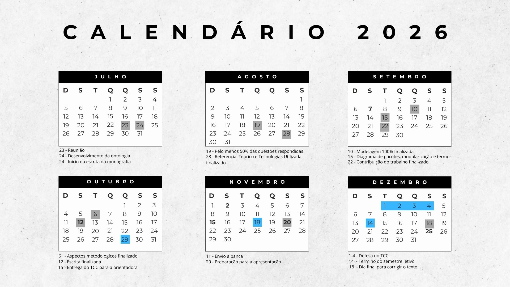

## Cronograma do TCC

- **23/07** – Reunião com a orientadora.
- **24/07** – Início da escrita da monografia e desenvolvimento da ontologia.
- **19/08** – Pelo menos 50% das questões respondidas.
- **28/08** – Referencial teórico e tecnologias utilizadas finalizados.
- **10/09** – Modelagem 100% concluída.
- **15/09** – Finalização do diagrama de pacotes, modularização e termos.
- **22/09** – Contribuição do trabalho finalizada.
- **06/10** – Avaliação da proposta concluída.
- **12/10** – Escrita da monografia finalizada.
- **15/10** – Entrega do TCC para a orientadora.
- **11/11** – Envio do trabalho para a banca.
- **01 a 04/12** – Defesa do TCC.
- **14/12** – Término do semestre letivo.