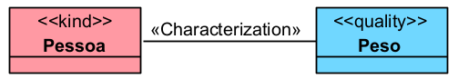

# «Characterization»

A relação «Characterization» conecta um portador a uma propriedade intrínseca que o caracteriza. Essa propriedade pode ser um «Mode» ou um «Quality».

## Exemplos simples:

- Pessoa -- «Characterization» -- Peso
- Pessoa -- «Characterization» -- Dor
- Produto -- «Characterization» -- Preço
- Veículo -- «Characterization» -- Cor
- Benefício Previdenciário -- «Characterization» -- Valor do Benefício

A documentação da OntoUML define «Characterization» como uma relação entre um tipo portador e sua característica intrínseca. Essa característica é existencialmente dependente do portador e pode ser estereotipada como «Quality» ou «Mode».

## Categorias principais

| Propriedade | Valor |
|---|---|
| Categoria | Relação formal / relação de inerência |
| Direcionada | Sim |
| Origem | Portador da propriedade |
| Destino permitido | Quality, Mode |
| Multiplicidade da origem | 1..1 |
| Multiplicidade do destino | 1..* |
| Relação típica | Portador → característica intrínseca |
| Exemplos | Pessoa–Peso, Pessoa–Dor, Produto–Preço |
| Propriedades binárias | Não reflexiva, não transitiva, não simétrica e não cíclica |

## Definição

Uma relação «Characterization» deve ser usada quando uma entidade possui uma característica que não existe sozinha, mas apenas como característica de algum portador.

### Exemplo:

O Peso não existe de forma independente. Ele é sempre o peso de alguma pessoa, animal, objeto ou entidade física.
