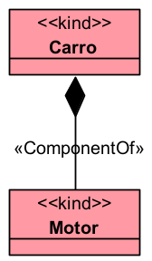

# «ComponentOf»

A relação «ComponentOf» representa uma relação parte-todo entre complexos funcionais. Ela deve ser usada quando uma entidade é componente funcional de outra, ou seja, quando a parte contribui para o funcionamento, estrutura ou organização do todo.

## Exemplos simples:

- Motor -- «ComponentOf» -- Carro
- Mão -- «ComponentOf» -- Braço
- Coração -- «ComponentOf» -- Sistema Circulatório
- Processador -- «ComponentOf» -- Computador
- Secretaria -- «ComponentOf» -- Prefeitura

A documentação da OntoUML define «ComponentOf» como uma relação de parte-todo entre dois complexos funcionais, como motor de carro, mão de braço e coração de sistema circulatório.

## Categorias principais

| Propriedade | Valor |
|---|---|
| Categoria | Relação parte-todo |
| Tipo de todo | Complexo funcional |
| Tipo de parte | Complexo funcional |
| Direcionada | Sim |
| Multiplicidade da origem | 1..* |
| Multiplicidade do destino | 0..* |
| Reflexiva | Não |
| Transitiva | Não necessariamente |
| Simétrica | Não |
| Cíclica | Não |
| Exemplos típicos | Motor–Carro, Mão–Braço, Coração–Sistema Circulatório |

## Definição

A relação «ComponentOf» deve ser usada quando o todo e a parte são entidades funcionais, e a parte desempenha alguma função dentro do todo.

### Exemplo:

O Motor é componente do Carro porque participa da estrutura funcional do veículo.
