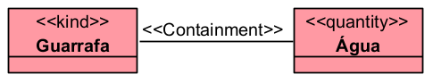

# «Containment»

A relação «Containment» representa uma relação entre um recipiente e o seu conteúdo, sendo esse conteúdo uma «Quantity», isto é, uma quantidade de matéria ou substância.

## Exemplos simples:

- Barril -- «Containment» -- Cerveja
- Garrafa -- «Containment» -- Água
- Tanque -- «Containment» -- Combustível
- Frasco -- «Containment» -- Medicamento Líquido
- Saco -- «Containment» -- Areia

A documentação da OntoUML define «Containment» como uma relação entre um container e seu conteúdo, sendo o conteúdo uma «Quantity», por exemplo, um barril que contém cerveja.

## Categorias principais

| Propriedade | Valor |
|---|---|
| Categoria | Relação parte-todo / contenção |
| Tipo de origem | Container / recipiente |
| Tipo de destino | Quantity |
| Direcionada | Sim |
| Multiplicidade da origem | 1..1 |
| Multiplicidade do destino | 1..1 |
| Reflexiva | Não |
| Transitiva | Não |
| Simétrica | Não |
| Cíclica | Não |
| Exemplo típico | Barril–Cerveja |

## Definição

A relação «Containment» deve ser usada quando uma entidade funciona como recipiente de uma quantidade de matéria.

### Exemplo:

- Nesse caso, a garrafa é o recipiente, e a água é o conteúdo.
