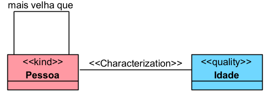

# «Formal»

A relação «Formal» representa uma relação comparativa ou formal, que existe diretamente entre dois ou mais indivíduos, sem precisar de um «Relator» para fundamentá-la.

Ela é usada principalmente para relações que podem ser explicadas pela comparação de valores de qualidades dos indivíduos relacionados, como idade, peso, preço, altura, data ou quantidade. A documentação da OntoUML define «Formal» como uma relação formal comparativa de domínio, reduzível à comparação de valores de qualidades dos indivíduos relacionados.

## Exemplos simples:

- Pessoa é mais velha que Pessoa
- Produto é mais caro que Produto
- Objeto é mais pesado que Objeto
- Aluno tem nota maior que Aluno
- Processo é anterior a Processo

## Categorias principais

| Propriedade | Valor |
|---|---|
| Categoria | Relação formal |
| Direcionada | Não |
| Multiplicidade da origem | 0..* |
| Multiplicidade do destino | 0..* |
| Depende de Relator | Não |
| Pode ser derivada de qualidades | Sim |
| Exemplo típico | mais velho que, mais pesado que, mais barato que |
| Restrições específicas | Não possui restrições ontológicas fortes na OntoUML |

## Definição

Uma relação «Formal» deve ser usada quando a associação entre os indivíduos pode ser explicada por uma comparação direta entre propriedades ou qualidades.

### Exemplo:

A relação mais velha que pode ser reduzida à comparação entre as idades das pessoas.
