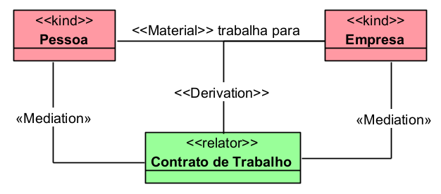

# «Material»

A relação «Material» representa uma relação com conteúdo próprio, normalmente social, jurídica, institucional, administrativa ou funcional, que não existe apenas por comparação direta entre indivíduos.

Ela é diferente da relação «Formal» porque a relação material precisa ser explicada por um relator. Ou seja, existe alguma entidade relacional que fundamenta a ligação entre as partes.

## Exemplos simples:

- Pessoa trabalha para Empresa
- Pessoa está matriculada em Escola
- Pessoa é casada com Pessoa
- Paciente é tratado por Unidade de Saúde
- Segurado recebe Benefício Previdenciário

A documentação da OntoUML explica que relações materiais possuem estrutura material própria e são mediadas por indivíduos chamados «Relator», como emprego, matrícula, casamento, tratamento ou compromisso.

## Categorias principais

| Propriedade | Valor |
|---|---|
| Categoria | Relação material |
| Direcionada | Não |
| Multiplicidade da origem | 1..* |
| Multiplicidade do destino | 1..* |
| Depende de Relator | Sim |
| Relação derivada | Sim |
| Relação auxiliar típica | «Derivation» |
| Relações relacionadas | «Mediation», «Derivation», «Relator» |
| Exemplo típico | trabalha para, estuda em, é casado com, recebe benefício |

## Definição

Uma relação «Material» deve ser usada quando a associação entre os indivíduos precisa de uma entidade intermediária que explique por que a relação existe.

### Exemplo:

A pessoa não "trabalha para" a empresa apenas por comparação de propriedades. Essa relação existe porque há um vínculo, contrato ou relação de emprego que conecta as partes.
