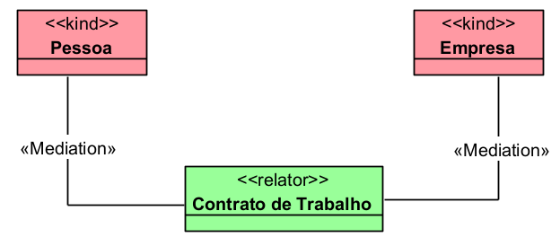

# «Mediation»

A relação «Mediation» conecta um «Relator» aos indivíduos que participam dele. Ela mostra quais entidades são mediadas, vinculadas ou conectadas por uma entidade relacional.

## Exemplos simples:

- Pessoa -- «Mediation» -- Contrato
- Empresa -- «Mediation» -- Contrato
- Aluno -- «Mediation» -- Matrícula
- Escola -- «Mediation» -- Matrícula
- Beneficiário -- «Mediation» -- Benefício Previdenciário
- INSS -- «Mediation» -- Benefício Previdenciário

Em termos práticos: se o «Relator» é aquilo que fundamenta uma relação material, a «Mediation» mostra quem participa desse relator.

## Categorias principais

| Propriedade | Valor |
|---|---|
| Categoria | Relação de dependência entre Relator e participantes |
| Tipo de relação | Formal |
| Direcionada | Normalmente não |
| Origem típica | «Relator» |
| Destino típico | Entidade mediada, como Kind, Role, Category, Mixin |
| Dependência | Obrigatória para o Relator |
| Relações relacionadas | «Material», «Derivation», «Relator» |
| Exemplo típico | Contrato mediando contratante e contratado |

## Definição

Uma relação «Mediation» deve ser usada para indicar que determinado indivíduo participa de um «Relator».

### Exemplo:

- O Contrato de Trabalho é o relator.
- Pessoa e Empresa são os participantes mediados por esse relator.
