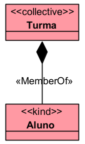

# «MemberOf»

A relação «MemberOf» representa uma relação parte-todo entre um indivíduo e um coletivo. Ela deve ser usada quando uma entidade é membro de uma coleção, grupo, turma, equipe, frota, rebanho ou outro «Collective».

## Exemplos simples:

- Aluno -- «MemberOf» -- Turma
- Servidor -- «MemberOf» -- Equipe
- Veículo -- «MemberOf» -- Frota
- Animal -- «MemberOf» -- Rebanho
- Árvore -- «MemberOf» -- Floresta

Em termos práticos:

- «MemberOf» = indivíduo membro de um coletivo

## Categorias principais

| Propriedade | Valor |
|---|---|
| Categoria | Relação parte-todo |
| Tipo de todo | Collective |
| Tipo de parte | Membro individual |
| Direcionada | Sim |
| Origem típica | Indivíduo membro |
| Destino típica | Coletivo |
| Reflexiva | Não |
| Simétrica | Não |
| Transitiva | Não necessariamente |
| Cíclica | Não |
| Exemplos típicos | Aluno–Turma, Veículo–Frota, Animal–Rebanho |

## Definição

Uma relação «MemberOf» deve ser usada quando uma entidade individual participa de um todo coletivo como membro.

### Exemplo:

- O Aluno é membro da Turma.
- A Turma é um coletivo formado por alunos.
