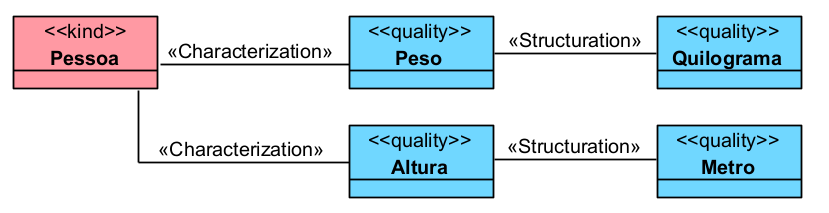

# «Structuration»

A relação «Structuration» conecta uma qualidade a uma estrutura de valor que organiza ou define seus possíveis valores.

Ela é usada principalmente quando um «Quality» precisa ser associado a um espaço de valores, escala, unidade, medida, padrão ou domínio estruturado.

## Exemplos simples:

- Peso -- «Structuration» -- Quilograma
- Temperatura -- «Structuration» -- Escala Celsius
- Preço -- «Structuration» -- Valor Monetário
- Cor -- «Structuration» -- Espaço de Cor
- Nota Escolar -- «Structuration» -- Escala de Nota

Em termos práticos:

- «Quality» representa a propriedade
- «Structuration» liga essa propriedade ao seu espaço de valores

## Categorias principais

| Propriedade | Valor |
|---|---|
| Categoria | Relação de estruturação |
| Origem típica | Quality |
| Destino típico | Estrutura de valor / espaço de qualidade |
| Relação relacionada | Characterization |
| Função principal | Indicar como uma qualidade é estruturada |
| Exemplo típico | Peso estruturado em quilogramas |
| Uso comum | Medidas, escalas, unidades, valores monetários, cores, notas |

## Definição

Uma relação «Structuration» deve ser usada quando a qualidade de um indivíduo precisa ser relacionada a uma estrutura que permite interpretar seu valor.

### Exemplo:

Nesse exemplo:

- Pessoa é o portador;
- Peso e Altura são qualidades da pessoa;
- Quilograma e Metro estruturam os valores dessas qualidades.
