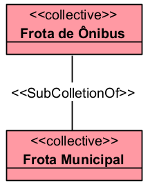

# «SubCollectionOf»

A relação «SubCollectionOf» representa uma relação parte-todo entre dois coletivos. Ela deve ser usada quando uma coleção menor é parte de uma coleção maior.

## Exemplos simples:

- Turma A -- «SubCollectionOf» -- Conjunto de Turmas
- Equipe Técnica -- «SubCollectionOf» -- Comissão Geral
- Frota de Ônibus -- «SubCollectionOf» -- Frota Municipal
- Grupo de Professores -- «SubCollectionOf» -- Corpo Docente
- Coleção de Cartas Curinga -- «SubCollectionOf» -- Baralho

A documentação da OntoUML define «SubCollectionOf» como uma relação de parte-todo entre dois «Collective». Exemplos clássicos incluem a coleção de curingas como parte de um baralho, a coleção de garfos como parte de um conjunto de talheres e a coleção de homens como parte de uma multidão.

## Categorias principais

| Propriedade | Valor |
|---|---|
| Categoria | Relação parte-todo |
| Tipo de parte | Collective |
| Tipo de todo | Collective |
| Direcionada | Sim |
| Origem típica | Subcoletivo |
| Destino típica | Coletivo maior |
| Multiplicidade da origem | 1..1 |
| Multiplicidade do destino | 1..1 |
| Transitividade | Sim |
| Compartilhável | Pode ser compartilhável ou não compartilhável |
| Exemplo típico | Frota de Ônibus–Frota Municipal |

## Definição

Uma relação «SubCollectionOf» deve ser usada quando tanto a parte quanto o todo são coletivos.

### Exemplo:

- A Frota de Ônibus é uma coleção de veículos.
- A Frota Municipal também é uma coleção de veículos.
- Logo, a relação entre elas é de subcoleção.
