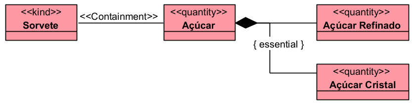

# «SubQuantityOf»

A relação «SubQuantityOf» representa uma relação parte-todo entre duas quantidades. Ela deve ser usada quando uma porção de matéria ou substância é parte de outra quantidade de matéria ou substância.

## Exemplos simples:

- Álcool -- «SubQuantityOf» -- Vinho
- Plasma -- «SubQuantityOf» -- Sangue
- Açúcar -- «SubQuantityOf» -- Sorvete
- Leite -- «SubQuantityOf» -- Cappuccino
- Porção de Água -- «SubQuantityOf» -- Quantidade de Água

A documentação da OntoUML define «SubQuantityOf» como uma relação de parte-todo entre dois «Quantity», isto é, entre quantidades ou substâncias não contáveis.

## Categorias principais

| Propriedade | Valor |
|---|---|
| Categoria | Relação parte-todo |
| Tipo de parte | Quantity |
| Tipo de todo | Quantity |
| Direcionada | Sim |
| Origem típica | Subquantidade |
| Destino típica | Quantidade maior |
| Multiplicidade da origem | 1..1 |
| Multiplicidade do destino | 1..1 |
| Compartilhável | Não |
| Transitividade | Sim |
| Reflexiva | Não |
| Simétrica | Não |
| Cíclica | Não |
| Exemplo típico | Plasma–Sangue |

## Definição

Uma relação «SubQuantityOf» deve ser usada quando tanto a parte quanto o todo são quantidades de matéria.

### Exemplo:

- O açúcar é uma subquantidade presente na quantidade de sorvete.
- Os tipos de açúcar são tratados como substâncias ou porções de matéria.
