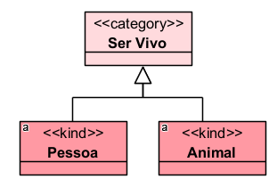
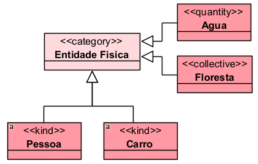
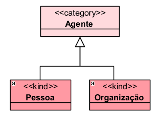
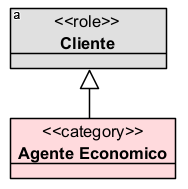
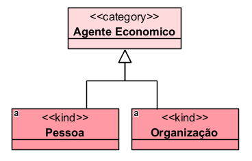
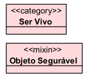
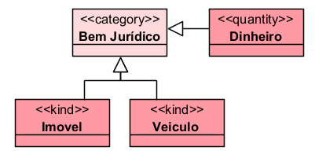
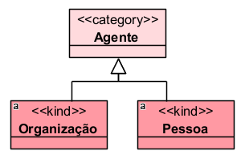
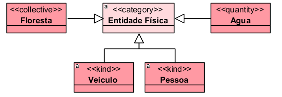
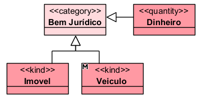

# «Category»

O «Category» representa um tipo abstrato, rígido e não sortal, usado para reunir propriedades essenciais comuns a indivíduos que seguem princípios de identidade diferentes.

Em outras palavras, ele agrupa tipos diferentes que compartilham alguma característica essencial, mas sem fornecer identidade própria.

## Exemplos simples:

- «Category» Agente
- «Category» Entidade Física
- «Category» Bem
- «Category» Objeto Jurídico
- «Category» Ser Vivo

A documentação da OntoUML define «Category» como um mixin rígido, sem dependência obrigatória, usado para agregar propriedades essenciais de indivíduos que seguem diferentes princípios de identidade.

## Categorias principais

| Propriedade | Valor |
|---|---|
| Categoria | RigidNonSortal |
| Prove identidade | Não |
| Princípio de identidade | Múltiplo |
| Rigidez | Rígido |
| Dependência | Opcional |
| Supertipos permitidos | Category, Mixin |
| Subtipos permitidos | Kind, Subkind, Collective, Quantity, Relator, Category, Mode, Quality, Role, Phase, RoleMixin, PhaseMixin, Mixin |
| Associação proibida | Structuration |
| Abstrato | Sim |

## Definição

Um «Category» deve ser usado quando se deseja representar uma generalização abstrata entre tipos diferentes, desde que essa generalização seja essencial para suas instâncias.

### Exemplo:

Pessoa e Animal possuem princípios de identidade próprios, mas ambos podem ser reunidos na categoria Ser Vivo.

### Outro exemplo:

Pessoa, Carro, Água e Floresta não possuem o mesmo princípio de identidade, mas podem compartilhar propriedades essenciais de entidades físicas, como localização, massa ou extensão espacial.

## Restrições

O «Category» é sempre abstrato. Isso significa que ele não deve possuir instâncias diretas; suas instâncias aparecem por meio dos seus subtipos concretos.

### Exemplo correto:

Nesse caso, não se instancia diretamente Agente. Instanciam-se Pessoa ou Organização.

Como o «Category» agrega indivíduos que podem seguir diferentes princípios de identidade, ele não deve ter como ancestral tipos que fornecem ou herdam identidade específica, como:

- «Kind»
- «Quantity»
- «Collective»
- «Subkind»
- «Role»
- «Phase»
- «Relator»
- «Mode»
- «Quality»

A documentação também destaca que, por ser rígido, o «Category» não pode ter como ancestral tipos antirrígidos, como «Role», «RoleMixin» ou «Phase».

### Exemplo inadequado:

Agente Econômico, sendo rígido, não deve depender de um papel temporário como Cliente.

## Questões comuns

### Qual é a diferença entre Category e Kind?

- O «Kind» fornece identidade.
- O «Category» não fornece identidade; apenas reúne tipos diferentes com propriedades essenciais comuns.

**Exemplo:**

- Pessoa e Organização fornecem identidade.
- Agente apenas generaliza uma característica comum.

### Qual é a diferença entre Category e Mixin?

- O «Category» é rígido: suas propriedades são essenciais para suas instâncias.
- O «Mixin» é semirrígido: pode reunir tipos rígidos e antirrígidos, nem sempre representando uma característica essencial.

**Exemplo:**

- Ser vivo é uma característica essencial para pessoas e animais.
- Objeto segurável pode ser uma classificação mais contextual, dependendo do domínio.

### Quando devo usar Category?

Use quando quiser criar uma generalização abstrata e essencial entre tipos com identidades diferentes.

**Exemplo:**

Bem Jurídico pode reunir diferentes tipos de entidades que possuem relevância jurídica, mas cada subtipo mantém seu próprio princípio de identidade.

### Um Category pode ter instâncias diretas?

Não. O «Category» é abstrato. Ele deve ser instanciado por meio de seus subtipos concretos, como Kind, Collective, Quantity ou Relator.

## Exemplos

### Exemplo 1 — Agente

- Agente generaliza entidades capazes de agir no domínio.
- Pessoa e Organização possuem princípios de identidade diferentes.

### Exemplo 2 — Entidade física

- Entidade Física reúne indivíduos que possuem existência material ou localização espacial.

### Exemplo 3 — Bem jurídico

- Bem Jurídico funciona como uma generalização abstrata de entidades relevantes para o direito.

## Resumo final

O «Category» deve ser usado para representar generalizações abstratas, rígidas e essenciais entre tipos que seguem diferentes princípios de identidade. Ele não fornece identidade, não possui instâncias diretas e serve para organizar propriedades comuns entre classes como Pessoa, Organização, Veículo, Água, Contrato ou Floresta.
