# «Collective»

O «Collective» representa um conjunto ou coleção de indivíduos que são percebidos como partes semelhantes dentro de um todo. Ele é usado quando os membros do conjunto contribuem de forma uniforme para a existência ou funcionamento do coletivo. A documentação da OntoUML define «Collective» como um conceito rígido que fornece princípio de identidade e possui estrutura interna homogênea.

## Exemplos simples:

- «Collective» Turma
- «Collective» Frota
- «Collective» Floresta
- «Collective» Rebanho
- «Collective» Pilha de Tijolos

Uma Frota, por exemplo, é formada por veículos. Os veículos são membros da frota e, em regra, são percebidos de maneira semelhante dentro daquele conjunto.

## Categorias principais

| Propriedade | Valor |
|---|---|
| Categoria | RigidSortal |
| Prove identidade | Sim |
| Princípio de identidade | Simples |
| Rigidez | Rígido |
| Dependência | Opcional |
| Supertipos permitidos | Category, Mixin |
| Subtipos permitidos | Subkind, Phase, Role |
| Associações proibidas | Derivation, Structuration, SubQuantityOf |

## Definição

Um «Collective» deve ser usado quando a classe representa um todo coletivo, formado por membros semelhantes ou tratados de maneira uniforme.

A pergunta central é:

**Os membros desse todo são percebidos da mesma forma dentro do conjunto?**

Se a resposta for sim, provavelmente se trata de um «Collective».

### Exemplo:

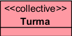

A Turma é um coletivo porque é composta por alunos que, naquele contexto, são percebidos de forma semelhante como membros da turma.

### Outro exemplo:

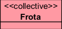

A Frota é composta por veículos. Cada veículo participa como membro do coletivo.

## Restrições

O «Collective» fornece identidade própria, assim como «Kind», «Quantity», «Relator», «Mode» e «Quality». Por isso, ele não deve ter como supertipo outro provedor de identidade, para evitar conflito entre princípios de identidade.

### Exemplo inadequado:

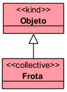

Nesse caso, Frota já fornece identidade própria como coletivo. Ela não deve herdar identidade de outro provedor.

Também não deve ter como supertipo tipos que apenas herdam identidade, como:

- «Subkind»
- «Role»
- «Phase»

Além disso, por ser rígido, um «Collective» não pode ter como supertipo um tipo antirrígido, como «Role», «Phase» ou «RoleMixin».

### Exemplo inadequado:

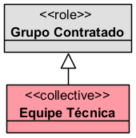

Equipe Técnica, se for um coletivo rígido, não deve herdar de um papel temporário.

## Questões comuns

### Qual é a diferença entre Collective e Kind?

- O «Kind» representa um indivíduo funcional, como uma pessoa, carro ou organização.
- O «Collective» representa um conjunto de indivíduos semelhantes.

**Exemplo:**

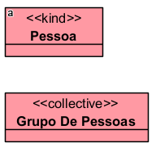

- Pessoa é um indivíduo.
- Grupo de Pessoas é um coletivo composto por pessoas.

### Qual é a diferença entre Collective e Quantity?

- O «Collective» é composto por membros individualizáveis.
- O «Quantity» representa uma quantidade de matéria, massa ou substância, normalmente não contável por membros individuais.

**Exemplo:**

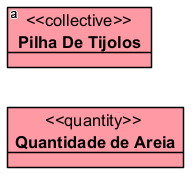

- Na pilha, é possível identificar os tijolos como membros.
- Na areia, o foco está na quantidade de matéria, não em membros individualizados.

### Família é Collective ou Kind?

Depende da modelagem. A documentação da OntoUML explica que alguns conceitos, como Família ou Frota, podem ser modelados como coletivos ou como complexos funcionais, conforme o modo como suas partes são entendidas. Se todos os membros forem percebidos com papéis semelhantes, pode ser Collective; se houver papéis funcionais distintos, pode ser tratado como outro tipo de entidade.

**Exemplo como coletivo:**

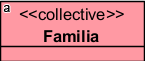

quando os membros são vistos de forma uniforme.

**Exemplo como estrutura funcional:**

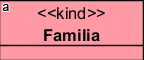

quando há papéis internos diferenciados, como responsável familiar, dependente, provedor etc.

### Um Collective pode ter subtipos?

Sim. Como outros provedores de identidade, o «Collective» pode ser especializado por:

- «Subkind»
- «Phase»
- «Role»

**Exemplo:**

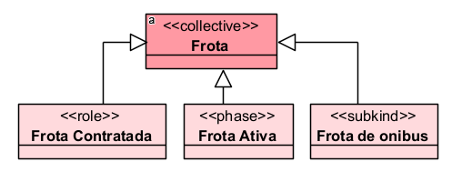

## Exemplos

### Exemplo 1 — Turma escolar
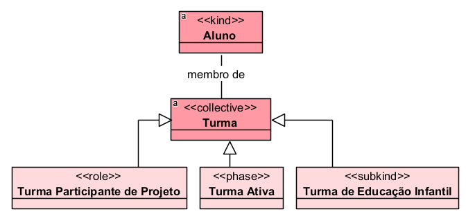

- Turma é um coletivo porque é formada por alunos que participam como membros.

### Exemplo 2 — Rebanho
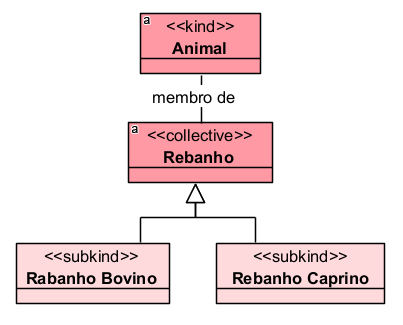

- Rebanho é um coletivo porque é composto por animais individualizáveis.

## Resumo final

O «Collective» deve ser usado para representar conjuntos homogêneos de indivíduos, como turmas, frotas, rebanhos, florestas ou grupos. Ele é rígido, fornece identidade própria e seus membros são percebidos de forma semelhante dentro do todo.
