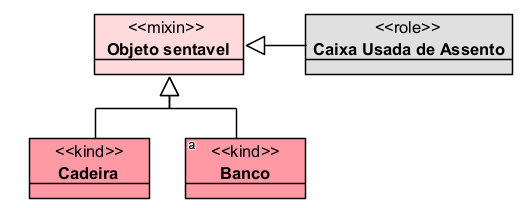
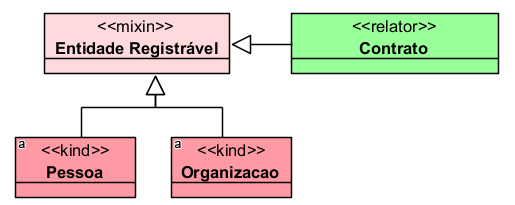
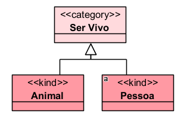
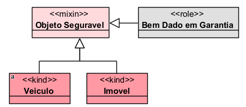
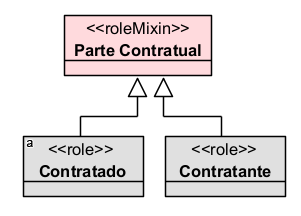
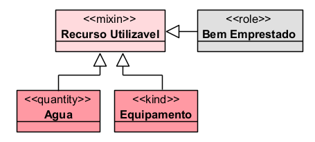
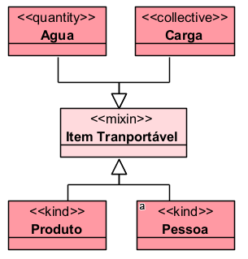
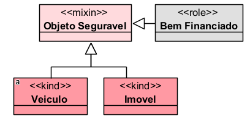
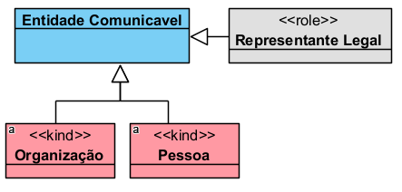
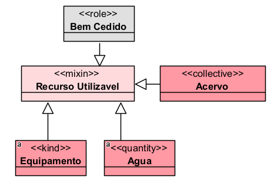

# «Mixin»

O «Mixin» representa um tipo abstrato, não sortal e semirrígido, usado para reunir propriedades comuns a indivíduos que podem seguir diferentes princípios de identidade e também possuir diferentes comportamentos de rigidez.

Em termos simples: o «Mixin» serve para generalizar uma característica que pode ser essencial para alguns tipos e acidental ou temporária para outros. A documentação da OntoUML explica que o «Mixin» é o único estereótipo que se comporta como rígido para alguns indivíduos e antirrígido para outros.

## Exemplos simples:

- «Mixin» Objeto Segurável
- «Mixin» Entidade Comunicável
- «Mixin» Recurso Utilizável
- «Mixin» Item Transportável
- «Mixin» Agente Econômico

## Categorias principais

| Propriedade | Valor |
|---|---|
| Categoria | SemiRigidNonSortal |
| Prove identidade | Não |
| Princípio de identidade | Múltiplo |
| Rigidez | Semirrígido |
| Dependência | Opcional |
| Supertipos permitidos | Mixin, Category |
| Subtipos permitidos | Subkind, Kind, Collective, Quantity, Category, Mixin, Role, Phase, RoleMixin, PhaseMixin, Relator, Quality, Mode |
| Associação proibida | Structuration |
| Abstrato | Sim |

## Definição

Um «Mixin» deve ser usado quando uma classe agrupa tipos diferentes, sem fornecer identidade própria, e quando a propriedade representada pode ser essencial para alguns subtipos e não essencial para outros.

### Exemplo:

Nesse exemplo, ser "sentável" pode ser essencial para Cadeira e Banco, mas apenas acidental para uma Caixa que está sendo usada como assento.

## Restrições

O «Mixin» é abstrato, portanto não deve possuir instâncias diretas. Suas instâncias aparecem por meio dos seus subtipos concretos.

Ele também não fornece identidade. A identidade das instâncias vem dos tipos especializados abaixo dele, como Kind, Subkind, Role, Phase, Relator, Quantity, Collective, Mode ou Quality.

### Exemplo correto:

Entidade Registrável não define a identidade das instâncias. Pessoa, Organização e Contrato possuem seus próprios princípios de identidade.

Além disso, o «Mixin» deve ser usado quando realmente houver mistura de rigidez. Se todos os subtipos forem rígidos, o correto provavelmente será «Category». Se todos forem antirrígidos, o correto provavelmente será «RoleMixin». Esse problema é tratado pela OntoUML como antipadrão MixRig, ou seja, um Mixin especializado apenas por tipos com a mesma rigidez.

## Questões comuns

### Qual é a diferença entre Mixin e Category?

- O «Category» é rígido. Ele representa uma característica essencial comum aos seus subtipos.
- O «Mixin» é semirrígido. Ele pode representar uma característica essencial para alguns subtipos e acidental para outros.

**Exemplo:**

Ser vivo é uma característica essencial para pessoa e animal.

Ser segurável pode ser essencial em alguns contextos do modelo e acidental em outros.

### Qual é a diferença entre Mixin e RoleMixin?

- O «RoleMixin» é antirrígido e dependente de relação.
- O «Mixin» é semirrígido e possui dependência opcional.

**Exemplo:**

Todos os subtipos são papéis relacionais.

O mixin reúne tipos de naturezas diferentes, com rigidez distinta.

### Quando devo usar Mixin?

Use quando precisar criar uma generalização abstrata que reúna tipos diferentes e a característica generalizada não seja essencial para todos.

**Exemplo:**

Item Transportável não fornece identidade. Ele apenas reúne entidades que podem ser transportadas no domínio modelado.

### Um Mixin pode ter instâncias diretas?

Não. O «Mixin» é abstrato. Ele serve para organizar o modelo e generalizar propriedades, mas suas instâncias devem ocorrer por meio de classes concretas especializadas.

## Exemplos

### Exemplo 1 — Objeto segurável

- Objeto Segurável reúne entidades que podem ser objeto de seguro. Para alguns tipos, essa característica pode ser estável; para outros, pode depender de uma situação específica.

### Exemplo 2 — Entidade comunicável

- Pessoa, Organização e Representante Legal podem receber comunicações, mas possuem princípios de identidade e rigidez diferentes.

### Exemplo 3 — Recurso utilizável

- Recurso Utilizável generaliza coisas que podem ser utilizadas em determinada atividade, sem transformar essa característica em identidade própria.

## Resumo final

O «Mixin» deve ser usado para representar generalizações abstratas e semirrígidas. Ele não fornece identidade, não possui instâncias diretas e agrupa tipos com diferentes princípios de identidade. Sua principal diferença em relação ao «Category» é que o Mixin pode reunir características essenciais para alguns indivíduos e acidentais para outros.
