# «Mode»

O «Mode» representa uma propriedade intrínseca particular de um indivíduo, sem valor estruturado. Ele é usado para modelar características que existem em outro indivíduo, chamado de portador.

## Exemplos simples:

- «Mode» Habilidade
- «Mode» Sintoma
- «Mode» Intenção
- «Mode» Dor
- «Mode» Permissão
- «Mode» Vulnerabilidade

A documentação da OntoUML define «Mode» como um tipo de propriedade intrínseca que depende existencialmente de seu portador. Assim como «Quality», o «Mode» não existe sozinho: ele precisa caracterizar alguma entidade.

## Categorias principais

| Propriedade | Valor |
|---|---|
| Categoria | Aspect |
| Prove identidade | Sim |
| Princípio de identidade | Simples |
| Rigidez | Rígido |
| Dependência | Obrigatória |
| Supertipos permitidos | Category, Mixin |
| Subtipos permitidos | Subkind, Role, Phase |
| Associações proibidas | Structuration, ComponentOf, SubCollectionOf, MemberOf, SubQuantityOf, Derivation |
| Abstrato | Sim |

## Definição

Um «Mode» deve ser usado quando a classe representa uma característica individualizada que pertence a outro indivíduo, mas que não é medida em um espaço de valores estruturado.

### Exemplo:

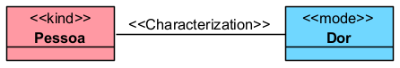

A Dor não existe isoladamente. Ela existe como dor de uma pessoa. Por isso, ela depende do seu portador.

### Outro exemplo:

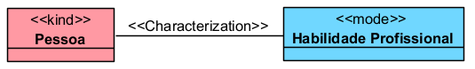

A habilidade profissional é uma propriedade intrínseca da pessoa. Ela caracteriza a pessoa, mas não é uma entidade independente como Pessoa, Contrato ou Organização.

## Restrições

Todo «Mode» deve estar conectado, direta ou indiretamente, a pelo menos uma relação «Characterization». Essa relação liga o portador à sua propriedade intrínseca.

### Exemplo correto:

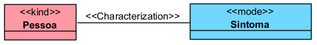

### Exemplo inadequado:

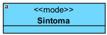

Nesse caso, o modelo está incompleto, porque não informa de quem o sintoma é.

O «Mode» também não deve ser confundido com uma entidade independente. Ele depende obrigatoriamente do portador. A especificação mais antiga da OntoUML descreve o «Mode» como um momento intrínseco que depende existencialmente de exatamente uma entidade.

## Questões comuns

### Qual é a diferença entre Mode e Quality?

Ambos são aspectos intrínsecos e dependem de um portador.
A diferença é que o «Quality» se conecta a um espaço de valores estruturado, enquanto o «Mode» não.

**Exemplo:**

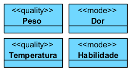

- Peso e Temperatura podem ser medidos em escalas.
- Dor e Habilidade, no modelo, podem ser tratadas como características individualizadas sem estrutura de valor própria.

### Qual é a diferença entre Mode e Relator?

- O «Mode» é uma propriedade intrínseca de um único portador.
- O «Relator» é uma entidade relacional que conecta dois ou mais participantes.

**Exemplo:**

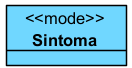

O sintoma pertence a uma pessoa.

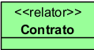

O contrato conecta partes contratantes.

### Quando devo usar Mode?

Use quando quiser representar uma característica que:

- pertence a um portador;
- não existe de forma independente;
- não é simplesmente um valor literal;
- não estrutura uma relação entre vários participantes.

**Exemplo:**

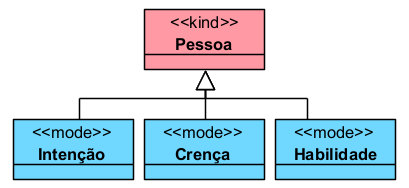

Esses elementos existem como aspectos da pessoa.

### Um Mode pode ter subtipos?

Sim. O «Mode» pode ter como subtipos «Subkind», «Role» e «Phase».

**Exemplo:**

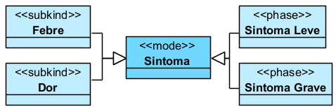

## Exemplos

### Exemplo 1 — Saúde
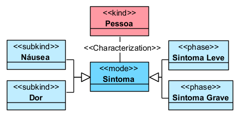

- Sintoma é um Mode porque caracteriza uma pessoa e depende dela para existir.

### Exemplo 2 — Educação
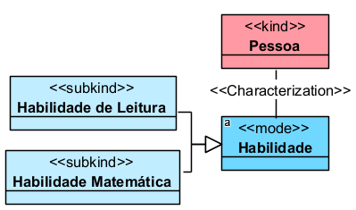

- A habilidade pertence à pessoa. Ela não é uma entidade independente.

### Exemplo 3 — Direito
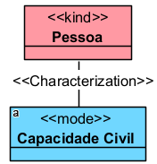

- A capacidade civil pode ser modelada como um Mode quando for tratada como uma característica jurídica intrínseca da pessoa.

## Resumo final

O «Mode» deve ser usado para representar propriedades intrínsecas individualizadas, como habilidades, sintomas, intenções, crenças, permissões ou capacidades. Ele é rígido, fornece identidade, depende obrigatoriamente de um portador e deve ser ligado a esse portador por uma relação «Characterization».
