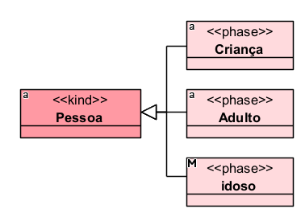
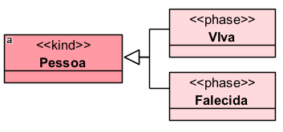
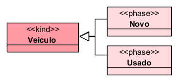
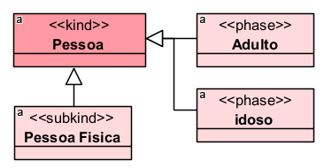
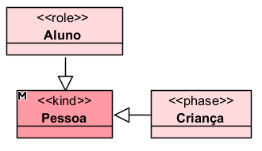

# «Phase»

O «Phase» representa uma fase temporária de um indivíduo, causada por uma mudança em uma propriedade intrínseca, como idade, condição física, estado de conservação, cor, situação biológica ou outro atributo interno.

Ele é antirrígido, porque uma instância pode deixar de pertencer à fase sem deixar de existir.

## Exemplos simples:

Uma pessoa pode ser criança, depois adulta e depois idosa, mas continua sendo a mesma Pessoa.

## Categorias principais

| Propriedade | Valor |
|---|---|
| Categoria | AntiRigidSortal |
| Prove identidade | Não |
| Princípio de identidade | Simples |
| Rigidez | Antirrígido |
| Dependência | Opcional |
| Supertipos permitidos | Kind, Subkind, Collective, Quantity, Relator, Phase, Mixin, PhaseMixin, Mode, Quality, Category |
| Subtipos permitidos | Phase, Role |
| Associação proibida | Structuration |

A documentação da OntoUML define «Phase» como subtipo antirrígido de provedores de identidade, instanciado por mudanças em propriedades intrínsecas, como idade, cor ou condição de um objeto.

## Definição

Um «Phase» deve ser usado quando uma classe representa uma condição transitória de um indivíduo, determinada por uma característica interna.

### Exemplo:

Nesse caso, Viva e Falecida são fases da pessoa. A mudança ocorre por uma condição intrínseca da própria pessoa, não por uma relação externa.

### Outro exemplo:

O veículo pode mudar de estado ao longo do tempo, mas continua sendo o mesmo veículo.

## Restrições

O «Phase» deve sempre herdar, direta ou indiretamente, de um único provedor de identidade, como Kind, Collective, Quantity, Relator, Mode ou Quality. Ele não fornece identidade própria, apenas usa a identidade do tipo superior.

Além disso, um «Phase» deve fazer parte de uma partição, normalmente representada por um conjunto de generalização disjunto e completo. Isso significa que as fases devem cobrir todas as possibilidades relevantes e não devem se sobrepor.

### Exemplo correto:

Como é antirrígido, um «Phase» não pode ser supertipo de tipos rígidos, como Kind, Subkind, Collective, Quantity, Relator, Mode, Quality ou Category.

Também não deve ser usado quando a classificação depende de uma relação externa. Nesses casos, o correto geralmente é usar «Role», não «Phase». A própria documentação sobre o antipadrão DepPhase explica que fases são instanciadas por propriedades intrínsecas, enquanto papéis são instanciados por propriedades relacionais.

## Questões comuns

### Qual é a diferença entre Phase e Subkind?

- O Subkind é rígido. O indivíduo pertence a ele durante toda a existência.
- O Phase é antirrígido. O indivíduo pode entrar e sair daquela fase.

**Exemplo:**

- Pessoa Fisica é uma especialização estável.
- Criança e Adulto são fases temporárias.

### Qual é a diferença entre Phase e Role?

- O Phase depende de uma propriedade interna.
- O Role depende de uma relação externa.

**Exemplo:**

- Criança depende da idade da pessoa.
- Aluno depende de uma relação com uma instituição de ensino.

### Preciso representar a propriedade que define a fase?

Não é obrigatório, mas é recomendável. A documentação da OntoUML orienta que, sempre que possível, a propriedade que causa a fase seja representada no modelo, como a idade para as fases Criança, Adulto e Idoso.

**Exemplo mais completo:**

## Exemplos

### Exemplo 1 — Pessoa por idade

A pessoa passa por fases conforme sua idade. A identidade continua sendo fornecida por Pessoa.

### Exemplo 2 — Pessoa por condição de vida

A fase depende de uma condição intrínseca da pessoa.

### Exemplo 3 — Veículo por estado de uso

O mesmo veículo pode deixar de ser novo e passar a ser usado.

## Resumo final

O «Phase» deve ser usado para representar estados temporários e intrínsecos de uma entidade. Ele não fornece identidade, é antirrígido e normalmente aparece em partições, como Criança/Adulto/Idoso, Novo/Usado ou Vivo/Falecido.
