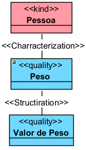
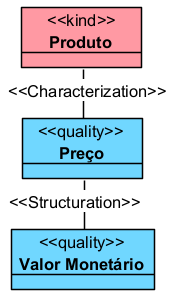
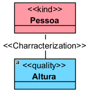
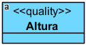
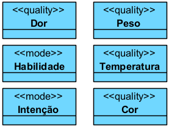
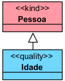
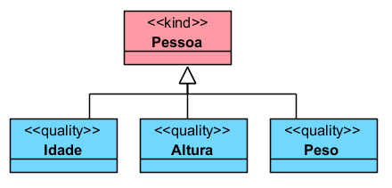
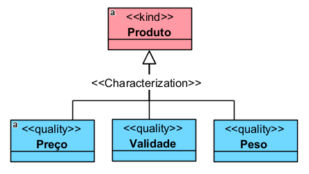

# «Quality»

O «Quality» representa uma propriedade intrínseca particular de um indivíduo, mas com uma diferença importante em relação ao «Mode»: a qualidade possui um valor estruturado.

## Exemplos simples:

- «Quality» Peso
- «Quality» Altura
- «Quality» Temperatura
- «Quality» Cor
- «Quality» Velocidade
- «Quality» Nome
- «Quality» ISBN

A documentação da OntoUML define «Quality» como uma propriedade intrínseca que depende existencialmente de um portador e que possui um valor estruturado. Exemplos clássicos são peso, altura, cor, velocidade, moeda, nome e ISBN.

## Categorias principais

| Propriedade | Valor |
|---|---|
| Categoria | Aspect |
| Prove identidade | Sim |
| Princípio de identidade | Simples |
| Rigidez | Rígido |
| Dependência | Obrigatória |
| Supertipos permitidos | Category, Mixin |
| Subtipos permitidos | Subkind, Role, Phase |
| Associações proibidas | ComponentOf, SubCollectionOf, MemberOf, SubQuantityOf, Derivation |
| Abstrato | Sim |

## Definição

Um «Quality» deve ser usado quando se deseja representar uma característica individualizada de uma entidade, desde que essa característica possa ser associada a algum espaço de valores.

### Exemplo:



O Peso não existe sozinho. Ele é sempre o peso de alguém ou de algo. Além disso, pode ser estruturado em valores, como 70 kg, 80 kg ou 95 kg.

### Outro exemplo:



O Preço caracteriza o produto e pode ser estruturado em valores monetários, como R$ 50,00, R$ 120,00 ou R$ 1.000,00.

## Restrições

Todo «Quality» deve depender de um portador, ou seja, de alguma entidade que ele caracteriza. Essa ligação normalmente é feita por meio da relação «Characterization». A documentação da OntoUML define «Characterization» como a relação entre um tipo portador e sua propriedade intrínseca, que pode ser um «Quality» ou um «Mode».

### Exemplo correto:



### Exemplo inadequado:



Nesse caso, o modelo está incompleto, porque não informa de quem é a altura.

Além disso, o «Quality» pode ser estruturado por uma relação de «Structuration», conectando a qualidade ao seu domínio ou espaço de valores. A especificação OntoUML explica que a qualidade conecta a entidade qualificada a um valor em um espaço de qualidade.

## Questões comuns

### Qual é a diferença entre Quality e Mode?

Ambos são propriedades intrínsecas e dependem de um portador.

A diferença é que o «Quality» possui valor estruturado, enquanto o «Mode» não precisa possuir esse tipo de estrutura.

**Exemplo:**



- Peso, Temperatura e Cor podem ser associados a escalas, medidas ou domínios de valor.
- Dor, Habilidade e Intenção podem ser modeladas como modos quando forem tratadas como características individualizadas sem espaço de valor formalizado.

### Qual é a diferença entre Quality e atributo comum?

Um atributo comum registra apenas um valor.

**Exemplo:**

```
Pessoa.idade: inteiro
```

Já o «Quality» representa a própria propriedade como uma entidade ontológica dependente.

**Exemplo:**



Use «Quality» quando a propriedade for importante para o domínio, precisar ter fases, subtipos, histórico, medições, unidades ou estrutura própria.

### Quando devo usar Quality?

Use quando a característica:

- pertence a um portador;
- não existe de forma independente;
- possui valor estruturado;
- é relevante o suficiente para ser modelada como classe, e não apenas como atributo.

**Exemplos:**

- «Quality» Temperatura Corporal
- «Quality» Pressão Arterial
- «Quality» Valor do Benefício
- «Quality» Nota Escolar
- «Quality» Grau de Incapacidade

## Tipos comuns de qualidade

A documentação da OntoUML diferencia três tipos de qualidades: perceptíveis, não perceptíveis e nominais.

### 1. Qualidades perceptíveis

São aquelas que podem ser medidas ou percebidas com instrumentos adequados.

- «Quality» Peso
- «Quality» Altura
- «Quality» Temperatura
- «Quality» Velocidade
- «Quality» Cor

### 2. Qualidades não perceptíveis

São propriedades que possuem valor estruturado, mas não são medidas diretamente por instrumento físico simples.

- «Quality» Valor Monetário
- «Quality» Moeda
- «Quality» Grau de Risco

### 3. Qualidades nominais

São qualidades identificadoras ou nomeadoras.

- «Quality» Nome
- «Quality» CPF
- «Quality» ISBN
- «Quality» Número de Processo

## Exemplos

### Exemplo 1 — Pessoa


- Altura, Peso e Idade são qualidades porque caracterizam a pessoa e possuem valores estruturados.

### Exemplo 2 — Produto


- O produto é o portador das qualidades.
- As qualidades dependem dele para existir.

## Resumo final

O «Quality» deve ser usado para representar propriedades intrínsecas com valor estruturado, como peso, altura, temperatura, preço, nome, CPF ou número de processo. Ele é rígido, fornece identidade, depende obrigatoriamente de um portador e normalmente é ligado a esse portador por uma relação «Characterization».
