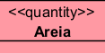
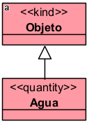
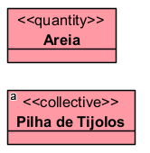
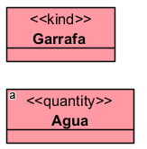
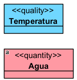
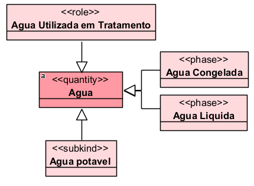
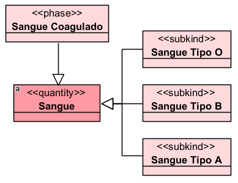
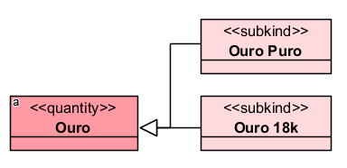

# «Quantity»

O «Quantity» representa uma quantidade de matéria ou substância não contável, como água, areia, argila, ouro, cerveja ou sangue. Ele é usado quando o objeto modelado não é tratado como uma coleção de membros individuais, mas como uma porção contínua de matéria.

## Exemplos simples:

- «Quantity» Água
- «Quantity» Areia
- «Quantity» Ouro
- «Quantity» Sangue
- «Quantity» Argila

A documentação da OntoUML define «Quantity» como um tipo rígido que fornece identidade e representa uma quantidade de matéria maximamente conectada topologicamente.

## Categorias principais

| Propriedade | Valor |
|---|---|
| Categoria | RigidSortal |
| Prove identidade | Sim |
| Princípio de identidade | Simples |
| Rigidez | Rígido |
| Dependência | Opcional |
| Supertipos permitidos | Category, Mixin |
| Subtipos permitidos | Subkind, Phase, Role |
| Associações proibidas | ComponentOf, Derivation, Structuration, SubCollectionOf |

## Definição

Um «Quantity» deve ser usado para representar coisas incontáveis, isto é, substâncias ou massas que podem ser divididas e continuar sendo instâncias do mesmo tipo.

A pergunta prática é:

**Se eu dividir uma porção dessa coisa em duas partes, cada parte continua sendo uma instância do mesmo tipo?**

Se a resposta for sim, provavelmente é um «Quantity».

### Exemplo:

Se uma porção de areia for dividida em duas, as duas partes continuam sendo areia. O mesmo raciocínio vale para água, argila, ouro e sangue.

## Restrições

O «Quantity» fornece identidade própria. Por isso, não deve ter como supertipo outro provedor de identidade, como Kind, Collective, Quantity, Relator, Mode ou Quality, para evitar conflito entre princípios de identidade.

### Exemplo inadequado:

Nesse caso, Água não deveria herdar identidade de Objeto, pois já possui seu próprio princípio de identidade como quantidade de matéria.

Também não deve ter como supertipo tipos que apenas herdam identidade, como:

- «Subkind»
- «Role»
- «Phase»

Além disso, como é rígido, um «Quantity» não pode ter como supertipo um tipo antirrígido, como Role, RoleMixin ou Phase.

## Questões comuns

### Qual é a diferença entre Quantity e Collective?

- O «Quantity» representa matéria não contável.
- O «Collective» representa um conjunto de membros individualizáveis.

**Exemplo:**

- Na areia, o foco está na massa ou porção de matéria.
- Na pilha de tijolos, é possível identificar cada tijolo como membro do coletivo.

### Qual é a diferença entre Quantity e Kind?

- O «Kind» representa um indivíduo ou objeto funcional, como pessoa, carro ou livro.
- O «Quantity» representa uma substância ou quantidade de matéria.

**Exemplo:**

- A garrafa é um objeto individual.
- A água é uma porção de substância.

### Qual é a diferença entre Quantity e Quality?

- O «Quantity» representa uma coisa material, como água, sangue ou areia.
- O «Quality» representa uma propriedade, como cor, peso, altura ou temperatura.

**Exemplo:**

- A água é uma substância.
- A temperatura é uma qualidade que pode caracterizar a água.

A própria documentação alerta para não confundir «Quantity» com «Quality».

### Um Quantity pode ter subtipos?

Sim. Ele pode ser especializado por Subkind, Phase e Role, além de poder ser generalizado por Category e Mixin.

**Exemplo:**

## Exemplos

### Exemplo 1 — Sangue

- Sangue é uma quantidade de matéria biológica.
- Os tipos sanguíneos podem ser modelados como subtipos.
- Sangue Coagulado pode ser uma fase.

### Exemplo 2 — Ouro

- Ouro é uma substância material.
- Ouro Puro e Ouro 18k são especializações da substância.

## Resumo final

O «Quantity» deve ser usado para representar matérias, substâncias ou massas não contáveis, como água, areia, sangue, argila e ouro. Ele é rígido, fornece identidade própria e se diferencia de Collective porque não é composto por membros individualizados, mas por porções de matéria.
