# «Relator»

O «Relator» representa uma entidade relacional, isto é, algo que existe para conectar dois ou mais indivíduos por meio de uma relação material.

Ele é usado quando a relação entre as partes precisa ser tratada como uma coisa própria no modelo.

## Exemplos simples:

- «Relator» Contrato
- «Relator» Matrícula
- «Relator» Casamento
- «Relator» Emprego
- «Relator» Benefício Previdenciário

Um Contrato, por exemplo, não é apenas uma associação entre duas pessoas. Ele é uma entidade que fundamenta a relação entre Contratante e Contratado.

## Categorias principais

| Propriedade | Valor |
|---|---|
| Categoria | RigidSortal |
| Prove identidade | Sim |
| Princípio de identidade | Simples |
| Rigidez | Rígido |
| Dependência | Obrigatória |
| Supertipos permitidos | Category, Mixin |
| Subtipos permitidos | Subkind, Phase, Role |
| Associações proibidas | ComponentOf, Structuration, SubCollectionOf, SubQuantityOf |

A documentação da OntoUML define «Relator» como o construto usado para representar os fundamentos ou "truth-makers" de relações materiais, ou seja, aquilo que precisa existir para que dois ou mais indivíduos estejam conectados por uma relação material.

## Definição

Um «Relator» deve ser usado quando a relação entre indivíduos possui existência própria, identidade e dependência em relação aos participantes.

### Exemplo:

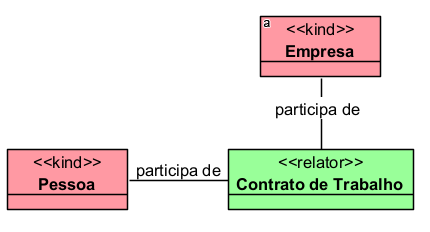

O Contrato de Trabalho é um Relator porque conecta a pessoa e a empresa, fundamentando a relação entre empregado e empregador.

### Outro exemplo:

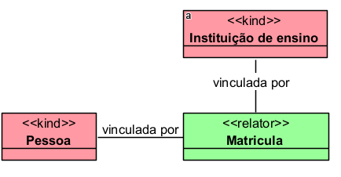

A Matrícula fundamenta a relação entre a pessoa e a instituição de ensino. Sem a matrícula, a pessoa não exerce o papel de aluno naquele contexto.

## Restrições

O «Relator» deve estar conectado, direta ou indiretamente, a pelo menos uma relação estereotipada como «Mediation». Isso ocorre porque ele depende de outros indivíduos para existir.

### Exemplo correto:

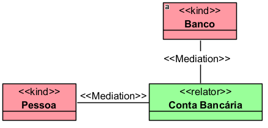

Além disso, a soma das cardinalidades mínimas das mediações ligadas ao Relator deve ser maior ou igual a 2. Em termos simples: um relator precisa mediar pelo menos dois participantes obrigatórios.

### Exemplo inadequado:

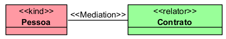

Se o contrato estiver ligado obrigatoriamente a apenas uma pessoa, o modelo fica incompleto, porque um contrato normalmente depende de pelo menos duas partes.

O «Relator» também não pode ter como supertipo direto ou indireto outro provedor de identidade, como Kind, Collective, Quantity, Relator, Mode ou Quality, para evitar conflito entre princípios de identidade.

Também não deve ter como supertipo tipos que apenas herdam identidade, como:

- «Subkind»
- «Role»
- «Phase»

Como é rígido, um «Relator» não pode ter como supertipo um tipo antirrígido, como Role, RoleMixin ou Phase.

## Questões comuns

### Qual é a diferença entre Relator e uma associação comum?

- Uma associação comum apenas indica que dois elementos estão relacionados.
- O Relator representa a própria entidade que fundamenta essa relação.

**Exemplo:**

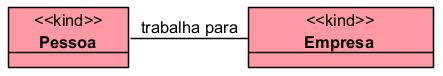

Essa é apenas uma relação.

Mas, se quisermos representar o vínculo que fundamenta essa relação:

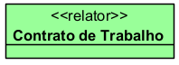

Nesse caso, o contrato é o objeto relacional que explica por que a pessoa trabalha para a empresa.

### Qual é a diferença entre Relator e Kind?

- O Kind representa um indivíduo funcional, como pessoa, carro ou organização.
- O Relator representa uma entidade dependente de relação, como contrato, matrícula ou casamento.

**Exemplo:**

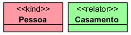

- A pessoa existe independentemente do casamento.
- O casamento só existe se houver pessoas ou partes relacionadas por ele.

### Todo contrato é Relator?

Em muitos modelos, sim. O contrato normalmente fundamenta papéis como:

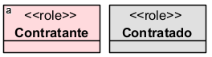

Esses papéis existem em razão do «Relator» Contrato.

### Benefício previdenciário pode ser Relator?

Pode, dependendo do objetivo do modelo. Em um domínio previdenciário, o Benefício Previdenciário pode funcionar como relator porque conecta segurado, INSS, dependente, requerimento, concessão e obrigações jurídicas.

**Exemplo:**

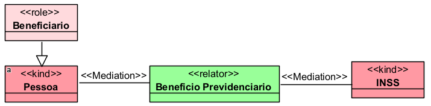

O benefício fundamenta a relação jurídica-previdenciária entre a pessoa e o INSS.

## Exemplos

### Exemplo 1 — Contrato
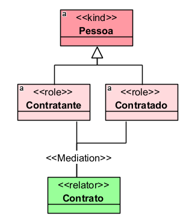

O Contrato é o relator que fundamenta os papéis de Contratante e Contratado.

### Exemplo 2 — Casamento
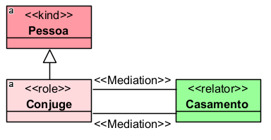

O Casamento é um relator porque fundamenta a relação conjugal entre duas pessoas.

## Resumo final

O «Relator» deve ser usado para representar entidades que fundamentam relações, como contratos, matrículas, casamentos, empregos, benefícios ou vínculos jurídicos. Ele é rígido, fornece identidade própria e possui dependência obrigatória, pois só existe conectado a outros indivíduos por relações de mediação.
