# «Role»

O «Role» representa um papel temporário assumido por um indivíduo em razão de uma relação externa com outro indivíduo ou contexto.

Ele é antirrígido, porque uma instância pode deixar de exercer aquele papel sem deixar de existir.

## Exemplos simples:

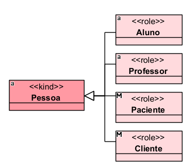

Uma pessoa pode ser Aluno em uma escola, deixar de ser aluno e continuar sendo a mesma Pessoa.

## Categorias principais

| Propriedade | Valor |
|---|---|
| Categoria | AntiRigidSortal |
| Prove identidade | Não |
| Princípio de identidade | Simples |
| Rigidez | Antirrígido |
| Dependência | Obrigatória / relacional |
| Supertipos permitidos | Kind, Subkind, Collective, Quantity, Relator, Role, Mixin, RoleMixin, Mode, Quality, Category |
| Subtipos permitidos | Role |
| Associação proibida | Structuration |

## Definição

Um «Role» deve ser usado quando uma classe representa uma classificação contextual, isto é, uma condição que o indivíduo assume por participar de uma relação.

### Exemplo:

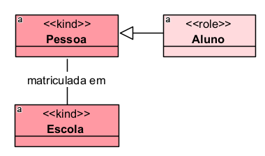

Nesse caso, Aluno depende da relação entre Pessoa e Escola.
A pessoa só é Aluno porque está vinculada a uma instituição de ensino.

## Restrições

O «Role» deve herdar, direta ou indiretamente, de um tipo que forneça identidade, como Kind, Collective, Quantity, Relator, Mode ou Quality.

Ele não fornece identidade própria. A identidade continua vindo do tipo superior.

### Exemplo:

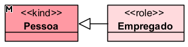

Empregado não define o que a pessoa é essencialmente. Apenas indica um papel exercido em uma relação de trabalho.

Como é antirrígido, um «Role» não deve ser supertipo de tipos rígidos, como Kind, Subkind, Collective, Quantity, Relator, Mode, Quality ou Category.

Além disso, o «Role» deve possuir uma dependência relacional obrigatória. Isso significa que ele deve estar ligado a alguma relação que explique por que aquele papel existe.

### Exemplo correto:

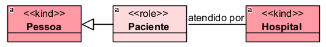

### Exemplo inadequado:

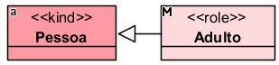

Adulto não é Role, porque não depende de uma relação externa. Depende da idade, que é uma propriedade intrínseca. Portanto, o correto seria:

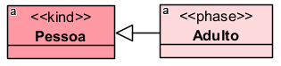

## Questões comuns

### Qual é a diferença entre Role e Phase?

- O Role depende de uma relação externa.
- O Phase depende de uma propriedade interna.

**Exemplo:**

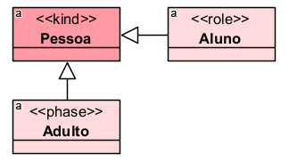

- Aluno depende de matrícula em uma instituição.
- Adulto depende da idade da pessoa.

### Qual é a diferença entre Role e Subkind?

- O Subkind é rígido e representa uma especialização permanente.
- O Role é antirrígido e representa uma condição contextual.

**Exemplo:**

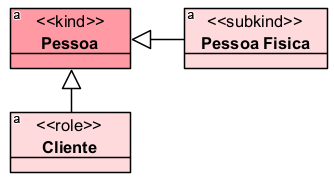

- Pessoa Física é uma especialização estável.
- Cliente depende de uma relação comercial ou contratual.

### Um mesmo indivíduo pode exercer vários Roles ao mesmo tempo?

Sim.

**Exemplo:**

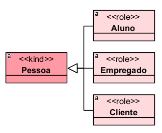

Uma mesma pessoa pode ser, ao mesmo tempo, aluna de uma faculdade, empregada de uma empresa e cliente de um banco.

### Todo papel social ou jurídico é Role?

Geralmente sim, quando depende de uma relação.

**Exemplos:**

- «Role» Autor
- «Role» Réu
- «Role» Segurado
- «Role» Beneficiário
- «Role» Contratante
- «Role» Contratado

Esses papéis normalmente dependem de processos, contratos, vínculos administrativos, relações previdenciárias ou relações jurídicas.

## Exemplos

### Exemplo 1 — Educação
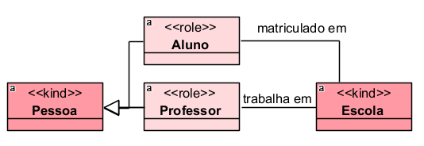

- Aluno e Professor são papéis porque dependem de uma relação com a escola.

### Exemplo 2 — Saúde
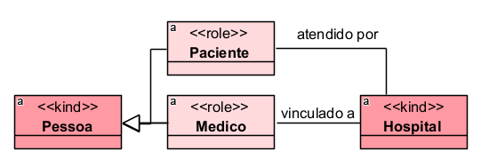

- Paciente depende de atendimento ou vínculo com serviço de saúde.
- Médico, neste exemplo, pode ser tratado como Role quando o foco é o papel exercido em um hospital específico.

## Resumo final

O «Role» deve ser usado para representar papéis temporários, contextuais e relacionais. Ele não fornece identidade, é antirrígido e depende obrigatoriamente de uma relação externa que explique sua existência, como matrícula, contrato, vínculo de trabalho, processo, atendimento ou benefício.
