# «RoleMixin»

O «RoleMixin» representa um papel abstrato, antirrígido e relacional, usado para agrupar papéis de indivíduos que podem ter diferentes princípios de identidade.

Ele é equivalente ao «Role», mas aplicado a tipos mais gerais. Enquanto o «Role» normalmente especializa um único provedor de identidade, o «RoleMixin» pode reunir papéis exercidos por entidades de naturezas diferentes. A documentação da OntoUML define o «RoleMixin» como o equivalente de «Role» para tipos que agregam instâncias com diferentes princípios de identidade.

## Exemplos simples:

- «RoleMixin» Parte Contratual
- «RoleMixin» Agente Responsável
- «RoleMixin» Prestador de Serviço
- «RoleMixin» Beneficiário
- «RoleMixin» Participante de Processo

## Categorias principais

| Propriedade | Valor |
|---|---|
| Categoria | AntiRigidNonSortal |
| Prove identidade | Não |
| Princípio de identidade | Múltiplo |
| Rigidez | Antirrígido |
| Dependência | Obrigatória |
| Supertipos permitidos | Mixin, RoleMixin, Category, PhaseMixin |
| Subtipos permitidos | Role, RoleMixin |
| Associação proibida | Structuration |
| Abstrato | Sim |

## Definição

Um «RoleMixin» deve ser usado quando uma classe representa uma função relacional comum assumida por indivíduos de tipos diferentes.

A pergunta prática é:

**Essa classe representa um papel dependente de relação, mas pode ser exercido por entidades de naturezas diferentes?**

Se a resposta for sim, provavelmente é um «RoleMixin».

### Exemplo:

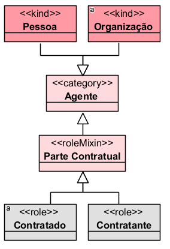

Parte Contratual é um RoleMixin, pois pode ser exercido tanto por uma Pessoa quanto por uma Organização, dependendo de uma relação contratual.

## Restrições

O «RoleMixin» é sempre abstrato, portanto não deve possuir instâncias diretas. Suas instâncias aparecem por meio de subtipos concretos, normalmente «Role».

### Exemplo correto:

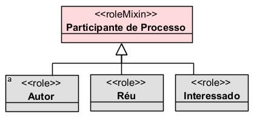

Nesse exemplo, não se instancia diretamente Participante de Processo. Instanciam-se papéis mais específicos, como Autor, Réu ou Interessado.

O «RoleMixin» também é antirrígido. Isso significa que o indivíduo pode deixar de exercer aquele papel sem deixar de existir.

### Exemplo:

```
Pessoa → Autor em um processo
Pessoa → deixa de ser Autor
Pessoa → continua existindo como Pessoa
```

Além disso, o «RoleMixin» possui dependência relacional obrigatória. Ele só faz sentido se houver uma relação externa que fundamente aquele papel. A documentação da OntoUML destaca que sua instanciação depende de uma propriedade relacional.

### Exemplo:

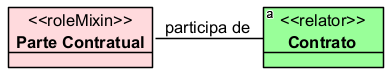

Sem o Contrato, não há justificativa ontológica para classificar alguém como Parte Contratual.

## Questões comuns

### Qual é a diferença entre Role e RoleMixin?

- O «Role» é um papel aplicado a indivíduos que seguem o mesmo princípio de identidade.
- O «RoleMixin» é um papel abstrato aplicado a indivíduos que podem seguir princípios de identidade diferentes.

**Exemplo com Role:**

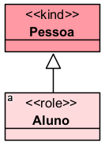

Aluno é um papel de Pessoa.

**Exemplo com RoleMixin:**

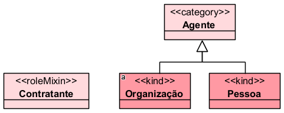

Contratante pode ser uma pessoa ou uma organização. Por isso, pode ser modelado como RoleMixin quando se deseja generalizar o papel.

### Qual é a diferença entre RoleMixin e PhaseMixin?

Ambos são abstratos, antirrígidos e não fornecem identidade.

A diferença está na origem da classificação:

- «RoleMixin» → depende de relação externa
- «PhaseMixin» → depende de condição interna ou estado

**Exemplo:**

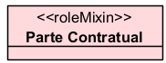

depende de um contrato.

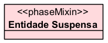

depende de um estado temporário da entidade.

### Qual é a diferença entre RoleMixin e Mixin?

- O «Mixin» é semirrígido e pode reunir características essenciais para alguns indivíduos e acidentais para outros.
- O «RoleMixin» é sempre antirrígido e sempre dependente de relação.

**Exemplo:**

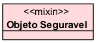

pode ser uma característica estável para alguns tipos e temporária para outros.

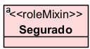

depende de uma relação securitária ou previdenciária.

### Quando devo usar RoleMixin?

Use quando o papel:

- depende de uma relação externa;
- é temporário ou contextual;
- pode ser exercido por entidades com identidades diferentes;
- é abstrato ou generaliza papéis mais específicos.

**Exemplo:**

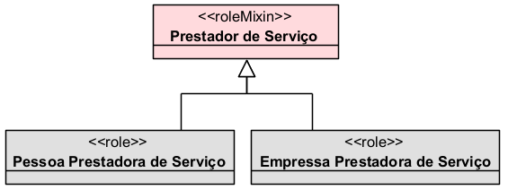

## Exemplos

### Exemplo 1 — Parte contratual
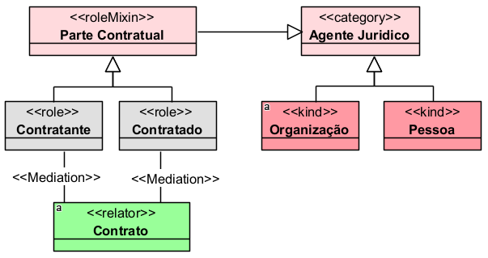

- Parte Contratual é um papel abstrato que pode ser exercido por pessoas ou organizações.

### Exemplo 2 — Participante de processo
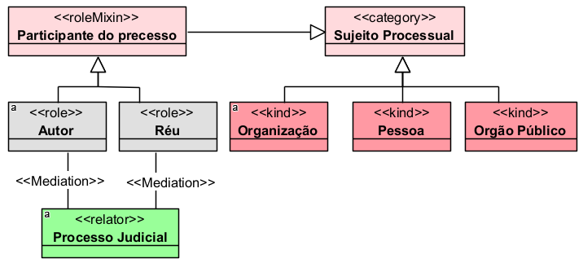

- Participante de Processo agrupa papéis processuais que dependem da existência de um processo.

## Resumo final

O «RoleMixin» deve ser usado para representar papéis abstratos, relacionais e antirrígidos que podem ser exercidos por indivíduos com diferentes princípios de identidade. Ele não fornece identidade, é sempre abstrato e depende obrigatoriamente de uma relação externa, como contrato, processo, vínculo administrativo, matrícula, atendimento ou benefício.
