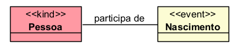
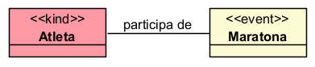
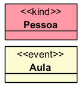
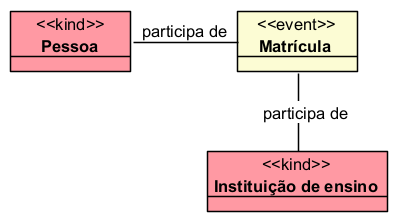
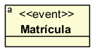
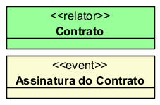
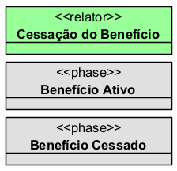
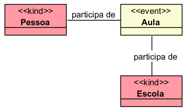
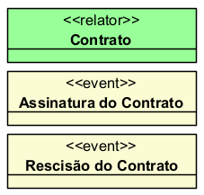
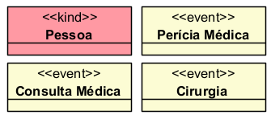

# Stereotype «Event» — resumo curto

O «Event» representa um acontecimento, ocorrência ou processo que acontece no tempo. Diferente dos objetos da UFO-A, como Pessoa, Contrato, Veículo ou Organização, o evento não é algo que permanece inteiro em cada momento. Ele se estende no tempo e é composto por partes temporais. A especificação de UFO-B define eventos como indivíduos compostos por partes temporais, que acontecem no tempo acumulando essas partes.

## Exemplos simples:

- «Event» Nascimento
- «Event» Casamento
- «Event» Reunião
- «Event» Aula
- «Event» Perícia Médica
- «Event» Protocolo de Requerimento
- «Event» Concessão de Benefício

## Categorias principais

| Propriedade | Valor |
|---|---|
| Categoria | Perdurant |
| Prove identidade | Sim |
| Princípio de identidade | Temporal |
| Rigidez | Rígido |
| Dependência | Obrigatória |
| Supertipos permitidos | Event, Complex Event, Atomic Event, conforme o nível de especialização |
| Subtipos permitidos | Atomic Event, Complex Event e especializações de eventos |
| Relação típica | Participation |
| Elementos relacionados | Object, Situation, Time Interval, Participation |

## Definição

Um «Event» deve ser usado quando a classe representa algo que ocorre, acontece, começa, termina e pode envolver participantes.

### Exemplo:

O nascimento não é uma pessoa, nem uma qualidade da pessoa. Ele é um acontecimento que ocorre em determinado intervalo temporal e envolve participantes.

### Outro exemplo:

A posse é um evento: acontece em uma data ou intervalo, altera uma situação e envolve participantes.

## Diferença entre objeto e evento

Na UFO, objetos são endurants: estão no tempo, mas permanecem inteiros em cada momento em que existem. A especificação explica que endurants são completamente presentes sempre que estão presentes.

Eventos são perdurants: acontecem no tempo e possuem partes temporais.

### Exemplo:

- A Pessoa existe ao longo do tempo e pode estar inteira presente em diferentes momentos.
- A Aula, por outro lado, possui partes temporais: início, desenvolvimento e fim.

## Restrições

Um «Event» deve ter alguma conexão com participantes. Em UFO-B, eventos são ontologicamente dependentes de seus participantes para existir. Essa participação é representada pela noção de Participation.

### Exemplo correto:

### Exemplo inadequado:

Nesse caso, o modelo está incompleto, porque não informa quem participa do evento.

## Questões comuns

### Qual é a diferença entre Event e Relator?

- O «Relator» fundamenta uma relação entre indivíduos e permanece enquanto aquela relação existir.
- O «Event» é uma ocorrência temporal.

**Exemplo:**

- O contrato é a entidade relacional.
- A assinatura do contrato é o evento que pode dar origem ao contrato.

### Qual é a diferença entre Event e Phase?

- O «Phase» representa um estado temporário de um objeto.
- O «Event» representa a ocorrência que pode levar a uma mudança de estado.

**Exemplo:**

- A cessação é o evento.
- O benefício cessado é a fase posterior.

## Exemplos

### Exemplo 1 — Educação

- A Aula é um evento porque acontece em determinado período e envolve participantes.

### Exemplo 2 — Contrato

- A assinatura e a rescisão são eventos.
- O contrato é o relator que fundamenta a relação jurídica entre as partes.

### Exemplo 3 — Saúde

- Consulta, perícia e cirurgia são eventos porque ocorrem no tempo, possuem participantes e podem alterar situações.

## Resumo final

O «Event» deve ser usado para representar acontecimentos, ocorrências ou processos temporais. Ele pertence à UFO-B, possui partes temporais, depende de participantes e pode transformar uma situação anterior em uma situação posterior. Exemplos comuns são Nascimento, Aula, Consulta, Perícia, Protocolo de Requerimento, Concessão de Benefício, Assinatura de Contrato e Sentença.
