# «HistoricalRole»

O «HistoricalRole» representa um papel histórico concreto, assumido por um indivíduo em razão de sua participação passada em um evento.

Ele é parecido com o «Role», mas com uma diferença central:

- «Role» → depende de uma relação atual ou contextual
- «HistoricalRole» → depende de um evento passado

## Exemplos simples:

- «HistoricalRole» Ex-Aluno
- «HistoricalRole» Ex-Servidor
- «HistoricalRole» Ex-Beneficiário
- «HistoricalRole» Vítima de Acidente
- «HistoricalRole» Participante de Audiência
- «HistoricalRole» Autor de Obra

## Categorias principais

| Propriedade | Valor |
|---|---|
| Categoria | AntiRigidSortal |
| Prove identidade | Não |
| Princípio de identidade | Simples |
| Rigidez | Antirrígido |
| Dependência | Obrigatória / histórica |
| Supertipos permitidos | Kind, Subkind, Collective, Quantity, Relator, Role, HistoricalRole, Category, Mixin, RoleMixin, HistoricalRoleMixin |
| Subtipos permitidos | HistoricalRole, Role |
| Relação típica | Participation |
| Elemento relacionado | Event |

## Definição

Um «HistoricalRole» deve ser usado quando uma classe representa uma condição adquirida por participação em um evento anterior.

### Exemplo:

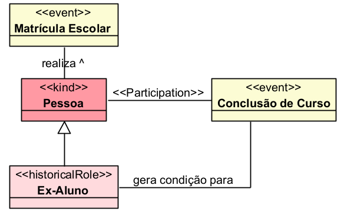

A pessoa é Ex-Aluno porque participou de eventos educacionais anteriores, como matrícula, frequência ou conclusão de curso.

### Outro exemplo:

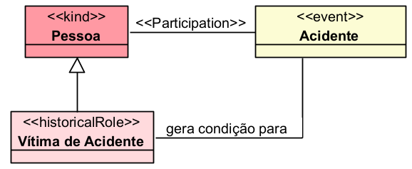

A pessoa é classificada como Vítima de Acidente porque participou historicamente do evento Acidente.

## Restrições

O «HistoricalRole» não fornece identidade própria. Ele herda a identidade de um tipo superior, geralmente um «Kind».

### Exemplo:

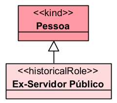

Ex-Servidor Público não define a identidade da pessoa. A identidade continua sendo fornecida por Pessoa.

Além disso, o «HistoricalRole» deve ser fundamentado por participação em evento. O modelo deve indicar qual acontecimento histórico justifica aquele papel.

### Exemplo correto:

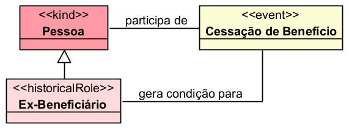

### Exemplo incompleto:

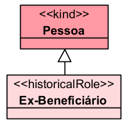

Nesse caso, falta indicar o evento que fundamenta a condição histórica.

## Questões comuns

### Qual é a diferença entre Role e HistoricalRole?

- O «Role» depende de uma relação atual.
- O «HistoricalRole» depende de um evento passado.

**Exemplo:**

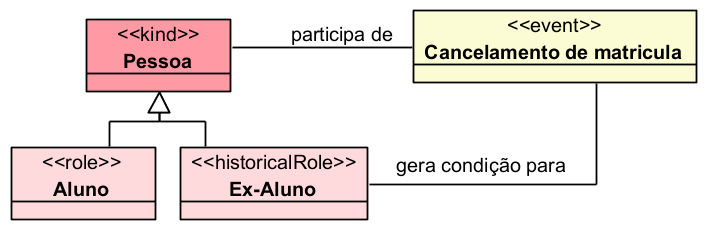

- Aluno depende de uma matrícula ou vínculo educacional atual.
- Ex-Aluno depende de uma participação passada em eventos educacionais.

### Qual é a diferença entre HistoricalRole e HistoricalRoleMixin?

- O «HistoricalRole» é usado quando os indivíduos seguem o mesmo princípio de identidade.
- O «HistoricalRoleMixin» é usado quando o papel histórico pode abranger indivíduos com diferentes princípios de identidade.

**Exemplo:**

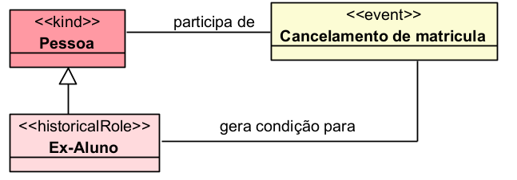

Aqui, o papel histórico é específico de Pessoa.

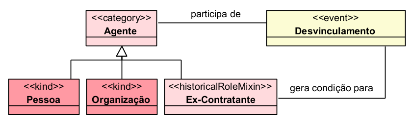

Aqui, o papel histórico pode ser exercido por pessoa ou organização.

### Qual é a diferença entre HistoricalRole e Phase?

- O «Phase» depende de uma condição interna ou estado do indivíduo.
- O «HistoricalRole» depende de participação em evento passado.

**Exemplo:**

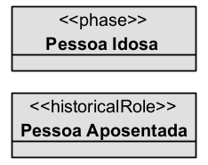

- Pessoa Idosa depende da idade.
- Pessoa Aposentada depende de um evento histórico de concessão de aposentadoria.

### Quando devo usar HistoricalRole?

Use quando a classificação:

- não fornece identidade;
- é assumida por um indivíduo de um tipo específico;
- depende de um evento passado;
- continua relevante mesmo depois do fim do evento ou da relação original.

**Exemplos:**

- «HistoricalRole» Ex-Empregado
- «HistoricalRole» Ex-Contratante
- «HistoricalRole» Ex-Beneficiário
- «HistoricalRole» Vítima de Acidente
- «HistoricalRole» Participante de Audiência

## Exemplos

### Exemplo 1 — Educação
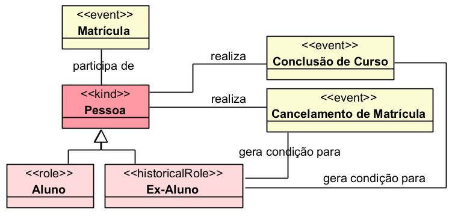

- Aluno representa o papel atual.
- Ex-Aluno representa uma condição histórica resultante de eventos anteriores.

### Exemplo 2 — Trabalho
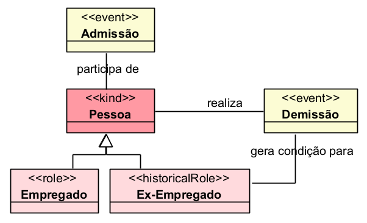

- Empregado depende da relação de trabalho atual.
- Ex-Empregado depende da participação histórica em eventos trabalhistas.

## Resumo final

O «HistoricalRole» deve ser usado para representar papéis históricos concretos assumidos por indivíduos em razão de sua participação em eventos passados. Ele não fornece identidade, é antirrígido e depende de um evento histórico, como matrícula, conclusão, demissão, acidente, audiência, concessão ou cessação de benefício.
