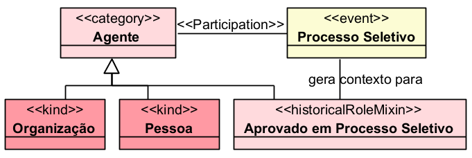
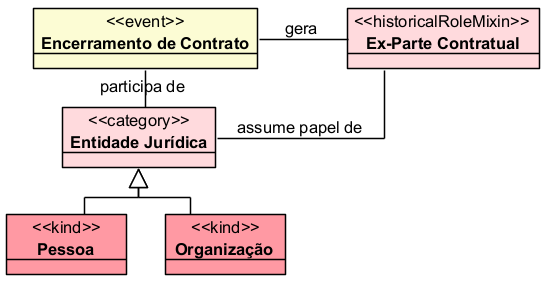
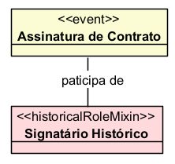
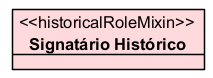
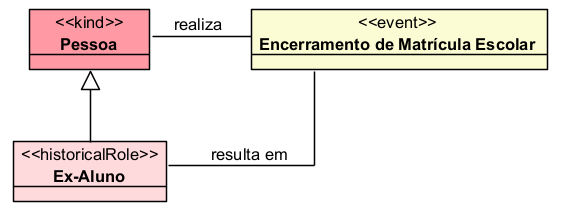
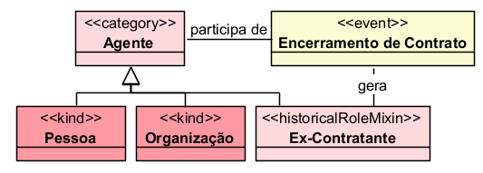
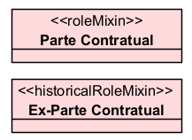
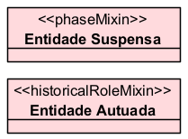
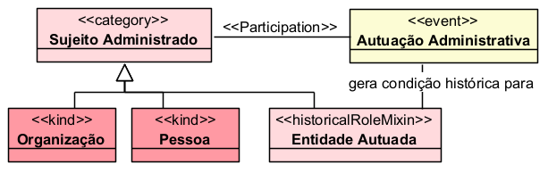
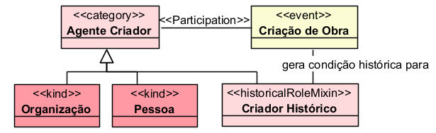

# «HistoricalRoleMixin»

O «HistoricalRoleMixin» representa um papel histórico abstrato, assumido por indivíduos que podem ter diferentes princípios de identidade, em razão de terem participado de algum evento anterior.

Ele é parecido com o «RoleMixin», mas com uma diferença importante: o RoleMixin depende de uma relação atual ou contextual; o HistoricalRoleMixin depende de uma participação histórica em um evento.

## Exemplos simples:

- «HistoricalRoleMixin» Ex-Participante
- «HistoricalRoleMixin» Vítima de Evento
- «HistoricalRoleMixin» Ex-Beneficiário
- «HistoricalRoleMixin» Autor de Produção Intelectual
- «HistoricalRoleMixin» Participante Histórico de Processo

A OntoUML Vocabulary define historicalRoleMixin como o equivalente de historicalRole para tipos que agregam instâncias com diferentes princípios de identidade.

## Categorias principais

| Propriedade | Valor |
|---|---|
| Categoria | AntiRigidNonSortal |
| Prove identidade | Não |
| Princípio de identidade | Múltiplo |
| Rigidez | Antirrígido |
| Dependência | Obrigatória / histórica |
| Supertipos permitidos | Mixin, Category, RoleMixin, HistoricalRoleMixin |
| Subtipos permitidos | HistoricalRole, HistoricalRoleMixin, Role, RoleMixin |
| Relação típica | Participation |
| Associação relacionada | Historical Dependence |
| Abstrato | Sim |

## Definição

Um «HistoricalRoleMixin» deve ser usado quando uma classe representa um papel adquirido por participação em um evento passado, mas que pode ser exercido por entidades de tipos diferentes.

### Exemplo:

Nesse caso, tanto uma Pessoa quanto uma Organização poderiam, dependendo do domínio, ser classificadas como aprovadas em um processo seletivo. A classificação decorre de um evento passado: a participação no processo seletivo.

A literatura sobre eventos em OntoUML explica que um «historicalRole» representa o papel que um endurant assume em virtude de ter participado de um evento de certo tipo. O HistoricalRoleMixin generaliza essa ideia para indivíduos com diferentes princípios de identidade.

## Restrições

O «HistoricalRoleMixin» não fornece identidade própria. A identidade continua vindo dos tipos concretos que ele generaliza, como Pessoa, Organização, Contrato, Produto, Equipamento ou outro tipo do domínio.

### Exemplo:

Ex-Parte Contratual não define o que a entidade é essencialmente. Apenas registra uma condição histórica.

Além disso, ele deve estar relacionado a algum «Event» por participação. Para que alguém seja classificado como um papel histórico, deve ter participado de um evento do tipo correspondente. Em OntoUML, o padrão de historicalRole exige uma relação com um tipo de evento por meio de «participation», com cardinalidade mínima no lado do evento indicando que a participação é obrigatória para exercer aquele papel.

### Exemplo correto:

### Exemplo inadequado:

Nesse caso, o modelo está incompleto, pois não mostra qual evento histórico fundamenta esse papel.

## Questões comuns

### Qual é a diferença entre HistoricalRole e HistoricalRoleMixin?

- O «HistoricalRole» é usado quando os indivíduos seguem o mesmo princípio de identidade.
- O «HistoricalRoleMixin» é usado quando o papel histórico pode agrupar indivíduos com princípios de identidade diferentes.

**Exemplo com HistoricalRole:**

Ex-Aluno é um papel histórico de Pessoa.

**Exemplo com HistoricalRoleMixin:**

Ex-Contratante pode reunir pessoas e organizações que participaram historicamente de contratos.

### Qual é a diferença entre RoleMixin e HistoricalRoleMixin?

- O «RoleMixin» depende de uma relação externa atual ou contextual.
- O «HistoricalRoleMixin» depende de um evento passado.

**Exemplo:**

- Parte Contratual representa quem exerce atualmente ou contextualmente um papel em uma relação contratual.
- Ex-Parte Contratual representa quem participou historicamente de um contrato, mas não necessariamente mantém a relação atual.

### Qual é a diferença entre PhaseMixin e HistoricalRoleMixin?

- O «PhaseMixin» depende de uma condição interna temporária.
- O «HistoricalRoleMixin» depende de uma participação anterior em evento.

**Exemplo:**

- Entidade Suspensa decorre de um estado atual da entidade.
- Entidade Autuada decorre de participação em um evento anterior, como uma autuação administrativa.

### Quando devo usar HistoricalRoleMixin?

Use quando a classificação:

- for abstrata;
- não fornecer identidade;
- puder abranger entidades de tipos diferentes;
- depender de participação em evento passado;
- permanecer verdadeira em razão de um histórico, e não necessariamente por uma relação atual.

**Exemplos:**

- «HistoricalRoleMixin» Ex-Participante de Licitação
- «HistoricalRoleMixin» Entidade Autuada
- «HistoricalRoleMixin» Entidade Vistoriada
- «HistoricalRoleMixin» Ex-Beneficiário
- «HistoricalRoleMixin» Signatário Histórico

## Exemplos

### Exemplo 1 — Processo administrativo

- Entidade Autuada é um papel histórico porque decorre da participação em uma autuação administrativa.

### Exemplo 2 — Produção intelectual

- Criador Histórico pode abranger pessoas ou organizações que participaram do evento de criação de uma obra.

## Resumo final

O «HistoricalRoleMixin» deve ser usado para representar papéis históricos abstratos, assumidos por entidades de diferentes tipos em razão de sua participação passada em eventos. Ele não fornece identidade, é antirrígido, possui dependência histórica obrigatória e generaliza papéis como Ex-Participante, Entidade Autuada, Ex-Beneficiário, Signatário Histórico ou Criador Histórico.
