# «Situation»

O «Situation» representa um estado de coisas que existe em determinado momento ou intervalo de tempo. Ele descreve uma configuração do mundo: quais entidades existem, quais relações estão valendo e quais condições estão satisfeitas.

## Exemplos simples:

- «Situation» Pessoa Matriculada
- «Situation» Benefício Ativo
- «Situation» Contrato Vigente
- «Situation» Processo em Análise
- «Situation» Servidor Aposentado
- «Situation» Requerimento Indeferido

Na UFO-B, as situações são importantes porque os eventos geralmente alteram situações: existe uma situação antes do evento e outra depois dele. A especificação de UFO-B trata eventos como ocorrências temporais que podem estar ligados a um estado anterior e a um estado posterior.

## Categorias principais

| Propriedade | Valor |
|---|---|
| Categoria | Situation / estado de coisas |
| Prove identidade | Não, em sentido sortal comum |
| Princípio de identidade | Contextual / dependente das entidades e relações envolvidas |
| Rigidez | Não se aplica como nos sortais da UFO-A |
| Dependência | Obrigatória |
| Supertipos permitidos | Situation e especializações de situação |
| Subtipos permitidos | Situações específicas do domínio |
| Relações típicas | pre-state, post-state, brings about, terminates, satisfies |
| Elementos relacionados | Event, Object, Relator, Mode, Quality, Participation |

## Definição

Um «Situation» deve ser usado quando se deseja representar uma condição do mundo em determinado tempo.

### Exemplo:

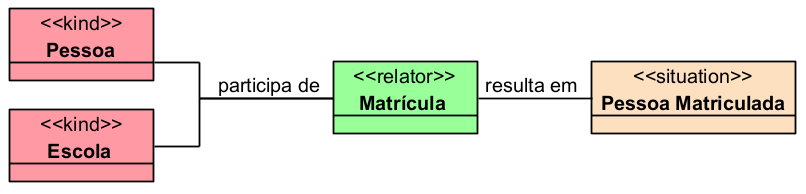

A situação Pessoa Matriculada representa o estado em que uma pessoa possui vínculo de matrícula com uma escola.

### Outro exemplo:

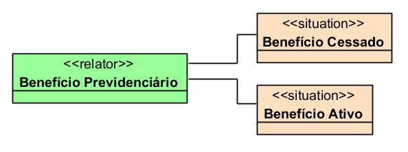

Essas situações descrevem estados possíveis de um benefício previdenciário.

## Relação entre evento e situação

Eventos normalmente mudam situações.

### Exemplo:

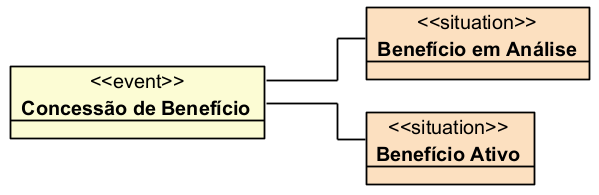

- A concessão é o evento.
- Benefício em Análise é a situação anterior.
- Benefício Ativo é a situação posterior.

### Outro exemplo:

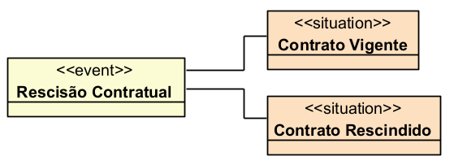

A rescisão contratual transforma a situação de vigência em situação de contrato rescindido.

## Restrições

O «Situation» não deve ser usado para representar objetos, papéis ou eventos.

### Exemplo inadequado:

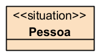

Pessoa não é situação; é um objeto persistente, normalmente modelado como:

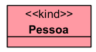

### Exemplo inadequado:

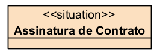

A assinatura não é uma situação; é um acontecimento. O correto seria:

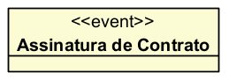

### Exemplo adequado:

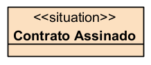

Aqui sim há uma situação, pois se representa o estado resultante da assinatura.

## Questões comuns

### Qual é a diferença entre Situation e Event?

- O «Event» representa algo que acontece.
- O «Situation» representa o estado de coisas que vale antes, durante ou depois de um acontecimento.

**Exemplo:**

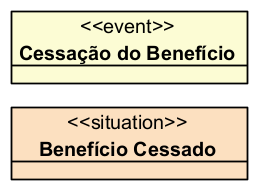

- A cessação é o evento.
- O benefício cessado é a situação resultante.

### Qual é a diferença entre Situation e Phase?

- O «Phase» classifica um indivíduo em um estado temporário.
- O «Situation» descreve uma configuração mais ampla do mundo ou do domínio.

**Exemplo:**

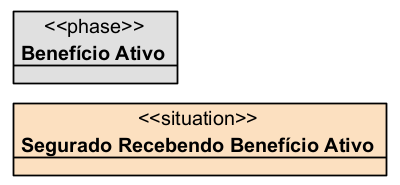

- Benefício Ativo pode ser uma fase do benefício.
- Segurado Recebendo Benefício Ativo é uma situação envolvendo segurado, benefício e relação de recebimento.

### Quando devo usar Situation?

Use quando quiser representar uma condição como:

- Benefício está ativo
- Contrato está vigente
- Pessoa está matriculada
- Processo está em análise
- Servidor está aposentado
- Pedido foi indeferido
- Aluno está frequentando aula

Ou seja, quando a ideia principal for um estado de coisas, e não um objeto ou evento isolado.

## Exemplos

### Exemplo 1 — Educação
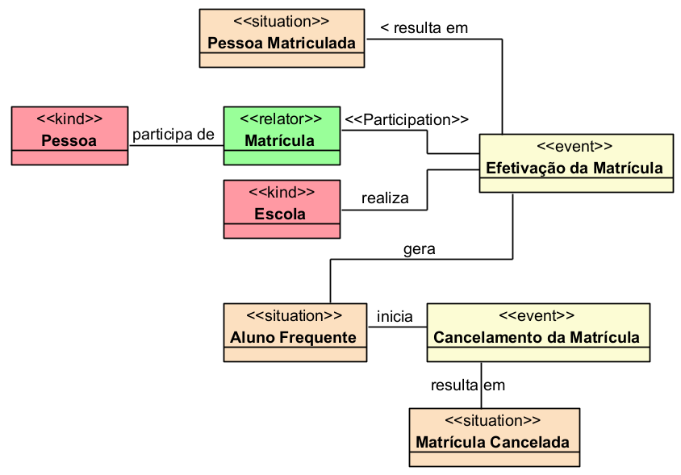

- A efetivação e o cancelamento são eventos.
- As situações representam estados resultantes desses eventos.

## Resumo final

O «Situation» deve ser usado para representar estados de coisas: condições que valem em determinado momento ou intervalo. Ele não é objeto, não é papel e não é evento. Em UFO-B, sua função principal é descrever o contexto anterior ou posterior a eventos, como Benefício Ativo, Contrato Vigente, Pessoa Matriculada, Processo em Análise ou Pedido Indeferido.
