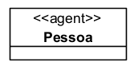
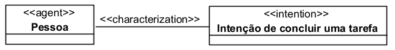
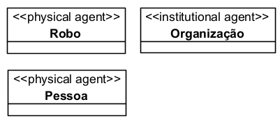
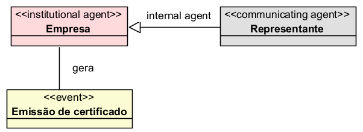
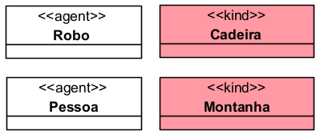
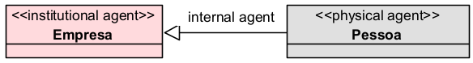
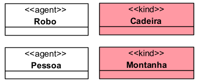
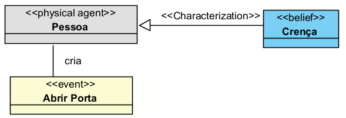
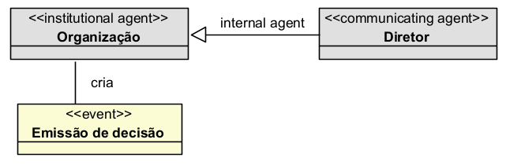

# «Agent»

O «Agent» é uma categoria da UFO-C usada para representar entidades capazes de agir, perceber eventos e possuir estados mentais ou intencionais.

Na UFO-C, um agente não é apenas uma entidade que existe no tempo, mas uma entidade que pode participar ativamente da realidade por meio de ações, percepções, comunicações, intenções, crenças e desejos.

## Exemplos simples de «Agent»:

* Pessoa
* Animal
* Robô
* Organização
* Associação
* Unidade institucional

Uma instância de Pessoa, por exemplo, pode ser considerada um agente porque pode perceber eventos, formar crenças, possuir desejos, estabelecer intenções e realizar ações.

Uma Organização também pode ser tratada como agente quando atua por meio de seus membros, comunica-se, toma decisões e realiza ações no contexto social.

## Definição

Um «Agent» representa uma entidade capaz de:

* realizar ações;
* perceber eventos;
* possuir estados mentais;
* carregar momentos intencionais;
* participar de interações sociais;
* comunicar-se com outros agentes, quando for um agente comunicante.

Na UFO-C, o conceito de Agent é central porque permite representar entidades que não apenas existem, mas também atuam intencionalmente.

### Exemplo:

A classe Pessoa representa uma entidade capaz de agir, perceber eventos e possuir momentos intencionais.

## Relação com Intentional Moment

Na UFO-C, um Agent pode carregar Intentional Moments.

Um **Intentional Moment** é um momento que depende existencialmente de um agente e possui conteúdo direcionado a algo.

Exemplos:

* Uma crença de um agente;
* Um desejo de um agente;
* Uma intenção de um agente;
* Um objetivo individual de um agente.

Esses momentos não existem isoladamente. Eles existem porque pertencem a um agente.

### Exemplo:

Neste exemplo, a intenção depende da pessoa para existir. A intenção é um momento intencional que inere no agente.

## Restrições

Um «Agent» deve ser usado apenas quando a entidade representada possuir capacidade agentiva.

Isso significa que a entidade deve poder, em algum sentido:

* agir;
* perceber;
* possuir estados mentais;
* comunicar-se;
* participar de interações sociais;
* produzir eventos de ação.

Nem todo objeto físico é um agente.

Por exemplo:

* Uma cadeira não é Agent;
* Uma pedra não é Agent;
* Uma montanha não é Agent;
* Uma porta não é Agent.

Esses elementos são objetos não agentivos, pois não agem intencionalmente, não percebem eventos e não possuem estados mentais.

## Questões comuns

### Todo «Kind» pode ser Agent?

Não. Um «Kind» pode representar qualquer tipo essencial de entidade, mas apenas alguns kinds representam agentes.

Pessoa e Organização podem ser agentes. Livro e Pedra não devem ser agentes, pois são objetos não agentivos.

### Agent é sempre uma pessoa?

Não. Pessoa é um exemplo de Agent, mas não é o único.

A UFO-C também admite agentes não humanos, como animais e robôs, além de agentes institucionais, como organizações e associações.

**Exemplo:**

### Uma organização pode ser Agent?

Sim. Uma organização pode ser considerada um Institutional Agent quando atua, percebe e comunica por meio de agentes internos.

**Exemplo:**

### Qual a diferença entre Agent e kind?

A diferença está na agentividade.

Um **Agent** pode agir, perceber e possuir estados mentais.

Um **kind** não possui agentividade.

**Exemplo:**

### Qual a diferença entre Physical Agent e Institutional Agent?

O **Physical Agent** é uma entidade física concreta capaz de agir diretamente.

O **Institutional Agent** é uma entidade social que age por meio de agentes internos.

**Exemplo:**

## Quando devo usar Agent?

Use «Agent» quando a classe representar uma entidade capaz de agir ou participar de ações intencionais.

**Exemplo:**

Não use «Agent» para objetos passivos ou meramente físicos que não possuem capacidade agentiva.

**Exemplo incorreto:**

`«Agent» Cadeira`

**Forma mais adequada:**

`«kind» Cadeira`

## Exemplos

### Exemplo 1 — Pessoa como Agent

Pessoa é um agente físico capaz de possuir estados mentais e realizar ações.

### Exemplo 2 — Organização como Institutional Agent

Organização pode ser modelada como Institutional Agent porque atua por meio de agentes internos.

## Resumo prático

Use «Agent» quando quiser representar uma entidade que:

* age;
* percebe;
* possui estados mentais;
* tem intenções;
* possui objetivos;
* comunica-se;
* participa de interações sociais;
* pode produzir eventos de ação.

Não use «Agent» para objetos passivos ou meramente físicos que não possuem capacidade agentiva.
