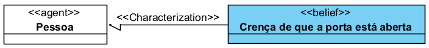
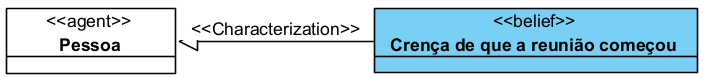
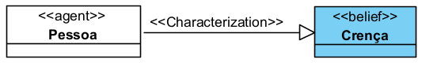
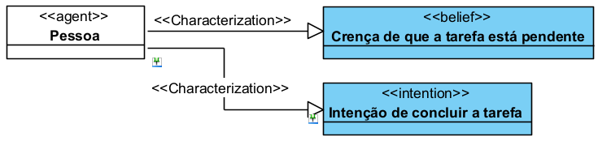
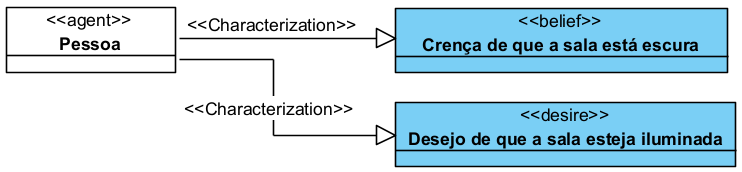
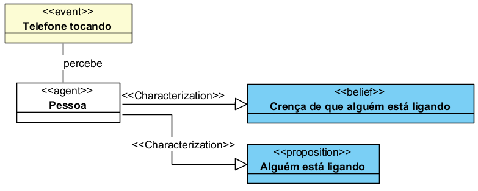
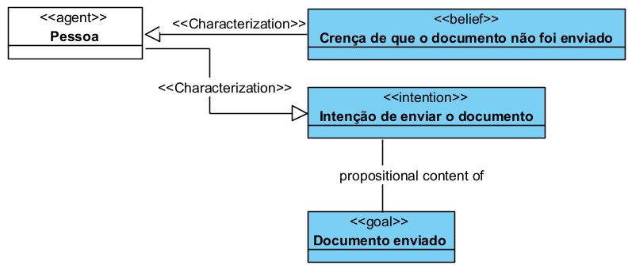

# «Belief»

O «Belief» é uma categoria da UFO-C usada para representar uma crença de um agente.

Na UFO-C, Belief é um tipo de **Mental Moment**, isto é, um momento mental que depende existencialmente de um agente. Ele representa algo que o agente toma como verdadeiro, ainda que essa crença possa ou não corresponder à realidade.

## Exemplos simples de «Belief»:

* Crença de que uma informação é verdadeira
* Crença de que um evento ocorreu
* Crença de que uma situação existe
* Crença de que uma tarefa foi concluída
* Crença de que outro agente realizou uma ação

Uma instância de Belief, por exemplo, não existe sozinha. Ela depende de um agente que acredita em algo.

## Definição

Um «Belief» representa uma crença mantida por um agente sobre determinado conteúdo proposicional.

Esse conteúdo pode ser verdadeiro ou falso. O ponto principal é que o agente acredita que aquela proposição corresponde a um estado de coisas.

Um Belief representa um conceito que:

* depende existencialmente de um Agent;
* é um tipo de Mental Moment;
* possui conteúdo proposicional;
* representa aquilo que o agente acredita;
* pode influenciar intenções, desejos e ações;
* não existe de forma independente do agente que o possui.

### Exemplo:

A crença de que a porta está aberta depende da pessoa que possui essa crença. A crença não existe isoladamente.

## Relação com Agent

Na UFO-C, Belief é um momento mental que inere em um agente.

Isso significa que a crença pertence ao agente e depende dele para existir.

### Exemplo:

Neste exemplo, a crença é um Mental Moment da Pessoa.

A forma mais adequada da relação é:

E não:

Porque quem inere é o momento mental no agente, e não o agente no momento mental.

## Restrições

Um «Belief» deve ser usado apenas para representar crenças ou estados mentais cognitivos de um agente.

Não deve ser usado para representar:

* fato objetivo;
* evento;
* ação;
* norma;
* objeto físico;
* relação social;
* desejo;
* intenção;
* objetivo.

Para fatos ou estados de coisas, use Proposition ou Situation.

Para desejos, use Desire.

Para intenções, use Intention.

Para ações, use Action Event.

## Questões comuns

### Belief é uma Proposition?

Não.

Belief é o estado mental do agente.

Proposition é o conteúdo desse estado mental.

**Exemplo:**

### Belief precisa ser verdadeiro?

Não.

Belief representa aquilo que o agente acredita, mesmo que a proposição seja falsa.

**Exemplo:**

Essa crença pode existir ainda que a reunião não tenha começado.

### Todo Agent possui Belief?

Não necessariamente.

A UFO-C permite representar agentes com momentos mentais, mas não obriga que todo agente em todo modelo tenha Belief explicitamente representado.

Use Belief apenas quando a crença for relevante para o modelo.

### Belief é o mesmo que Intention?

Não.

Belief representa aquilo que o agente acredita.

Intention representa aquilo que o agente pretende realizar.

**Exemplo:**

### Belief é o mesmo que Desire?

Não.

Belief representa uma crença sobre o mundo.

Desire representa um estado desejado pelo agente.

**Exemplo:**

## Quando devo usar Belief?

Use «Belief» quando precisar representar aquilo que um agente acredita.

**Exemplo:**

Use Belief quando a crença for importante para explicar:

* uma decisão;
* uma intenção;
* uma ação;
* uma expectativa;
* uma interpretação;
* uma comunicação;
* um comportamento do agente.

## Exemplos

### Exemplo 1 — Crença formada por percepção

A percepção do evento pode contribuir para a formação da crença.

### Exemplo 2 — Belief influenciando Intention

A crença de que o documento não foi enviado pode motivar a intenção de enviá-lo.

## Resumo prático

Use «Belief» quando quiser representar uma crença de um agente.

Não use Belief para representar o fato em si. Use Belief para representar que um agente acredita naquele conteúdo.
