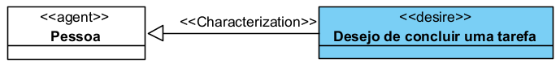
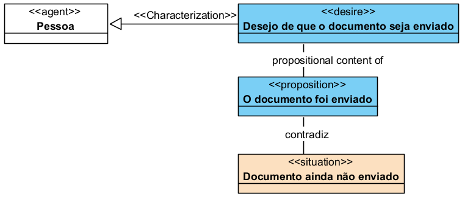
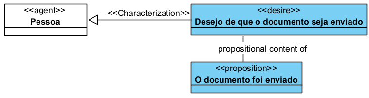
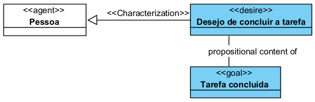
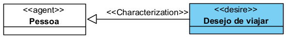
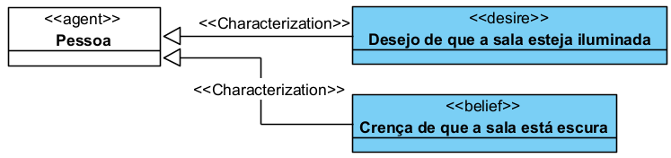
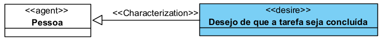
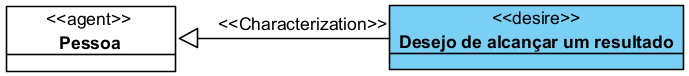
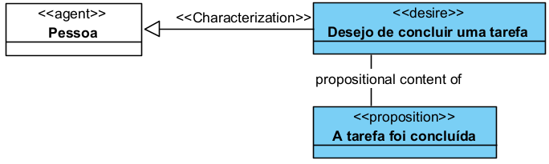
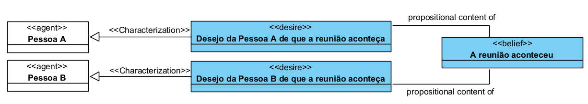

# «Desire»

O «Desire» é uma categoria da UFO-C usada para representar um desejo de um agente.

Na UFO-C, Desire é um tipo de **Mental Moment**, isto é, um momento mental que depende existencialmente de um agente. Ele representa algo que o agente quer, busca ou gostaria que fosse verdadeiro ou realizado.

## Exemplos simples de «Desire»:

* Desejo de concluir uma tarefa
* Desejo de alcançar um resultado
* Desejo de que uma situação aconteça
* Desejo de evitar uma situação
* Desejo de modificar um estado de coisas

Uma instância de Desire, por exemplo, não existe sozinha. Ela depende de um agente que deseja algo.

## Definição

Um «Desire» representa um estado mental de um agente voltado a algo que ele deseja que ocorra, permaneça ou seja alcançado.

Esse conteúdo pode ser um estado de coisas futuro, uma situação pretendida, uma mudança na realidade ou a manutenção de uma condição considerada desejável pelo agente.

Um Desire representa um conceito que:

* depende existencialmente de um Agent;
* é um tipo de Mental Moment;
* possui conteúdo proposicional;
* representa aquilo que o agente deseja;
* pode influenciar intenções e ações;
* não existe de forma independente do agente que o possui.

### Exemplo:

A vontade de concluir a tarefa depende da pessoa que possui esse desejo. O Desire não existe isoladamente.

## Desire satisfeito e Desire não satisfeito

Um Desire pode existir mesmo que seu conteúdo ainda não tenha sido realizado.

O desejo aponta para um estado de coisas pretendido, mas esse estado pode ainda não existir.

### Exemplo:

Mesmo que a situação real seja “Documento ainda não enviado”, o Desire pode existir como estado mental da pessoa.

## Restrições

Um «Desire» deve ser usado apenas para representar desejos ou estados mentais volitivos de um agente.

Não deve ser usado para representar:

* fato objetivo;
* evento;
* ação;
* norma;
* objeto físico;
* relação social;
* crença;
* intenção;
* objetivo em si.

Para fatos ou estados de coisas, use Proposition ou Situation.

Para crenças, use Belief.

Para intenções, use Intention.

Para objetivos, use Goal.

Para ações, use Action Event.

## Questões comuns

### Desire é uma Proposition?

Não.

Desire é o estado mental do agente.

Proposition é o conteúdo desse estado mental.

**Exemplo:**

### Desire é o mesmo que Goal?

Não.

Desire é o desejo do agente.

Goal é o objetivo representado como uma proposição.

**Exemplo:**

### Todo Desire vira Intention?

Não.

Um agente pode desejar algo sem se comprometer a agir para realizar esse desejo.

**Exemplo:**

A pessoa pode desejar viajar, mas não necessariamente terá uma intenção concreta de comprar passagem ou organizar a viagem.

### Desire é o mesmo que Belief?

Não.

Belief representa aquilo que o agente acredita.

Desire representa aquilo que o agente deseja.

**Exemplo:**

### Desire precisa ser realizado para existir?

Não.

Um desejo pode existir mesmo quando o estado desejado ainda não foi alcançado.

**Exemplo:**

Esse desejo pode existir mesmo antes de a tarefa ser concluída.

## Quando devo usar Desire?

Use «Desire» quando precisar representar aquilo que um agente deseja.

**Exemplo:**

Use Desire quando o desejo for importante para explicar:

* uma intenção;
* uma motivação;
* uma expectativa;
* uma ação;
* uma decisão;
* uma orientação de comportamento;
* uma busca por determinado objetivo.

## Exemplos

### Exemplo 1 — Pessoa com desejo simples

A Pessoa possui um desejo cujo conteúdo é a proposição “A tarefa foi concluída”.

### Exemplo 2 — Dois agentes com o mesmo conteúdo desejado

A proposição é a mesma, mas existem dois Desires distintos, um para cada agente.

## Resumo prático

Use «Desire» quando quiser representar um desejo de um agente.

Não use Desire para representar o fato em si. Use Desire para representar que um agente deseja determinado conteúdo.
