# «Goal»

O «Goal» é uma categoria da UFO-C usada para representar um objetivo.

Na UFO-C, Goal pode ser compreendido como um conteúdo proposicional que expressa um estado de coisas que um agente deseja alcançar, manter ou tornar verdadeiro.

Diferente de Belief, Desire e Intention, que são Mental Moments do agente, Goal representa o conteúdo objetivo para o qual esses estados mentais podem estar direcionados.

## Exemplos simples de «Goal»:

* Tarefa concluída
* Documento enviado
* Problema resolvido
* Porta aberta
* Mensagem comunicada
* Relatório finalizado
* Resultado alcançado

Um Goal representa aquilo que pode ser desejado, pretendido ou buscado por um agente.

## Definição

Um «Goal» representa um estado de coisas desejado ou pretendido por um agente.

Ele pode funcionar como conteúdo de um Desire ou de uma Intention.

Um Goal representa um conceito que:

* é um tipo de Proposition;
* representa um objetivo;
* pode ser conteúdo de um Desire;
* pode ser conteúdo de uma Intention;
* pode orientar ações por meio de intenções;
* não é o próprio estado mental do agente;
* não é a ação realizada;
* não é necessariamente uma situação já existente.

### Exemplo:

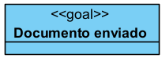

Neste exemplo, “Tarefa concluída” é um objetivo formulado como conteúdo proposicional.

## Relação com Proposition

Goal é uma especialização de Proposition.

Toda Goal é uma Proposition, mas nem toda Proposition é necessariamente uma Goal.

Uma Proposition pode apenas descrever um conteúdo.

Um Goal, por sua vez, descreve um conteúdo tratado como objetivo.

### Exemplo:

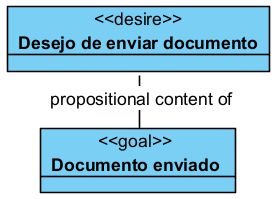

Neste exemplo, o conteúdo “Documento enviado” não é apenas uma proposição, mas um objetivo a ser alcançado.

## Restrições

Um «Goal» deve ser usado apenas para representar objetivos formulados como conteúdo proposicional.

Não deve ser usado para representar:

* agente;
* crença;
* desejo;
* intenção;
* ação;
* evento;
* situação concreta;
* objeto físico;
* relação social em si.

Para o agente, use Agent.

Para crenças, use Belief.

Para desejos, use Desire.

Para intenções, use Intention.

Para ações, use Action Event.

Para estados de coisas reais, use Situation.

Para relações sociais, use Social Moment.

## Questões comuns

### Goal é o mesmo que Desire?

Não.

Desire é o estado mental do agente.

Goal é o conteúdo desejado.

**Exemplo:**

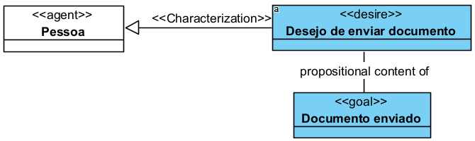

### Goal é o mesmo que Intention?

Não.

Intention é o estado mental prático do agente.

Goal é o objetivo pretendido.

**Exemplo:**

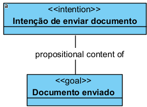

### Goal é o mesmo que Action Event?

Não.

Goal é o objetivo.

Action Event é a ação que pode ser realizada para alcançar esse objetivo.

**Exemplo:**

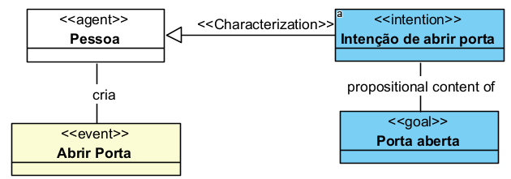

### Goal precisa ser alcançado para existir?

Não.

Um Goal pode existir como objetivo mesmo antes de ser alcançado.

**Exemplo:**

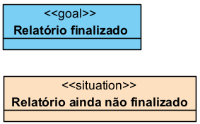

### Todo Goal precisa estar ligado a uma Intention?

Não necessariamente.

Um Goal pode estar ligado a Desire, Intention, Belief ou até a um conteúdo comunicado.

No entanto, se o objetivo estiver sendo perseguido de forma prática, a ligação com Intention costuma ser a mais adequada.

## Quando devo usar Goal?

Use «Goal» quando precisar representar um objetivo.

**Exemplo:**

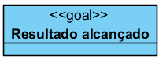

Use Goal quando o conteúdo proposicional for:

* desejado;
* pretendido;
* buscado;
* comunicado como objetivo;
* usado para orientar uma ação;
* usado para explicar uma intenção.

## Exemplos

### Exemplo 1 — Goal como conteúdo de Intention

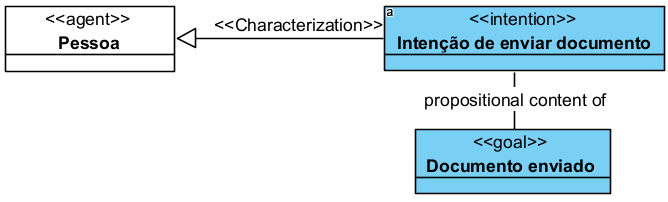

A Pessoa possui uma intenção orientada ao Goal “Documento enviado”.

### Exemplo 2 — Goal orientando Action Event

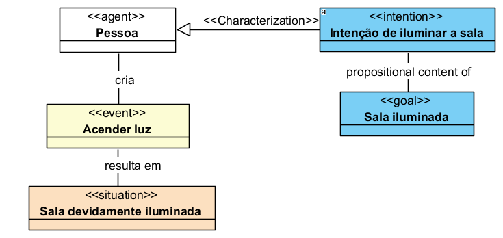

O Goal orienta a intenção, e a ação produz uma situação correspondente.

## Resumo prático

Use «Goal» quando quiser representar um objetivo.

A estrutura básica é:

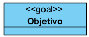

Quando for conteúdo de desejo:

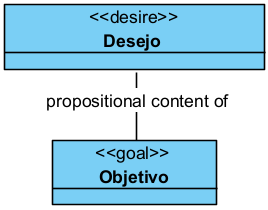

Quando for conteúdo de intenção:

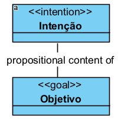

Quando orientar uma ação:

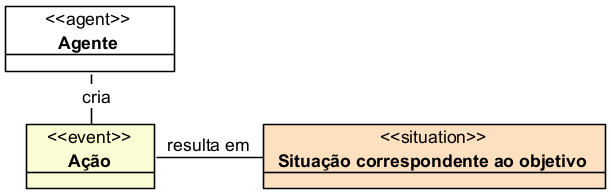

Não use Goal para representar o desejo, a intenção ou a ação em si. Use Goal para representar o conteúdo objetivo ao qual esses elementos se dirigem.
