# «Intention»

O «Intention» é uma categoria da UFO-C usada para representar uma intenção de um agente.

Na UFO-C, Intention é um tipo de **Mental Moment**, isto é, um momento mental que depende existencialmente de um agente. Ela representa aquilo que o agente pretende realizar, alcançar ou produzir como resultado de sua atuação.

Diferente de Belief, que representa aquilo que o agente acredita, e de Desire, que representa aquilo que o agente deseja, Intention indica uma orientação prática do agente em direção a uma ação ou objetivo.

## Exemplos simples de «Intention»:

* Intenção de enviar uma mensagem
* Intenção de concluir uma tarefa
* Intenção de abrir uma porta
* Intenção de resolver um problema
* Intenção de alcançar determinado objetivo
* Intenção de comunicar uma informação

Uma instância de Intention, por exemplo, não existe sozinha. Ela depende de um agente que pretende realizar algo.

## Definição

Um «Intention» representa um estado mental de um agente voltado à realização de uma ação ou ao alcance de determinado objetivo.

A intenção indica que o agente não apenas deseja algo, mas se orienta de forma prática para realizar, produzir ou alcançar determinado estado de coisas.

Um Intention representa um conceito que:

* depende existencialmente de um Agent;
* é um tipo de Mental Moment;
* possui conteúdo proposicional;
* pode ter como conteúdo um Goal;
* representa aquilo que o agente pretende realizar;
* pode orientar a criação de Action Events;
* não existe de forma independente do agente que a possui.

### Exemplo:

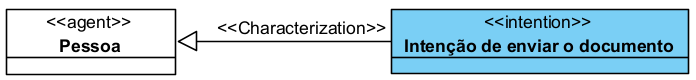

A intenção de concluir a tarefa depende da pessoa que possui essa intenção. A Intention não existe isoladamente.

## Restrições

Um «Intention» deve ser usado apenas para representar intenções ou estados mentais práticos de um agente.

Não deve ser usado para representar:

* fato objetivo;
* evento;
* ação;
* norma;
* objeto físico;
* relação social;
* crença;
* desejo;
* objetivo em si.

Para fatos ou estados de coisas, use Proposition ou Situation.

Para crenças, use Belief.

Para desejos, use Desire.

Para objetivos, use Goal.

Para ações, use Action Event.

## Questões comuns

### Intention é uma Proposition?

Não.

Intention é o estado mental do agente.

Proposition é o conteúdo desse estado mental.

**Exemplo:**

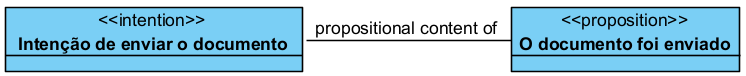

### Intention é o mesmo que Goal?

Não.

Intention é a intenção do agente.

Goal é o objetivo representado como uma proposição.

**Exemplo:**

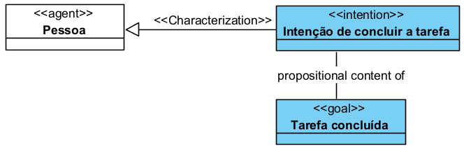

### Toda Intention gera um Action Event?

Não necessariamente.

Uma intenção pode existir sem que a ação correspondente ocorra.

**Exemplo:**

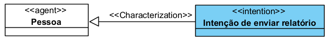

Essa intenção pode existir mesmo que o relatório ainda não tenha sido enviado.

### Toda Intention vem de um Desire?

Não obrigatoriamente.

Um Desire pode contribuir para a formação de uma Intention, mas a ontologia não exige que toda intenção seja explicitamente derivada de um desejo no modelo.

**Exemplo:**

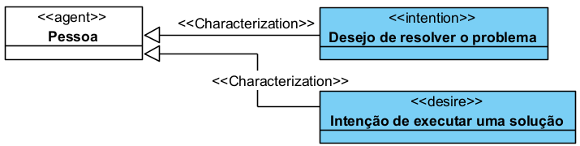

### Intention é o mesmo que Action Event?

Não.

Intention é um estado mental.

Action Event é um evento produzido por uma ação do agente.

**Exemplo:**

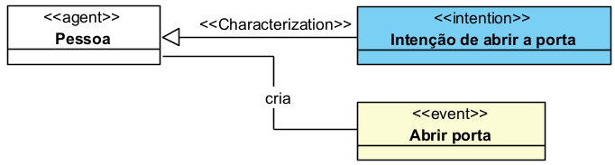

## Quando devo usar Intention?

Use «Intention» quando precisar representar aquilo que um agente pretende realizar.

**Exemplo:**

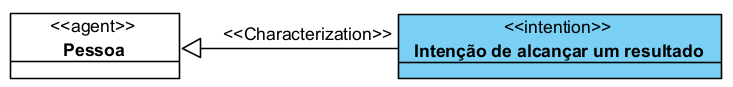

Use Intention quando a intenção for importante para explicar:

* uma ação;
* uma decisão;
* uma comunicação;
* uma mudança de situação;
* um comportamento orientado por objetivo;
* a relação entre desejo, objetivo e ação.

## Exemplos

### Exemplo 1 — Pessoa com intenção simples

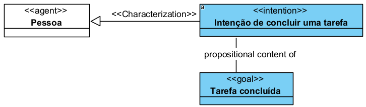

A Pessoa possui uma intenção cujo conteúdo é o objetivo “Tarefa concluída”.

### Exemplo 2 — Intention relacionada a Goal

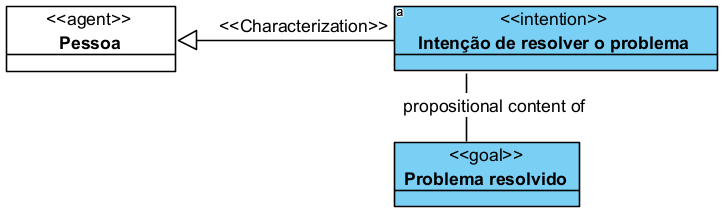

A Intention tem como conteúdo um Goal.

## Resumo prático

Use «Intention» quando quiser representar uma intenção de um agente.

A estrutura básica é:

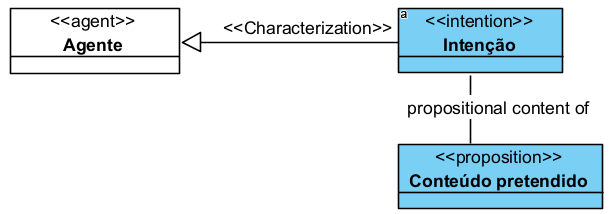

Quando a intenção estiver orientada a um objetivo, use:

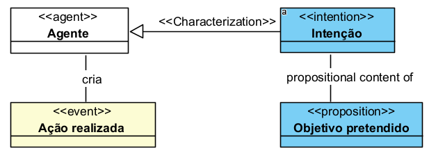

Quando a intenção orientar uma ação, use:

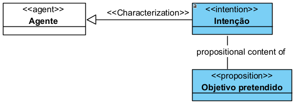

Não use Intention para representar a ação em si. Use Intention para representar que um agente pretende realizar determinado conteúdo ou alcançar determinado objetivo.
