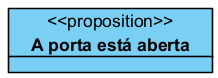
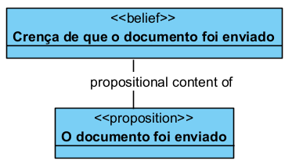
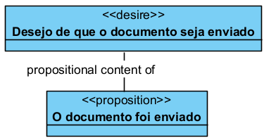
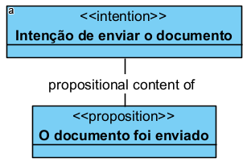
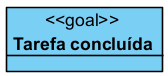
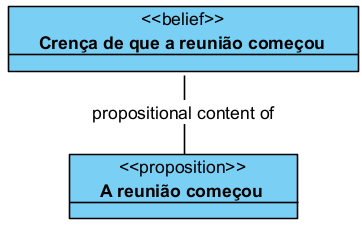
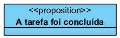
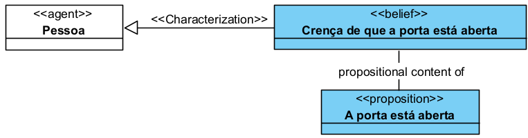
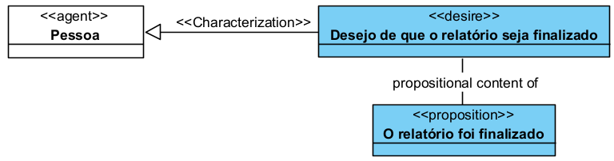

# «Proposition»

A «Proposition» é uma categoria usada para representar o conteúdo proposicional de momentos intencionais, como crenças, desejos, intenções e objetivos.

Na UFO-C, agentes podem possuir Mental Moments, como Belief, Desire e Intention. Esses momentos não são apenas estados mentais isolados: eles normalmente se referem a algum conteúdo. Esse conteúdo pode ser representado como uma Proposition.

## Exemplos simples de «Proposition»:

* A porta está aberta
* A tarefa foi concluída
* O documento foi enviado
* A reunião começou
* O problema foi resolvido
* A mensagem foi recebida

Uma Proposition representa um conteúdo que pode ser acreditado, desejado, pretendido ou comunicado por um agente.

## Definição

Uma «Proposition» representa um conteúdo declarativo ou proposicional.

Ela expressa algo que pode ser tomado como verdadeiro, desejado, pretendido, comunicado ou assumido por um agente.

Uma Proposition representa um conceito que:

* pode ser conteúdo de uma crença;
* pode ser conteúdo de um desejo;
* pode ser conteúdo de uma intenção;
* pode representar um objetivo, quando especializada como Goal;
* não é o próprio estado mental do agente;
* não é necessariamente a situação real;
* pode ser verdadeira ou falsa em relação à realidade.

### Exemplo:

Neste exemplo, “A porta está aberta” representa um conteúdo proposicional. Esse conteúdo pode ser acreditado, desejado ou pretendido por um agente.

## Restrições

Uma «Proposition» deve ser usada para representar conteúdo proposicional.

Não deve ser usada para representar:

* o agente que possui o estado mental;
* o próprio estado mental;
* o evento que ocorre;
* a ação realizada;
* a situação concreta;
* o objeto físico;
* a relação social.

Para o agente, use Agent.

Para crenças, use Belief.

Para desejos, use Desire.

Para intenções, use Intention.

Para objetivos, use Goal.

Para eventos, use Event ou Action Event.

Para estados de coisas reais, use Situation.

## Questões comuns

### Proposition é o mesmo que Belief?

Não.

Belief é o estado mental.

Proposition é o conteúdo acreditado.

**Exemplo:**

### Proposition é o mesmo que Desire?

Não.

Desire é o estado mental do agente.

Proposition é o conteúdo desejado.

**Exemplo:**

### Proposition é o mesmo que Intention?

Não.

Intention é o estado mental prático do agente.

Proposition é o conteúdo pretendido.

**Exemplo:**

### Proposition é o mesmo que Goal?

Não exatamente.

Goal é um tipo específico de Proposition.

Toda Goal pode ser tratada como Proposition, mas nem toda Proposition é necessariamente um Goal.

**Exemplo:**

Tarefa concluída é um tipo de proposition

### Proposition precisa ser verdadeira?

Não.

Uma Proposition pode ser conteúdo de uma crença falsa, de um desejo ainda não realizado ou de uma intenção ainda não executada.

**Exemplo:**

Essa Proposition pode ser falsa em relação à Situation real.

## Quando devo usar Proposition?

Use «Proposition» quando precisar representar o conteúdo de:

* uma crença;
* um desejo;
* uma intenção;
* um objetivo;
* uma comunicação;
* uma interpretação;
* uma expectativa;
* um estado de coisas descrito.

**Exemplo:**

Use Proposition quando o foco estiver no conteúdo formulado, e não no agente, no evento ou na situação concreta.

## Exemplos

### Exemplo 1 — Proposition como conteúdo de Belief

A Proposition é o conteúdo acreditado pela Pessoa.

### Exemplo 2 — Proposition como conteúdo de Desire

A Proposition é o conteúdo desejado pela Pessoa.

## Resumo prático

Use «Proposition» quando quiser representar um conteúdo proposicional.

A estrutura básica é:

`«Mental Moment» Estado mental --propositional content of-- «Proposition» Conteúdo proposicional`

Exemplos:

`«Belief» Crença --propositional content of-- «Proposition» Conteúdo acreditado`

`«Desire» Desejo --propositional content of-- «Proposition» Conteúdo desejado`

`«Intention» Intenção --propositional content of-- «Proposition» Conteúdo pretendido`

Quando o conteúdo for um objetivo, use:

`«Goal» Objetivo`

Não use Proposition para representar o estado mental em si. Use Proposition para representar o conteúdo ao qual o estado mental se refere.
