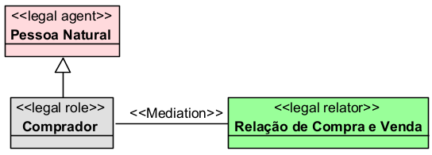
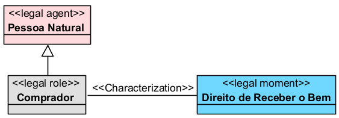
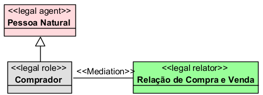

# «Legal Agent»

## Definição

O `«Legal Agent»` representa o **agente juridicamente relevante**, isto é, a entidade capaz de participar de relações jurídicas, desempenhar papéis jurídicos e estar vinculada a posições jurídicas, como direitos, deveres, poderes, permissões, sujeições, imunidades ou responsabilidades.

Na UFO-L, o agente jurídico está associado à ideia de sujeito capaz de atuar no universo jurídico. Ele pode participar de relações jurídicas, ocupar papéis jurídicos específicos e ser afetado por normas, atos jurídicos, decisões, contratos ou situações jurídicas.

## Exemplo

Um exemplo de `«Legal Agent»` é:

Nesse caso, a `Pessoa Natural` é tratada como sujeito juridicamente relevante, pois pode celebrar contratos, ajuizar ações, adquirir direitos, assumir deveres e participar de relações jurídicas.

## Relações

O `«Legal Agent»` normalmente se relaciona com outros elementos da UFO-L da seguinte forma:

### Com `«Legal Role»`

Um agente jurídico pode desempenhar um papel jurídico em determinada relação.

Exemplo:

### Com `«Legal Relator»`

O agente jurídico participa de uma relação jurídica, normalmente por meio de um papel jurídico.

Exemplo:

### Com `«Legal Moment»`

O agente jurídico pode ser portador de uma posição jurídica.

Exemplo:

## Restrições

O `«Legal Agent»` deve ser usado apenas quando a entidade tiver capacidade de participar juridicamente de uma relação.

Principais restrições:

* deve poder desempenhar algum papel jurídico;
* deve poder estar vinculado a uma posição jurídica;
* deve poder participar de relações jurídicas;
* pode ser individual, como uma pessoa natural;
* pode ser coletivo ou institucional, como empresa, associação, fundação, órgão público ou Estado;
* não deve ser usado para objetos jurídicos sem agência.

Exemplo de uso inadequado:

O contrato não deve ser modelado como agente, pois ele não pratica atos por si mesmo. Ele pode fundamentar ou estruturar uma relação jurídica, mas os agentes são as partes contratantes.

## Questões comuns

### Pessoa Natural é `«Legal Agent»` ou `«kind»`?

No OntoUML tradicional, `Pessoa Natural` normalmente seria modelada como `«kind»`.

Porém, em uma adaptação baseada na UFO-L, é possível usar:

Nesse caso, deve-se explicar no texto que `«Legal Agent»` é um stereotype jurídico adaptado, mapeado para os construtos formais da UFO/OntoUML.

### Pessoa Jurídica é `«Legal Agent»`?

Sim.

A pessoa jurídica pode participar de relações jurídicas, contratar, assumir obrigações, ser titular de direitos, responder judicialmente e praticar atos jurídicos por meio de seus representantes.

### Contrato é `«Legal Agent»`?

Não.

O contrato não é agente. Ele não pratica atos por si mesmo e não é titular de direitos ou deveres. O contrato pode fundamentar ou estruturar uma relação jurídica, mas os agentes são as partes contratantes.

### Processo é `«Legal Agent»`?

Não.

O processo não é agente. Ele não pratica atos por si mesmo. Em uma modelagem baseada na UFO-L, o processo pode ser representado como uma relação jurídica reificada ou como estrutura processual, dependendo do recorte adotado.

### Juiz é `«Legal Agent»`?

Depende do recorte do modelo.

Se o foco for a pessoa física investida na função, pode-se modelar:

Se o foco for a instituição que exerce jurisdição, pode-se modelar:

Já o papel exercido dentro da relação processual pode ser:

## Quando devo usar

Use `«Legal Agent»` quando quiser representar um sujeito juridicamente relevante, capaz de:

* participar de uma relação jurídica;
* desempenhar um papel jurídico;
* ser titular de direito;
* assumir dever;
* exercer poder jurídico;
* sofrer sujeição jurídica;
* possuir imunidade jurídica;
* responder por obrigação;
* produzir ato jurídico;
* celebrar contrato;
* figurar em processo judicial, administrativo ou arbitral.

O `«Legal Agent»` deve ser usado para representar o sujeito da relação jurídica, e não o objeto sobre o qual a relação incide.

## Exemplos

### Exemplo 1

Explicação:

A `Pessoa Natural` é o agente jurídico. Ao participar de uma compra e venda, ela desempenha o papel jurídico de `Comprador` dentro da `Relação de Compra e Venda`.

### Exemplo 2

Explicação:

A `Empresa` é um agente jurídico institucional. Em uma relação trabalhista, ela assume o papel de `Empregador` dentro da `Relação de Emprego`.

## Resumo prático

Use `«Legal Agent»` para representar **quem pode agir, responder ou participar juridicamente de uma relação**.

Exemplo adequado:

* `«Legal Agent» Pessoa Natural`

Exemplo inadequado:

* `«Legal Agent» Contrato`

Regra prática:

Se a entidade pode ser titular de direitos, assumir deveres, exercer poderes ou participar de uma relação jurídica como sujeito, ela pode ser modelada como `«Legal Agent»`.

Se a entidade é apenas documento, objeto, bem, evento ou instrumento jurídico, ela não deve ser modelada como `«Legal Agent»`.
