# «Legal Event»

## Definição

O `«Legal Event»` representa um **evento juridicamente relevante**, isto é, uma ocorrência que produz efeitos no mundo jurídico.

Na UFO-L, o `Legal Event` é usado para representar acontecimentos capazes de **criar, modificar ou extinguir** relações jurídicas, papéis jurídicos ou posições jurídicas. Ele está ligado à dimensão dinâmica do Direito, pois indica quando algo juridicamente relevante acontece.

Em termos práticos, o `«Legal Event»` representa o fato ou ato que altera uma situação jurídica.

## Exemplo

Um exemplo de `«Legal Event»` é:

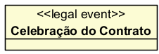

Nesse caso, a `Celebração do Contrato` é um evento jurídico porque pode criar uma relação contratual entre as partes.

## Relações, se tiver

O `«Legal Event»` normalmente se relaciona com outros elementos da UFO-L da seguinte forma:

### Com `«Legal Relator»`

Um `«Legal Event»` pode criar, modificar ou extinguir uma relação jurídica.

Exemplo:

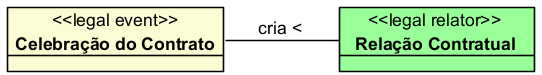

### Com `«Legal Role»`

Um evento jurídico pode fazer com que um agente passe a desempenhar determinado papel jurídico.

Exemplo:

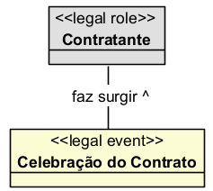

### Com `«Legal Moment»`

Um evento jurídico pode criar, modificar ou extinguir posições jurídicas.

Exemplo:

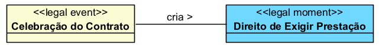

### Com `«Legal Agent»`

O evento jurídico normalmente envolve agentes jurídicos que praticam ou são afetados por esse evento.

Exemplo:

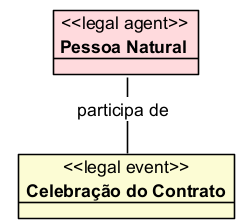

## Restrições

O `«Legal Event»` deve ser usado apenas para representar **acontecimentos juridicamente relevantes**, e não agentes, papéis, relações ou posições jurídicas.

Principais restrições:

* deve representar uma ocorrência no tempo;
* deve produzir efeito jurídico;
* pode criar, modificar ou extinguir uma relação jurídica;
* pode criar, modificar ou extinguir uma posição jurídica;
* pode fazer surgir ou encerrar papéis jurídicos;
* pode envolver agentes jurídicos;
* não deve ser usado para representar sujeitos, documentos, relações ou direitos em si.

Exemplo de uso inadequado:

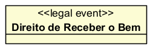

O `Direito de Receber o Bem` não é um evento. Ele é uma posição jurídica. Portanto, o mais adequado é:

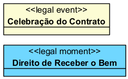

## Questões comuns

### `«Legal Event»` é a mesma coisa que `«Legal Relator»`?

Não.

O `«Legal Event»` representa uma ocorrência no tempo.

O `«Legal Relator»` representa a relação jurídica criada, modificada ou extinta por esse evento.

Exemplo:

* `Celebração do Contrato` → `«Legal Event»`
* `Relação Contratual` → `«Legal Relator»`

### Contrato é `«Legal Event»`?

Depende do recorte.

Se você estiver falando do ato de celebrar o contrato, pode modelar como evento:

Mas se estiver falando do documento contratual, ele não é evento. Nesse caso, deve ser modelado como documento jurídico ou descrição normativa.

### Sentença é `«Legal Event»`?

Depende do recorte.

Se o foco for o ato de proferir a sentença, pode-se modelar como:

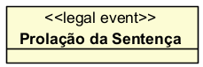

Se o foco for o documento produzido, a sentença não é evento, mas documento ou decisão jurídica.

### Morte é `«Legal Event»`?

Sim, quando produzir efeitos jurídicos.

Exemplo:

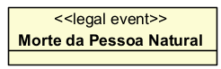

Esse evento pode extinguir personalidade jurídica, abrir sucessão, modificar relações familiares e gerar direitos hereditários.

### Pagamento é `«Legal Event»`?

Sim.

O pagamento é um evento jurídico porque pode extinguir ou modificar uma obrigação.

Exemplo:

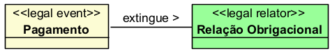

### Nascimento é `«Legal Event»`?

Sim, quando considerado em seus efeitos jurídicos.

Exemplo:

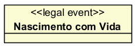

Esse evento pode marcar o início da personalidade civil e gerar relações jurídicas familiares, registrais e sucessórias.

## Quando devo usar

Use `«Legal Event»` quando quiser representar uma ocorrência que tenha relevância jurídica e produza efeitos sobre relações, papéis ou posições jurídicas.

Use esse stereotype para representar eventos como:

* celebração de contrato;
* pagamento;
* inadimplemento;
* nascimento;
* morte;
* casamento;
* divórcio;
* posse;
* transferência de propriedade;
* publicação de lei;
* prolação de sentença;
* citação;
* interposição de recurso;
* trânsito em julgado;
* concessão de benefício;
* rescisão contratual.

O `«Legal Event»` é adequado quando o foco do modelo for mostrar **o acontecimento que gera efeitos jurídicos**.

## Exemplos

### Exemplo 1

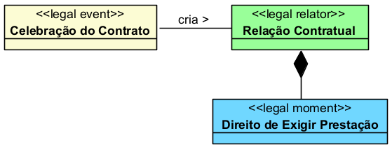

Explicação:

A celebração do contrato é o evento jurídico que cria a relação contratual e faz surgir posições jurídicas entre as partes.

### Exemplo 2

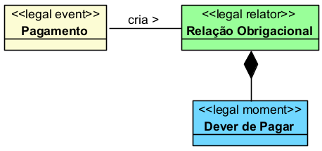

Explicação:

O pagamento é o evento jurídico que pode extinguir ou modificar a relação obrigacional, encerrando o dever de pagar.

## Resumo prático

Use `«Legal Event»` para representar **acontecimentos que produzem efeitos jurídicos**.

Exemplo adequado:

* `«Legal Event» Celebração do Contrato`

Exemplo inadequado:

* `«Legal Event» Direito de Receber o Bem`

Regra prática:

Se o elemento representa o sujeito, use `«Legal Agent»`.

Se representa o papel do sujeito, use `«Legal Role»`.

Se representa o vínculo jurídico entre os papéis, use `«Legal Relator»`.

Se representa uma posição jurídica, use `«Legal Moment»`.

Se representa uma ocorrência que cria, modifica ou extingue efeitos jurídicos, use `«Legal Event»`.

Assim:

* `Pessoa Natural` → `«Legal Agent»`
* `Contratante` → `«Legal Role»`
* `Relação Contratual` → `«Legal Relator»`
* `Direito de Exigir Prestação` → `«Legal Moment»`
* `Celebração do Contrato` → `«Legal Event»`
