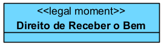
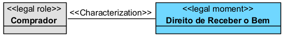
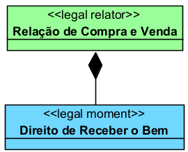
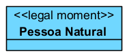
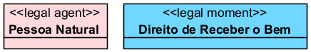
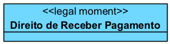
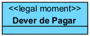
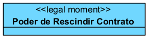
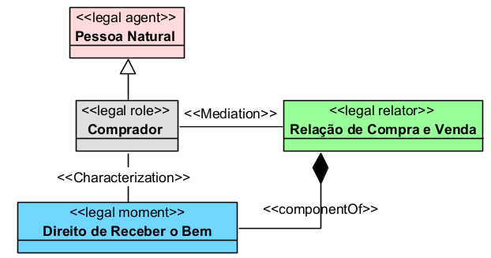
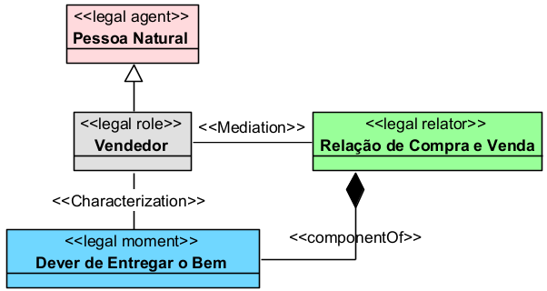

# «Legal Moment»

## Definição

O `«Legal Moment»` representa uma **posição jurídica dependente de um agente jurídico ou de um papel jurídico** dentro de uma relação jurídica.

Na UFO-L, os momentos jurídicos representam situações como direito, dever, permissão, poder jurídico, sujeição, imunidade ou incapacidade jurídica. Eles não existem isoladamente, pois dependem de alguém que os possui e de uma relação jurídica que lhes dá contexto.

Em termos práticos, o `«Legal Moment»` indica aquilo que um sujeito pode exigir, deve cumprir, pode fazer, está autorizado a fazer ou está juridicamente submetido a suportar.

## Exemplo

Um exemplo de `«Legal Moment»` é:

Nesse caso, o `Direito de Receber o Bem` é uma posição jurídica pertencente ao comprador dentro de uma relação de compra e venda.

## Relações

O `«Legal Moment»` normalmente se relaciona com outros elementos da UFO-L da seguinte forma:

### Com `«Legal Role»`

O `«Legal Moment»` caracteriza um papel jurídico, indicando uma posição jurídica assumida por esse papel.

Exemplo:

### Com `«Legal Agent»`

O agente jurídico pode ser portador de um momento jurídico por meio do papel que desempenha.

Exemplo:

### Com `«Legal Relator»`

O `«Legal Moment»` faz parte de uma relação jurídica estruturada por um `«Legal Relator»`.

Exemplo:

### Com outro `«Legal Moment»`

Um `«Legal Moment»` normalmente possui uma posição jurídica correlata.

Exemplo:

## Restrições

O `«Legal Moment»` deve ser usado apenas para representar **posições jurídicas**, e não agentes, papéis, relações ou eventos.

Principais restrições:

* deve depender de um agente ou papel jurídico;
* deve estar inserido em uma relação jurídica;
* não deve existir isoladamente no modelo;
* pode ter outro momento jurídico correlato;
* pode representar direito, dever, permissão, poder, sujeição, imunidade ou incapacidade jurídica;
* não deve ser usado para representar documento, contrato, sentença, processo ou evento.

Exemplo de uso inadequado:

A `Pessoa Natural` não é uma posição jurídica. Ela é um agente jurídico. Portanto, o mais adequado é:

## Questões comuns

### `«Legal Moment»` é a mesma coisa que `«Legal Role»`?

Não.

O `«Legal Role»` representa o papel jurídico concreto desempenhado por um agente.

O `«Legal Moment»` representa a posição jurídica que esse papel possui.

Exemplo:

* `Comprador` → `«Legal Role»`
* `Direito de Receber o Bem` → `«Legal Moment»`

### Direito é `«Legal Moment»`?

Sim.

Na UFO-L, direitos subjetivos podem ser modelados como momentos jurídicos, pois são posições jurídicas dependentes de um sujeito ou papel.

Exemplo:

### Dever é `«Legal Moment»`?

Sim.

O dever jurídico também é uma posição jurídica dependente de um sujeito ou papel.

Exemplo:

### Poder jurídico é `«Legal Moment»`?

Sim.

O poder jurídico pode ser modelado como `«Legal Moment»`, pois representa uma posição jurídica que permite a um sujeito produzir efeitos jurídicos.

Exemplo:

### Sentença é `«Legal Moment»`?

Não.

A sentença não é uma posição jurídica. Ela pode reconhecer, criar, modificar ou extinguir posições jurídicas, mas não é um `«Legal Moment»`.

Dependendo do recorte, a sentença pode ser tratada como documento jurídico, ato jurídico ou evento jurídico.

### Contrato é `«Legal Moment»`?

Não.

O contrato não é uma posição jurídica. Ele pode criar ou estruturar uma relação jurídica, mas os direitos e deveres decorrentes dele é que podem ser modelados como `«Legal Moment»`.

Exemplo:

* `Contrato` → documento ou descrição normativa
* `Relação Contratual` → `«Legal Relator»`
* `Direito de Exigir Prestação` → `«Legal Moment»`

## Quando devo usar

Use `«Legal Moment»` quando quiser representar uma **posição jurídica atribuída a um sujeito ou papel jurídico**.

Use esse stereotype para representar elementos como:

* direito;
* dever;
* permissão;
* proibição;
* poder jurídico;
* sujeição;
* imunidade;
* incapacidade jurídica;
* responsabilidade;
* obrigação jurídica específica.

O `«Legal Moment»` deve ser usado quando o foco do modelo for mostrar o conteúdo jurídico que pertence a determinado papel dentro de uma relação.

## Exemplos

### Exemplo 1

Explicação:

O comprador possui o direito de receber o bem dentro da relação de compra e venda. Esse direito é uma posição jurídica e, por isso, pode ser modelado como `«Legal Moment»`.

### Exemplo 2

Explicação:

O vendedor possui o dever de entregar o bem dentro da relação de compra e venda. Esse dever é uma posição jurídica e, por isso, pode ser modelado como `«Legal Moment»`.

## Resumo prático

Use `«Legal Moment»` para representar **direitos, deveres, poderes, permissões, sujeições, imunidades ou outras posições jurídicas**.

Exemplo adequado:

* `«Legal Moment» Direito de Receber o Bem`

Exemplo inadequado:

* `«Legal Moment» Comprador`

Regra prática:

Se o elemento representa o sujeito, use `«Legal Agent»`.

Se representa o papel do sujeito, use `«Legal Role»`.

Se representa o vínculo jurídico entre os papéis, use `«Legal Relator»`.

Se representa a posição jurídica pertencente a um sujeito ou papel, use `«Legal Moment»`.

Assim:

* `Pessoa Natural` → `«Legal Agent»`
* `Comprador` → `«Legal Role»`
* `Relação de Compra e Venda` → `«Legal Relator»`
* `Direito de Receber o Bem` → `«Legal Moment»`
* `Dever de Entregar o Bem` → `«Legal Moment»`
