# «Legal Relator»

## Definição

O `«Legal Relator»` representa uma **relação jurídica reificada**, isto é, uma entidade relacional que conecta agentes jurídicos por meio dos papéis que eles desempenham.

Na UFO-L, o `Legal Relator` é usado para representar a estrutura da relação jurídica. Ele não é apenas uma associação simples entre sujeitos, mas o elemento que organiza os papéis jurídicos e as posições jurídicas existentes entre eles, como direitos, deveres, poderes, sujeições, permissões ou imunidades.

Em termos práticos, o `«Legal Relator»` representa o vínculo jurídico que faz com que determinados agentes estejam relacionados juridicamente.

## Exemplo

Um exemplo de `«Legal Relator»` é:

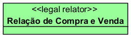

Nesse caso, a `Relação de Compra e Venda` conecta os papéis jurídicos de `Comprador` e `Vendedor`, estruturando os direitos e deveres existentes entre eles.

## Relações

O `«Legal Relator»` normalmente se relaciona com outros elementos da UFO-L da seguinte forma:

### Com `«Legal Role»`

O `«Legal Relator»` media os papéis jurídicos envolvidos na relação.

Exemplo:

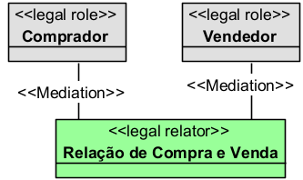

### Com `«Legal Agent»`

O `«Legal Agent»` participa da relação jurídica por meio de um papel jurídico.

Exemplo:

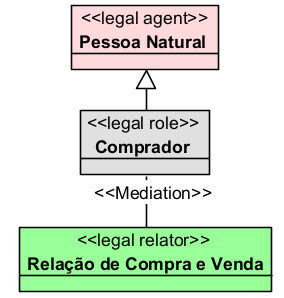

### Com `«Legal Moment»`

O `«Legal Relator»` é composto por posições jurídicas, como direitos e deveres.

Exemplo:

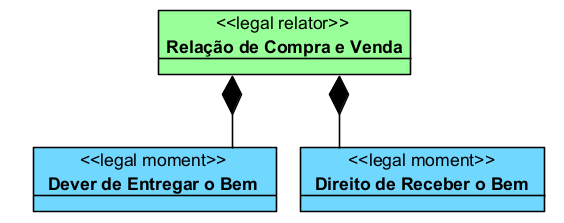

### Com `«Legal Event»`

Um `«Legal Event»` pode criar, modificar ou extinguir um `«Legal Relator»`.

Exemplo:

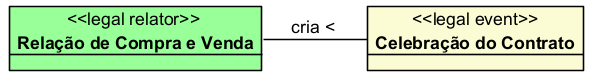

## Restrições

O `«Legal Relator»` deve ser usado apenas para representar uma **relação jurídica estruturada**, e não um agente, papel, documento ou evento.

Principais restrições:

* deve conectar dois ou mais papéis jurídicos;
* deve mediar agentes jurídicos por meio dos papéis que eles desempenham;
* pode conter posições jurídicas;
* pode ser criado, modificado ou extinto por eventos jurídicos;
* não deve ser usado para representar pessoa, empresa, Estado ou órgão público;
* não deve ser usado para representar papéis como comprador, vendedor, autor ou réu;
* não deve ser confundido com contrato, sentença, petição ou lei.

Exemplo de uso inadequado:

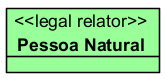

A `Pessoa Natural` não é uma relação jurídica. Ela é um agente jurídico. Portanto, o mais adequado é:

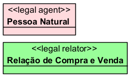

## Questões comuns

### `«Legal Relator»` é a mesma coisa que uma relação simples?

Não.

Uma relação simples apenas liga dois elementos. O `«Legal Relator»`, por outro lado, representa uma relação jurídica como uma entidade própria, capaz de mediar papéis e estruturar posições jurídicas.

Exemplo:

* relação simples: `Comprador compra de Vendedor`
* `«Legal Relator»`: `Relação de Compra e Venda`

O segundo caso é mais adequado quando você precisa representar direitos, deveres e papéis jurídicos de forma explícita.

### Contrato é `«Legal Relator»`?

Depende do recorte.

Em geral, o contrato como documento não deve ser modelado como `«Legal Relator»`. O documento contratual pode ser entendido como instrumento ou descrição normativa.

O mais adequado é separar:

* `Contrato` como documento ou descrição normativa;
* `Relação Contratual` como `«Legal Relator»`.

Exemplo:

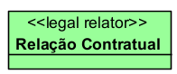

### Processo é `«Legal Relator»`?

Pode ser, dependendo do recorte.

Se o objetivo for representar o vínculo jurídico-processual entre autor, réu e órgão julgador, o processo pode ser modelado como uma relação jurídica reificada.

Exemplo:

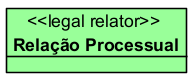

### Obrigação é `«Legal Relator»`?

Pode ser modelada como `«Legal Relator»` quando representa o vínculo jurídico entre credor e devedor.

Exemplo:

* `«Legal Relator» Relação Obrigacional`

Dentro dela, podem existir posições jurídicas como:

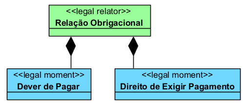

### Sentença é `«Legal Relator»`?

Não, em regra.

A sentença é melhor entendida como ato, documento ou evento jurídico, dependendo do recorte do modelo. Ela pode modificar ou extinguir uma relação jurídica, mas não é a própria relação jurídica.

## Quando devo usar

Use `«Legal Relator»` quando quiser representar uma **relação jurídica estruturada entre sujeitos**, especialmente quando for necessário explicitar:

* quais agentes participam da relação;
* quais papéis jurídicos são desempenhados;
* quais direitos e deveres existem;
* quais poderes e sujeições existem;
* qual evento criou, modificou ou extinguiu a relação;
* qual vínculo jurídico une os participantes.

O `«Legal Relator»` é adequado para representar relações como:

* relação contratual;
* relação obrigacional;
* relação de compra e venda;
* relação de emprego;
* relação processual;
* relação previdenciária;
* relação tributária;
* relação administrativa;
* relação familiar;
* relação de propriedade.

## Exemplos

### Exemplo 1

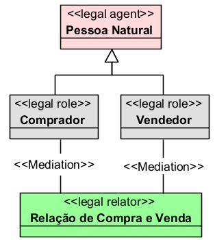

Explicação:

A `Relação de Compra e Venda` é o vínculo jurídico que conecta comprador e vendedor, estruturando direitos e deveres entre as partes.

### Exemplo 2

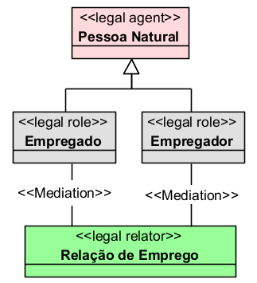

Explicação:

A `Relação de Emprego` é o vínculo jurídico que conecta empregado e empregador, organizando direitos trabalhistas e deveres contratuais.

## Resumo prático

Use `«Legal Relator»` para representar **o vínculo jurídico que conecta agentes por meio de papéis jurídicos**.

Exemplo adequado:

* `«Legal Relator» Relação de Compra e Venda`

Exemplo inadequado:

* `«Legal Relator» Pessoa Natural`

Regra prática:

Se o elemento representa o sujeito, use `«Legal Agent»`.

Se representa o papel do sujeito na relação, use `«Legal Role»`.

Se representa o vínculo jurídico entre os papéis, use `«Legal Relator»`.

Se representa uma posição jurídica dentro do vínculo, use `«Legal Moment»`.

Assim:

* `Pessoa Natural` → `«Legal Agent»`
* `Comprador` → `«Legal Role»`
* `Vendedor` → `«Legal Role»`
* `Relação de Compra e Venda` → `«Legal Relator»`
* `Direito de Receber o Bem` → `«Legal Moment»`
* `Dever de Entregar o Bem` → `«Legal Moment»`
