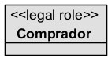
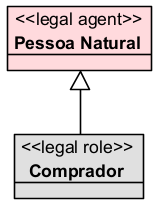
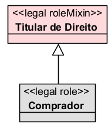
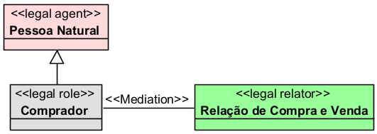
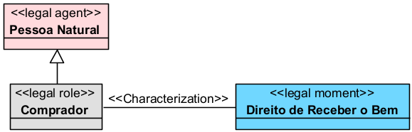
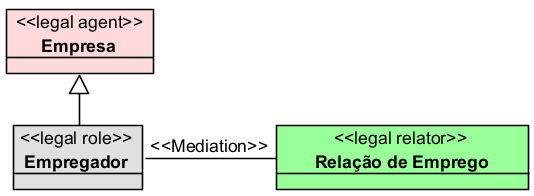

# «Legal Role»

## Definição

O `«Legal Role»` representa um **papel jurídico concreto** desempenhado por um `«Legal Agent»` dentro de uma relação jurídica específica.

Diferentemente do `«Legal Agent»`, que representa o sujeito juridicamente relevante, o `«Legal Role»` representa a função que esse sujeito assume em determinado contexto jurídico.

Assim, uma mesma entidade pode desempenhar diferentes papéis jurídicos em relações distintas. Por exemplo, uma pessoa natural pode ser compradora em uma relação de compra e venda, autora em uma relação processual e devedora em uma relação obrigacional.

## Exemplo

Um exemplo de `«Legal Role»` é:

Nesse caso, `Comprador` é um papel jurídico concreto exercido por um agente dentro de uma relação de compra e venda.

## Relações

O `«Legal Role»` normalmente se relaciona com outros elementos da UFO-L da seguinte forma:

### Com `«Legal Agent»`

O `«Legal Agent»` desempenha um `«Legal Role»`.

Exemplo:

### Com `«Legal RoleMixin»`

O `«Legal Role»` pode especializar ou pertencer a uma categoria abstrata de papéis jurídicos.

Exemplo:

### Com `«Legal Relator»`

O `«Legal Role»` participa de uma relação jurídica reificada.

Exemplo:

### Com `«Legal Moment»`

O `«Legal Role»` pode ser portador de uma posição jurídica.

Exemplo:

## Restrições

O `«Legal Role»` deve ser usado apenas para representar **papéis jurídicos concretos**, e não sujeitos jurídicos em si.

Principais restrições:

* depende de um `«Legal Agent»` que desempenha o papel;
* depende de uma relação jurídica ou contexto jurídico;
* não deve ser usado para representar uma pessoa, empresa ou Estado diretamente;
* pode estar associado a um `«Legal RoleMixin»`;
* pode ser portador de posições jurídicas;
* pode ser mediado por um `«Legal Relator»`;
* deve representar uma função jurídica assumida em determinado contexto.

Exemplo de uso inadequado:

A `Pessoa Natural` não é um papel jurídico. Ela é o agente que pode desempenhar papéis jurídicos. Portanto, o mais adequado é:

## Questões comuns

### `«Legal Role»` é a mesma coisa que `«Legal Agent»`?

Não.

O `«Legal Agent»` representa o sujeito juridicamente relevante.

O `«Legal Role»` representa o papel que esse sujeito desempenha em uma relação jurídica.

Exemplo:

* `Pessoa Natural` → `«Legal Agent»`
* `Comprador` → `«Legal Role»`

### `Comprador` é `«Legal Role»` ou `«Legal RoleMixin»`?

`Comprador` é melhor modelado como `«Legal Role»`, pois representa um papel jurídico concreto em uma relação de compra e venda.

Já `Titular de Direito` é melhor modelado como `«Legal RoleMixin»`, pois representa uma categoria mais abstrata de papéis.

### Um mesmo agente pode desempenhar vários `«Legal Roles»`?

Sim.

Uma mesma pessoa, empresa ou instituição pode ocupar papéis diferentes em relações distintas.

Exemplo:

* uma pessoa pode ser `Comprador` em uma compra e venda;
* pode ser `Locador` em uma locação;
* pode ser `Autor` em um processo;
* pode ser `Devedor` em uma obrigação.

### Todo `«Legal Role»` precisa de um `«Legal Relator»`?

Em uma modelagem mais completa, sim.

O papel jurídico normalmente existe dentro de uma relação jurídica. Por isso, é recomendável indicar o `«Legal Relator»` que contextualiza aquele papel.

Exemplo:

### Um documento pode ser `«Legal Role»`?

Não.

Documentos, contratos, petições, sentenças e certidões não são papéis jurídicos. Eles podem ser documentos jurídicos, objetos jurídicos ou elementos normativos, mas não `«Legal Role»`.

## Quando devo usar

Use `«Legal Role»` quando quiser representar a **função jurídica concreta** desempenhada por um agente em uma relação jurídica.

Use esse stereotype para representar papéis como:

* comprador;
* vendedor;
* credor;
* devedor;
* autor;
* réu;
* contratante;
* contratado;
* empregador;
* empregado;
* locador;
* locatário;
* consumidor;
* fornecedor;
* proprietário;
* possuidor.

O `«Legal Role»` é adequado quando a entidade só faz sentido dentro de uma relação jurídica específica.

## Exemplos

### Exemplo 1

Explicação:

A `Pessoa Natural` é o agente jurídico. Ao participar de uma compra e venda, ela desempenha o papel concreto de `Comprador` dentro da `Relação de Compra e Venda`.

### Exemplo 2

Explicação:

A `Empresa` é o agente jurídico. Ao contratar um trabalhador, ela desempenha o papel concreto de `Empregador` dentro da `Relação de Emprego`.

## Resumo prático

Use `«Legal Role»` para representar **o papel jurídico concreto exercido por um agente**.

Exemplo adequado:

* `«Legal Role» Comprador`

Exemplo inadequado:

* `«Legal Role» Pessoa Natural`

Regra prática:

Se o elemento representa o sujeito em si, use `«Legal Agent»`.

Se o elemento representa a função jurídica que esse sujeito assume em uma relação, use `«Legal Role»`.

Assim:

* `Pessoa Natural` → `«Legal Agent»`
* `Comprador` → `«Legal Role»`
* `Titular de Direito` → `«Legal RoleMixin»`
* `Relação de Compra e Venda` → `«Legal Relator»`
* `Direito de Receber o Bem` → `«Legal Moment»`
