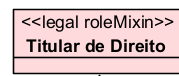
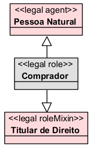
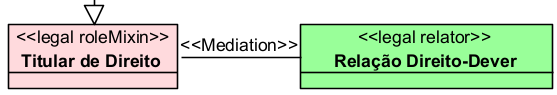
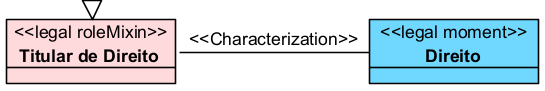
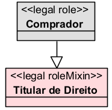
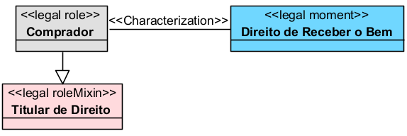
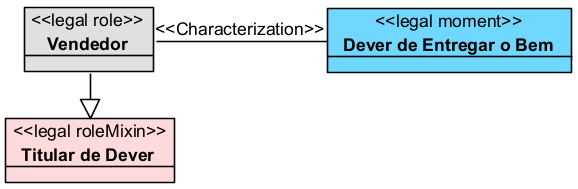

# «Legal RoleMixin»

## Definição

O `«Legal RoleMixin»` representa uma **categoria abstrata de papéis jurídicos**. Ele agrupa diferentes `«Legal Roles»` que possuem uma mesma função jurídica geral, ainda que possam ser desempenhados por agentes com naturezas distintas.

Na UFO-L, o `Legal RoleMixin` é uma especialização de `Social RoleMixin` e funciona como um conjunto de papéis jurídicos relacionados a uma posição jurídica. Por exemplo, a categoria `Right Holder` reúne papéis jurídicos de sujeitos que ocupam a posição de titulares de direito em face de sujeitos titulares de dever.

## Exemplo

Um exemplo de `«Legal RoleMixin»` é:

Esse stereotype pode agrupar vários papéis jurídicos concretos, como comprador, credor, consumidor, proprietário ou autor, desde que esses papéis estejam ocupando uma posição de titularidade de direito em uma relação jurídica.

## Relações

O `«Legal RoleMixin»` normalmente se relaciona com outros elementos da UFO-L da seguinte forma:

### Com `«Legal Role»`

O `«Legal RoleMixin»` é especializado por papéis jurídicos concretos.

Exemplo:

### Com `«Legal Agent»`

O `«Legal Agent»` desempenha um `«Legal Role»`, e esse papel pode estar agrupado em um `«Legal RoleMixin»`.

Exemplo:

### Com `«Legal Relator»`

Cada `«Legal RoleMixin»` normalmente aparece dentro de uma relação jurídica mediada por um `«Legal Relator»`.

Exemplo:

### Com `«Legal Moment»`

O `«Legal RoleMixin»` está associado a uma posição jurídica.

Exemplo:

## Restrições

O `«Legal RoleMixin»` deve ser usado apenas para representar **categorias abstratas de papéis jurídicos**, e não papéis concretos desempenhados diretamente por um agente.

Principais restrições:

* não representa um agente jurídico;
* não representa uma relação jurídica;
* não representa uma posição jurídica isolada;
* deve agrupar papéis jurídicos semelhantes;
* deve estar associado a uma posição jurídica;
* deve possuir, em regra, uma categoria correlata ou conversa;
* deve ser especializado por `«Legal Roles»` concretos.

Exemplo de uso inadequado:

* `«Legal RoleMixin» Comprador`

O termo `Comprador` é melhor modelado como `«Legal Role»`, pois representa um papel jurídico concreto em uma relação de compra e venda.

## Questões comuns

### `«Legal RoleMixin»` é a mesma coisa que `«Legal Role»`?

Não.

O `«Legal RoleMixin»` é mais abstrato. Ele representa uma categoria geral de papéis jurídicos.

O `«Legal Role»` representa um papel jurídico concreto desempenhado por um agente em uma relação específica.

Exemplo:

### Quando devo usar `«Legal RoleMixin»` em vez de `«Legal Role»`?

Use `«Legal RoleMixin»` quando quiser representar uma categoria ampla de papéis jurídicos.

Use `«Legal Role»` quando quiser representar o papel concreto exercido por um agente.

Exemplo:

### Todo `«Legal Role»` precisa estar ligado a um `«Legal RoleMixin»`?

Não necessariamente em diagramas mais simples.

Porém, em uma modelagem mais alinhada à UFO-L, é recomendável ligar o `«Legal Role»` a um `«Legal RoleMixin»`, pois isso ajuda a explicitar qual posição jurídica aquele papel ocupa na relação.

### `«Legal RoleMixin»` pode existir sozinho?

Em termos de modelagem conceitual, ele pode aparecer como categoria abstrata. Porém, para ter utilidade no modelo, deve ser especializado por papéis jurídicos concretos ou relacionado a posições jurídicas.

### `Titular de Dever` também é `«Legal RoleMixin»`?

Sim.

Na UFO-L, os papéis jurídicos aparecem em pares correlatos. Assim, se existe um `Titular de Direito`, normalmente existe um `Titular de Dever` em uma relação jurídica correlata.

## Quando devo usar

Use `«Legal RoleMixin»` quando quiser representar uma **categoria geral de papéis jurídicos**, especialmente quando diferentes papéis concretos compartilham uma mesma posição jurídica.

Use esse stereotype para organizar papéis como:

* titulares de direitos;
* titulares de deveres;
* titulares de permissões;
* titulares de poderes jurídicos;
* sujeitos à autoridade ou sujeição jurídica;
* titulares de imunidade;
* titulares de incapacidade jurídica.

O `«Legal RoleMixin»` é útil quando o modelo precisa mostrar que vários papéis jurídicos diferentes pertencem a uma mesma categoria de posição jurídica.

## Exemplos

### Exemplo 1

Explicação:

O `Comprador` é um papel jurídico concreto. Ele pode ser classificado como `Titular de Direito` porque, na relação de compra e venda, possui o direito de receber o bem.

### Exemplo 2

Explicação:

O `Vendedor` é um papel jurídico concreto. Ele pode ser classificado como `Titular de Dever` porque, na relação de compra e venda, possui o dever de entregar o bem.

## Resumo prático

Use `«Legal RoleMixin»` para representar **categorias abstratas de papéis jurídicos**.

Exemplo adequado:

* `«Legal RoleMixin» Titular de Direito`

Exemplo inadequado:

* `«Legal RoleMixin» Comprador`

Regra prática:

Se o elemento representa uma categoria geral de papéis, use `«Legal RoleMixin»`.

Se o elemento representa um papel jurídico concreto exercido por um agente, use `«Legal Role»`.

Assim:

* `Titular de Direito` → `«Legal RoleMixin»`
* `Comprador` → `«Legal Role»`
* `Pessoa Natural` → `«Legal Agent»`
* `Relação de Compra e Venda` → `«Legal Relator»`
* `Direito de Receber o Bem` → `«Legal Moment»`
