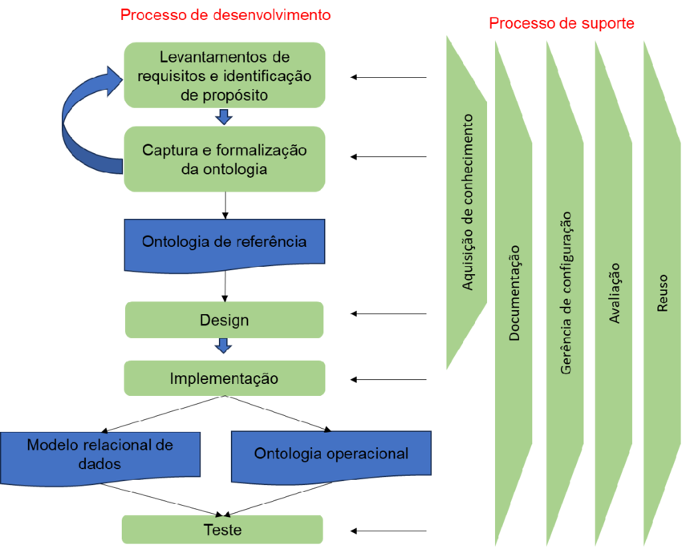

# SABiO - Systematic Approach for Building Ontologies

## 1. Levantamento de Requisitos e Identificação de Propósito

Nesta etapa, define-se o objetivo da ontologia e o problema que ela pretende resolver.

São identificados:

- o domínio da ontologia;
- a finalidade do modelo;
- o público-alvo;
- o escopo da representação;
- os requisitos da ontologia;
- as questões de competência.

Essa etapa responde à pergunta principal: **para que a ontologia será construída?**

## 2. Captura e Formalização da Ontologia

Nesta etapa, o conhecimento do domínio é coletado, analisado e organizado.

São levantados:

- conceitos principais;
- relações entre conceitos;
- propriedades;
- restrições;
- regras do domínio;
- termos relevantes.

Após a captura, ocorre a formalização, em que os elementos identificados são estruturados de maneira mais precisa e rigorosa.

## 3. Ontologia de Referência

A **ontologia de referência** é o modelo conceitual resultante da captura e formalização.

Ela representa o domínio em alto nível, com foco na clareza conceitual e na fidelidade ao domínio, sem se preocupar diretamente com detalhes de implementação computacional.

Essa ontologia serve como base para as etapas seguintes do processo.

## 4. Design

Na etapa de **design**, a ontologia de referência é preparada para ser implementada.

Aqui são tomadas decisões sobre:

- organização da ontologia;
- modularização;
- padrões de modelagem;
- nomes de classes e relações;
- estrutura técnica;
- reaproveitamento de modelos existentes.

O objetivo é transformar a ontologia de referência em um modelo mais próximo da implementação.

## 5. Implementação

Na implementação, a ontologia é construída em uma linguagem ou ferramenta específica.

Nessa etapa, o modelo conceitual passa a existir como um artefato computacional.

Exemplos de linguagens e ferramentas:

- OWL;
- OntoUML;
- Protégé;
- OLED;
- Visual Paradigm.

A implementação pode gerar diferentes artefatos, como uma **ontologia operacional** ou um **modelo relacional de dados**.

## 6. Teste

A etapa de teste verifica se a ontologia implementada atende aos requisitos definidos no início do processo.

São analisados aspectos como:

- consistência;
- clareza;
- completude;
- ausência de contradições;
- adequação ao domínio;
- capacidade de responder às questões de competência.

O teste permite identificar erros, lacunas e ajustes necessários antes da utilização final da ontologia.

## Conclusão

O processo de desenvolvimento do **SABiO** conduz a construção da ontologia de forma organizada.

Primeiro, define-se o propósito e os requisitos. Depois, o conhecimento do domínio é capturado e formalizado, gerando uma ontologia de referência. Em seguida, essa ontologia passa pelo design, implementação e teste, garantindo maior clareza, consistência e utilidade ao modelo.