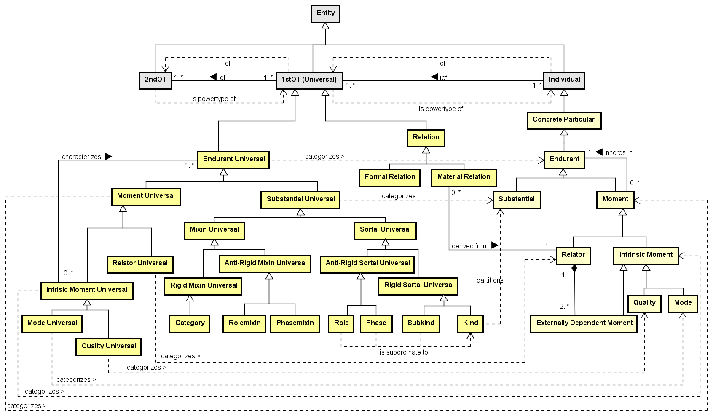

# UFO-A: Unified Foundational Ontology for Objects

## Introdução

A **UFO-A** é a parte da Unified Foundational Ontology dedicada à representação dos **endurants**, isto é, entidades que persistem no tempo mantendo sua identidade.

Ela não trata diretamente de eventos, ações ou processos, pois esses são abordados principalmente pela **UFO-B**.

## Endurants

**Endurants** são entidades que existem no tempo, mas não acontecem no tempo. Elas permanecem identificáveis mesmo sofrendo mudanças.

Exemplos:

- Pessoa
- Animal
- Carro
- Árvore
- Livro

Na UFO-A, os endurants se dividem em duas categorias principais:

1. **Substantials**: entidades relativamente independentes;
2. **Moments**: entidades dependentes de outras.

## 1. Substantials

Os **Substantials** são endurants que existem de forma relativamente independente, ou seja, não dependem existencialmente de outro indivíduo específico.

Exemplos:

- Pessoa
- Cachorro
- Casa
- Empresa

### Tipos de Substantials

A UFO-A classifica os tipos de substantials conforme sua função ontológica:

- **Kind**: tipo essencial de uma entidade;
- **SubKind**: especialização rígida de um Kind;
- **Role**: papel assumido em determinado contexto;
- **Phase**: fase temporária de uma entidade;
- **Category**: generalização rígida que reúne diferentes Kinds;
- **Mixin**: generalização que pode reunir tipos de naturezas distintas;
- **RoleMixin**: generalização de papéis contextuais;
- **PhaseMixin**: generalização de fases.

## 2. Moments

Os **Moments** são endurants dependentes. Eles não existem isoladamente, pois precisam estar ligados a um portador, também chamado de **carrier**.

Exemplos:

- Cor
- Peso
- Altura
- Dor
- Habilidade
- Vínculo

### Tipos de Moments

A UFO-A divide os moments principalmente em:

- **Quality**: característica mensurável ou perceptível;
- **Mode**: propriedade particular dependente de um único portador;
- **Relator**: entidade relacional que conecta dois ou mais indivíduos.

## 3. Rigidez em UFO-A

A rigidez é um critério usado para entender se um tipo é essencial ou contingente para seus indivíduos.

### Rígido

Um tipo é **rígido** quando todo indivíduo que pertence a ele deve pertencer a esse tipo durante toda a sua existência.

Exemplos:

- **Kind**: Pessoa
- **SubKind**: Mulher
- **Category**: Objeto Físico

### Antirrígido

Um tipo é **antirrígido** quando o indivíduo pode adquiri-lo ou perdê-lo sem deixar de existir.

Exemplos:

- **Role**: Estudante
- **Phase**: Criança
- **RoleMixin**: Cliente
- **PhaseMixin**: Jovem

### Semirrígido

Um tipo é **semirrígido** quando reúne propriedades que podem ser essenciais para alguns indivíduos, mas não para outros.

Exemplo:

- **Mixin**: Segurável

## Conclusão

A **UFO-A** fornece uma base conceitual rigorosa para modelar objetos, propriedades e relações estruturais. Sua principal contribuição é distinguir entidades independentes, como os **Substantials**, de entidades dependentes, como os **Moments**.

Por isso, ela é especialmente útil para representar:

- entidades persistentes no tempo;
- tipos essenciais e contextuais;
- fases, papéis e propriedades;
- relações estruturais entre indivíduos.

Para representar eventos, ações e processos, a UFO-A é complementada pela **UFO-B**.