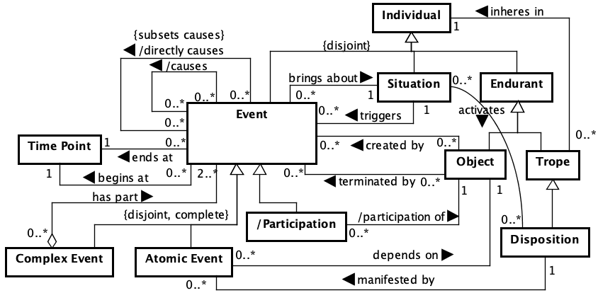
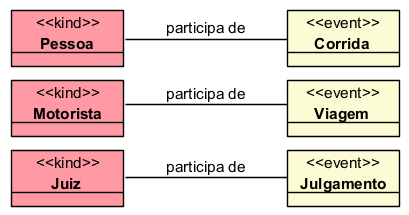

# UFO-B: Unified Foundational Ontology for Events

## Introdução

A UFO-B é a parte da Unified Foundational Ontology dedicada à representação dos **perdurants**, ou seja, entidades que acontecem no tempo.

Diferente da UFO-A, que trata de objetos persistentes (endurants), a UFO-B trata de eventos, processos, mudanças e situações temporais.

---

## Perdurants

São entidades que se desenvolvem no tempo e possuem partes temporais. Elas não existem inteiras em um único instante, mas ocorrem ao longo de uma duração.

**Exemplos:**

- Corrida
- Viagem
- Reunião
- Construção
- Nascimento
- Crescimento

A UFO-B está relacionada principalmente a duas categorias:

- **Events**: acontecimentos ou ocorrências;
- **Situations**: estados de coisas que podem existir antes, durante ou depois de eventos.

---

## 1. Events

São perdurants que acontecem no tempo e podem provocar mudanças na realidade.

**Exemplos:**

- Abrir uma porta
- Iniciar uma reunião
- Realizar uma viagem
- Construir uma casa
- Nascimento de uma pessoa

Um evento pode ser simples ou composto por outros eventos menores. Também pode ter início, duração e fim.

### 1.1 Características dos Events

- **Temporalidade**: ocorrem ao longo do tempo, não são instantâneos;
- **Causalidade**: podem provocar mudanças na realidade;
- **Participação**: envolvem participantes (entidades da UFO-A);
- **Estrutura**: podem ser simples ou compostos;
- **Resultado**: podem gerar resultados ou mudanças de estado.

### 1.2 Tipos de Events

Dentro da UFO-B, os eventos podem ser compreendidos conforme sua estrutura temporal:

- **Atomic Event**:
Evento elementar que não pode ser decomposição em eventos menores. É a unidade atômica de acontecimento.

- **Complex Event**:
Evento composto por múltiplos eventos menores (atômicos ou complexos) que ocorrem em sequência ou simultaneamente.

- **Process**:
Evento contínuo que se estende ao longo do tempo sem um fim claramente definido dentro do contexto observado.

- **Achievement**:
Evento que culmina em um resultado específico. O foco está no ponto final alcançado.

- **Accomplishment**:
Evento que se estende ao longo do tempo e resulta em um estado específico alcançado.

## 2. Situations

São estados de coisas que existem em determinado momento ou intervalo de tempo. Uma situação é um **estado** da realidade em um ponto ou período temporal.

**Exemplos:**

- A porta está aberta
- O carro está parado
- A reunião está em andamento
- A pessoa está sentada
- A casa está construída

### 2.1 Características das Situations

- **Temporalidade**: existem em um instante ou intervalo de tempo;
- **Estado**: representam condições ou estados de coisas;
- **Dependência**: frequentemente dependem de participantes (UFO-A);
- **Dinamismo**: podem ser alteradas por eventos;
- **Sequência**: podem ocorrer antes, durante ou depois de eventos.

## 3. Participação em Events

Os eventos geralmente envolvem participantes. Esses participantes são entidades persistentes, normalmente representadas pela UFO-A (Substantials).

**Exemplos:**

- Pessoa participa de uma corrida
- Motorista realiza uma viagem
- Funcionário participa de uma reunião
- Máquina executa uma operação
- Juiz profere sentença em processo

Portanto, a UFO-B complementa a UFO-A, pois eventos dependem de entidades que participam deles.

### 3.1 Relação entre Participantes (UFO-A) e Events (UFO-B)

## 4. Temporalidade em UFO-B

Um conceito central na UFO-B é o **tempo**.

Os eventos podem ser analisados por:

- **Início**: quando o evento começa;
- **Duração**: quanto tempo o evento leva;
- **Fim**: quando o evento termina;
- **Sequência**: ordem entre múltiplos eventos;
- **Simultaneidade**: eventos que ocorrem ao mesmo tempo;
- **Resultado**: mudança de estado gerada pelo evento.

## 5. Conclusão

A UFO-B fornece uma base conceitual para modelar eventos, processos e mudanças no tempo.

O foco nos perdurants torna a UFO-B ideal para representar:

- Acontecimentos e eventos
- Processos contínuos
- Mudanças de estado
- Situações temporais
- Participação de entidades em eventos
- Relações temporais entre ocorrências
- Sequências e dependências entre eventos

**Integração com UFO-A:**

Enquanto a UFO-A representa **entidades que persistem no tempo** (objetos, pessoas, organizações), a UFO-B representa **entidades que acontecem no tempo** (eventos, processos, mudanças).

Juntas, UFO-A e UFO-B formam um framework completo para representar tanto a estrutura estática de um domínio quanto sua dinâmica temporal.

### Quando usar UFO-A e UFO-B

- **Use UFO-A** quando o foco for em entidades persistentes e suas propriedades (objetos, pessoas, organizações)
- **Use UFO-B** quando o foco for em acontecimentos, processos e mudanças de estado
- **Use ambas** para representar domínios complexos que envolvem tanto entidades quanto eventos
