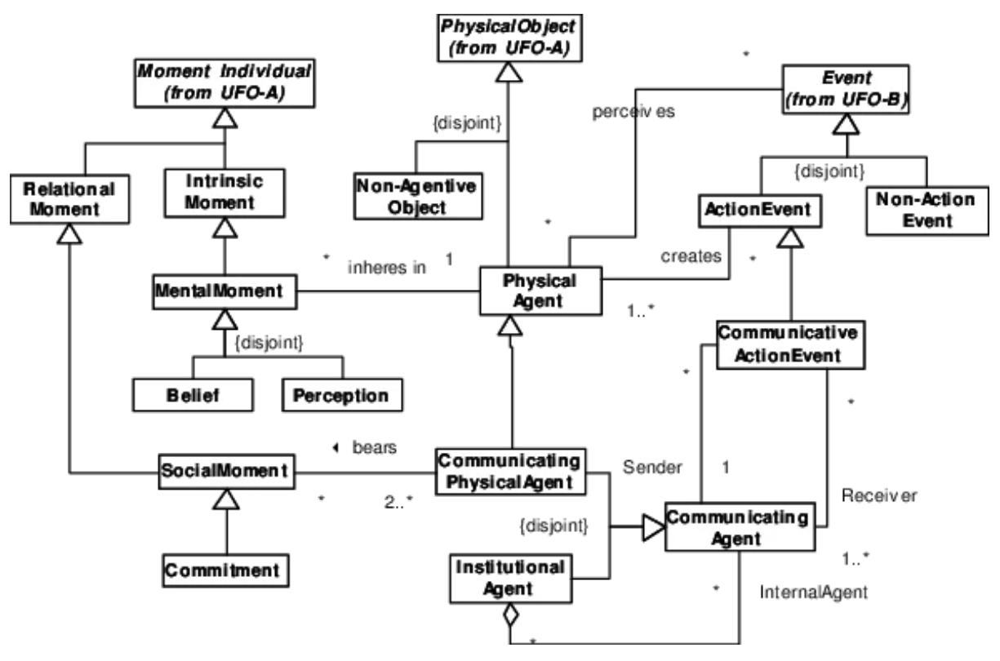

# UFO-C: Unified Foundational Ontology for Social and Intentional Aspects

## Introdução

A UFO-C é a parte da Unified Foundational Ontology voltada à representação dos aspectos sociais e intencionais da realidade.

Enquanto a UFO-A trata de objetos e a UFO-B trata de eventos, a UFO-C trata de agentes, intenções, ações, compromissos e relações sociais.

## Aspectos principais

A UFO-C considera que algumas entidades dependem de agentes capazes de agir, decidir, ter objetivos e assumir compromissos.

**Exemplos:**

- Pessoa
- Organização
- Intenção
- Objetivo
- Ação
- Compromisso
- Norma social

## 1. Agents

São entidades capazes de agir intencionalmente.

**Exemplos:**

- Pessoa
- Grupo
- Organização
- Instituição

## 2. Intentional Moments

São estados ou propriedades mentais dependentes de um agente.

**Exemplos:**

- Crença
- Desejo
- Intenção
- Objetivo
- Compromisso

## 3. Actions

São eventos realizados intencionalmente por agentes.

**Exemplos:**

- Enviar uma mensagem
- Fazer uma promessa
- Assinar um documento
- Participar de uma reunião

## 4. Social Objects e Social Relators

A UFO-C também representa objetos e relações que existem por reconhecimento social.

### Exemplos de Social Objects:

- Documento
- Regra
- Cargo
- Organização

### Exemplos de Social Relators:

- Promessa
- Acordo
- Compromisso
- Vínculo social

## Conclusão

A UFO-C fornece uma base para modelar agentes, intenções, ações e relações sociais.

Ela é útil para representar:

- agentes individuais e coletivos;
- objetivos e intenções;
- ações intencionais;
- compromissos;
- normas sociais;
- relações entre agentes.

Assim, a UFO-C complementa a UFO-A e a UFO-B ao representar a dimensão social e intencional da realidade.
