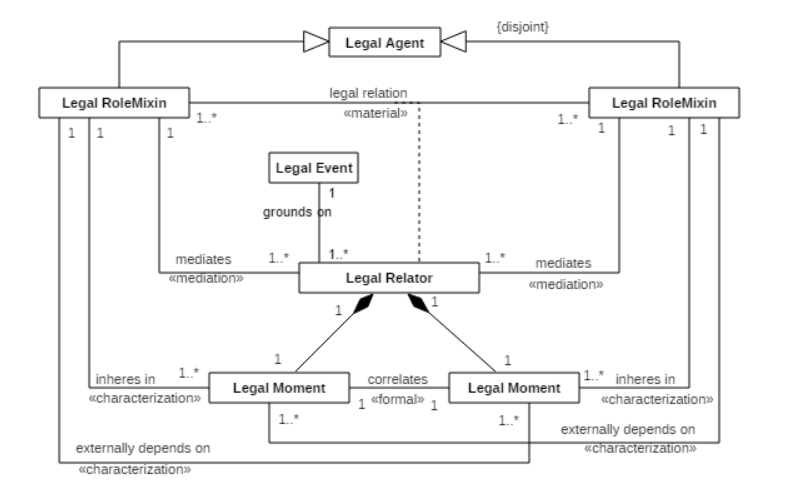

# UFO-L: Legal Core Ontology

## Introdução

A **UFO-L** é uma ontologia núcleo jurídica construída a partir da **Unified Foundational Ontology (UFO)**.

Seu objetivo é representar conceitos jurídicos fundamentais, especialmente aqueles relacionados a **agentes jurídicos**, **papéis jurídicos**, **normas jurídicas**, **posições jurídicas** e **relações jurídicas**.

Diferente de abordagens focadas apenas na norma, a UFO-L enfatiza a **relação jurídica** como estrutura central do domínio jurídico.

Assim, uma relação jurídica não é tratada apenas como uma associação simples entre sujeitos, mas como uma entidade ontológica própria, composta por posições jurídicas correlatas.

## 1. Legal Agent

**Legal Agent** é o agente capaz de participar de relações jurídicas.

Ele pode exercer papéis jurídicos e ocupar posições jurídicas dentro de uma relação.

Exemplos:

* Pessoa física;
* Pessoa jurídica;
* Órgão público;
* Estado;
* Organização;
* Autoridade;
* Instituição.

Na UFO-L, o Legal Agent pode desempenhar diferentes Legal Roles dependendo do contexto jurídico.

## 2. Legal Role

**Legal Role** é o papel jurídico desempenhado por um Legal Agent em uma relação jurídica específica.

Exemplos:

* Credor;
* Devedor;
* Autor;
* Réu;
* Contratante;
* Contratado;
* Titular de direito;
* Titular de dever;
* Autoridade competente;
* Beneficiário.

Um Legal Role é dependente do contexto jurídico. Um mesmo agente pode desempenhar vários papéis em relações diferentes.

Exemplo:

Uma pessoa pode ser autora em um processo, contratante em um contrato e beneficiária em uma relação previdenciária.

## 3. Legal RoleMixin

**Legal RoleMixin** representa uma categoria geral de papéis jurídicos.

Ele agrupa papéis jurídicos que podem ser desempenhados por diferentes tipos de agentes, com diferentes princípios de identidade.

Exemplos:

* Right Holder;
* Duty Holder;
* Permission Holder;
* NoRight Holder;
* Liberty Holder;
* Power Holder;
* Subjection Holder;
* Immunity Holder;
* Disability Holder.

O Legal RoleMixin é útil quando a ontologia ainda está em um nível mais abstrato, antes de especificar papéis concretos de um domínio.

Exemplo:

Right Holder pode ser especializado em Autor, Consumidor, Beneficiário, Credor ou qualquer outro papel que represente alguém titular de um direito em uma relação jurídica.

## 4. Legal Moment

**Legal Moment** representa uma posição jurídica.

As posições jurídicas são dependentes dos agentes que as possuem e também dependem externamente dos outros agentes envolvidos na relação.

Exemplos:

* Direito;
* Dever;
* Permissão;
* Ausência de direito;
* Liberdade;
* Poder jurídico;
* Sujeição;
* Imunidade;
* Incapacidade.

Na UFO-L, uma posição jurídica não existe isoladamente. Ela pertence a um agente em determinado papel e se relaciona com outra posição jurídica correlata.

Exemplo:

O direito de um sujeito corresponde ao dever de outro sujeito.

## 4.1 Tipos de Legal Moments

A UFO-L representa diferentes posições jurídicas, entre elas:

* **Right to an Action**: direito a uma ação;
* **Duty to Act**: dever de agir;
* **Right to an Omission**: direito a uma omissão;
* **Duty to Omit**: dever de omitir;
* **Permission to Act**: permissão para agir;
* **Permission to Omit**: permissão para omitir;
* **NoRight to an Action**: ausência de direito a uma ação;
* **NoRight to an Omission**: ausência de direito a uma omissão;
* **Legal Power**: poder jurídico;
* **Legal Subjection**: sujeição jurídica;
* **Immunity**: imunidade;
* **Disability**: incapacidade;
* **Protected Liberty**: liberdade protegida;
* **Unprotected Liberty**: liberdade não protegida.

## 5. Legal Relator

**Legal Relator** é a relação jurídica reificada.

Ele representa a relação jurídica como uma entidade própria, e não apenas como uma linha ligando dois sujeitos.

Um Legal Relator conecta papéis jurídicos e é composto por Legal Moments correlatos.

Exemplos:

* Relação direito-dever;
* Relação permissão-ausência de direito;
* Relação poder-sujeição;
* Relação imunidade-incapacidade;
* Relação de liberdade protegida;
* Relação de liberdade não protegida.

O Legal Relator é uma das categorias centrais da UFO-L.

## 5.1 Características do Legal Relator

* Media Legal RoleMixins ou Legal Roles;
* É composto por Legal Moments;
* Representa uma relação jurídica como entidade ontológica;
* Pode ser criado, modificado ou extinto por um evento jurídico;
* Permite representar posições jurídicas correlatas;
* Evita tratar relações jurídicas apenas como associações simples.

## 6. Tipos de Legal Relators

A UFO-L trabalha com diferentes tipos de Legal Relators:

* **Right-Duty Relator**: relação entre titular de direito e titular de dever;
* **NoRight-Permission Relator**: relação entre ausência de direito e permissão;
* **Power-Subjection Relator**: relação entre poder jurídico e sujeição;
* **Disability-Immunity Relator**: relação entre incapacidade e imunidade;
* **Liberty Relator**: relação envolvendo liberdade jurídica.

Esses relators podem ser especializados conforme o tipo de posição jurídica envolvida.

Exemplos:

* Right-Duty to an Action Relator;
* Right-Duty to an Omission Relator;
* NoRight to an Action-Permission to Omit Relator;
* NoRight to an Omission-Permission to Act Relator;
* Protected Liberty Relator;
* Unprotected Liberty Relator.

## 7. Legal Event

**Legal Event** é um evento juridicamente relevante.

Ele pode criar, modificar ou extinguir relações jurídicas.

Exemplos:

* Assinatura de contrato;
* Nascimento;
* Morte;
* Protocolo de requerimento;
* Decisão judicial;
* Publicação de norma;
* Celebração de negócio jurídico;
* Descumprimento de obrigação.

O Legal Event está relacionado à UFO-B, pois representa algo que acontece no tempo e produz efeitos jurídicos.

## 8. Relação entre Legal Event e Legal Relator

Um Legal Relator pode ser fundamentado por um Legal Event.

Isso significa que uma relação jurídica surge, se transforma ou se encerra a partir de um evento juridicamente relevante.

Exemplos:

* Um contrato cria uma relação jurídica entre contratante e contratado;
* Uma decisão judicial cria uma nova situação jurídica;
* Um nascimento cria relações jurídicas familiares;
* Uma morte pode extinguir algumas relações e criar outras;
* Um requerimento administrativo pode iniciar uma relação procedimental.

## 9. Conclusão

A UFO-L fornece uma base conceitual para representar juridicamente agentes, papéis, posições e relações.

Seu foco principal é a relação jurídica, entendida como uma estrutura composta por papéis jurídicos e posições jurídicas correlatas.

Ela é útil para representar:

* Normas jurídicas;
* Agentes jurídicos;
* Papéis jurídicos;
* Direitos e deveres;
* Permissões e ausências de direito;
* Poderes e sujeições;
* Imunidades e incapacidades;
* Eventos juridicamente relevantes;
* Relações jurídicas como entidades próprias.

Resumo

Legal Agent desempenha Legal Role.

Legal Role ocupa uma posição jurídica.

A posição jurídica é um Legal Moment.

Legal Moments correlatos compõem um Legal Relator.

O Legal Relator representa a relação jurídica.

Um Legal Event cria, modifica ou extingue essa relação.

Uma Legal Norm pode definir essa estrutura.
