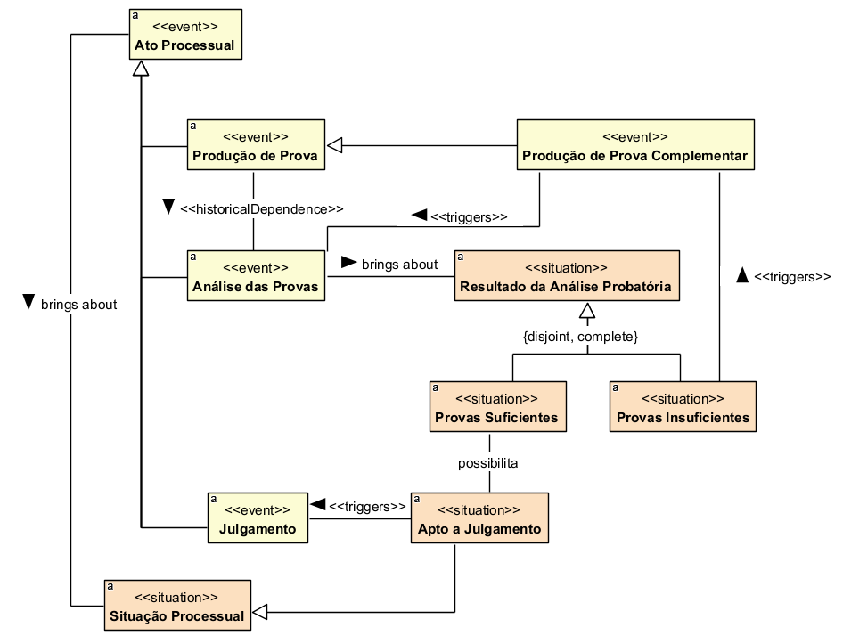

## Diagrama de Analise e Julgamento

### Dicionário de termos

| Conceito | Definição |
|---|---|
| **Ato Processual** | Evento praticado no curso do processo que produz efeitos ou altera uma situação processual. |
| **Produção de Prova** | Ato processual destinado à obtenção e incorporação de elementos probatórios necessários à demonstração dos fatos relevantes para o processo. |
| **Produção de Prova Complementar** | Evento de produção adicional de provas realizado quando os elementos probatórios existentes são considerados insuficientes. |
| **Análise das Provas** | Ato processual de exame e avaliação dos elementos probatórios produzidos no processo. |
| **Resultado da Análise Probatória** | Situação resultante da avaliação das provas disponíveis no processo. |
| **Provas Suficientes** | Situação em que os elementos probatórios existentes são considerados suficientes para permitir o prosseguimento do processo para julgamento. |
| **Provas Insuficientes** | Situação em que os elementos probatórios existentes não são suficientes para permitir o julgamento, podendo exigir produção de prova complementar. |
| **Apto a Julgamento** | Situação processual em que o processo reúne elementos suficientes para ser submetido a julgamento. |
| **Julgamento** | Ato processual em que a controvérsia é apreciada e decidida pelo órgão julgador. |
| **Situação Processual** | Estado em que o processo se encontra em determinado momento de sua tramitação. |