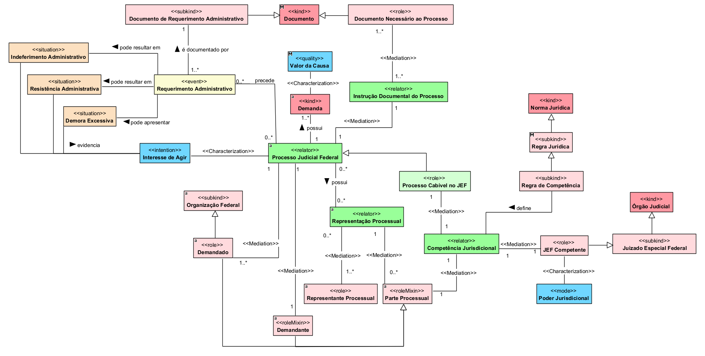

## Diagrama de competência do JEF

  
### Dicionário de termos

| Conceito | Definição |
|---|---|
| **Documento** | Registro que contém informações relevantes para comprovação, instrução ou realização de atos jurídicos e processuais. |
| **Documento de Requerimento Administrativo** | Documento que registra ou comprova a realização de requerimento perante a Administração Pública. |
| **Documento Necessário ao Processo** | Documento cuja apresentação é necessária ou relevante para a adequada instrução do processo judicial. |
| **Requerimento Administrativo** | Pedido formulado perante a Administração Pública com o objetivo de obter o reconhecimento ou a satisfação de determinada pretensão. |
| **Indeferimento Administrativo** | Situação resultante da rejeição, pela Administração Pública, da pretensão apresentada em requerimento administrativo. |
| **Resistência Administrativa** | Situação em que a Administração Pública se opõe à pretensão apresentada pelo interessado. |
| **Demora Excessiva** | Situação caracterizada pela ausência de decisão administrativa dentro de prazo razoável. |
| **Interesse de Agir** | Necessidade de recorrer ao Poder Judiciário para obtenção da tutela pretendida diante de situação que justifique a atuação jurisdicional. |
| **Demanda** | Pretensão submetida ao Poder Judiciário, composta por causa de pedir e um ou mais pedidos processuais. |
| **Valor da Causa** | Expressão econômica atribuída à demanda para fins processuais. |
| **Processo Judicial Federal** | Relação processual instaurada perante a Justiça Federal para apreciação e solução de uma demanda. |
| **Instrução Documental do Processo** | Relação que reúne os documentos necessários ou relevantes para a adequada formação e instrução do processo judicial. |
| **Processo Cabível no JEF** | Processo judicial federal que atende aos critérios necessários para tramitação perante o Juizado Especial Federal. |
| **Organização Federal** | Organização pertencente à esfera federal que pode participar de relações jurídicas e processuais. |
| **Parte Processual** | Participante que ocupa um dos polos da relação processual. |
| **Demandante** | Parte processual que apresenta a pretensão submetida à apreciação do Poder Judiciário. |
| **Demandado** | Parte processual contra a qual a pretensão judicial é formulada. |
| **Representação Processual** | Relação que vincula uma parte processual ao sujeito que atua juridicamente em seu nome ou na defesa de seus interesses. |
| **Representante Processual** | Sujeito que exerce a representação jurídica de uma parte no processo. |
| **Norma Jurídica** | Norma integrante do ordenamento jurídico que estabelece direitos, deveres, competências ou consequências jurídicas. |
| **Regra Jurídica** | Norma jurídica que estabelece condições e consequências aplicáveis a determinada situação jurídica. |
| **Regra de Competência** | Regra jurídica que estabelece critérios para determinar qual órgão judicial possui competência para apreciar determinada causa. |
| **Competência Jurisdicional** | Relação que atribui a determinado órgão judicial o poder de processar e julgar uma causa segundo as regras de competência aplicáveis. |
| **JEF Competente** | Papel exercido pelo Juizado Especial Federal quando possui competência jurisdicional para processar e julgar determinado processo. |
| **Órgão Judicial** | Estrutura integrante do Poder Judiciário responsável pelo exercício da função jurisdicional. |
| **Juizado Especial Federal** | Órgão judicial federal destinado ao processamento e julgamento das causas abrangidas pela competência dos Juizados Especiais Federais. |
| **Poder Jurisdicional** | Poder atribuído ao órgão judicial para exercer a jurisdição e decidir as causas submetidas à sua competência. |