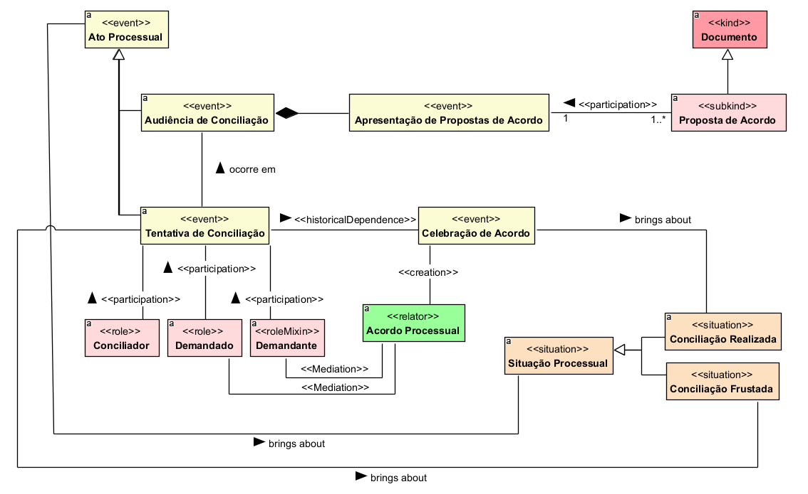

## Diagrama de Conciliação

### Dicionário de termos

| Conceito | Definição |
|---|---|
| **Ato Processual** | Evento praticado no curso do processo que produz efeitos ou altera uma situação processual. |
| **Audiência de Conciliação** | Ato processual destinado à realização de tentativa de solução consensual entre as partes. |
| **Apresentação de Propostas de Acordo** | Evento ocorrido no contexto da audiência em que são apresentadas propostas destinadas à solução consensual do conflito. |
| **Documento** | Registro que contém informações ou manifestações juridicamente relevantes para o processo. |
| **Proposta de Acordo** | Documento que registra uma proposta de solução consensual apresentada no curso da conciliação. |
| **Tentativa de Conciliação** | Ato processual em que demandante e demandado, com participação do conciliador, buscam alcançar solução consensual para a controvérsia. |
| **Celebração de Acordo** | Evento em que as partes chegam a um consenso e constituem um acordo processual. |
| **Conciliador** | Participante responsável por auxiliar as partes na busca de solução consensual para o conflito. |
| **Demandante** | Parte que apresenta a demanda ao Poder Judiciário e participa da tentativa de conciliação. |
| **Demandado** | Parte contra a qual a demanda é formulada e que participa da tentativa de conciliação. |
| **Acordo Processual** | Relação constituída entre demandante e demandado a partir da concordância quanto à solução consensual da controvérsia. |
| **Situação Processual** | Estado em que o processo se encontra em determinado momento de sua tramitação. |
| **Conciliação Realizada** | Situação processual resultante da celebração de acordo entre as partes. |
| **Conciliação Frustada** | Situação processual resultante da tentativa de conciliação sem obtenção de acordo entre as partes. |