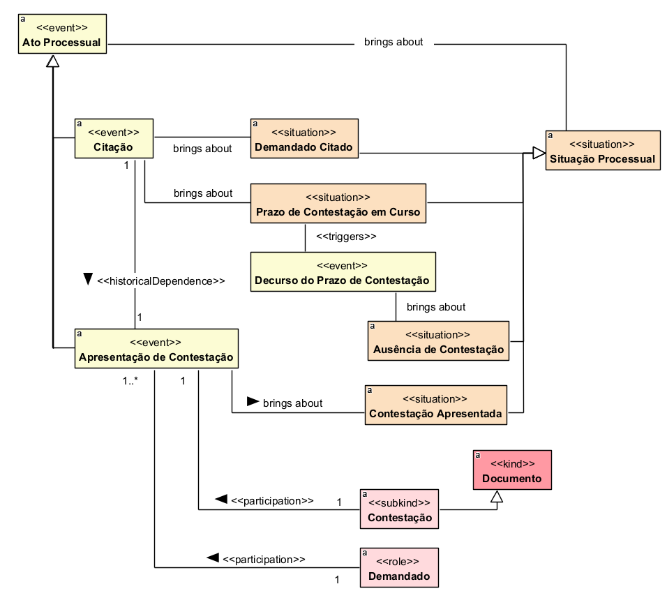

## Diagrama de Contestação

### Dicionário de termos

| Conceito | Definição |
|---|---|
| **Ato Processual** | Evento praticado no curso do processo que produz efeitos ou altera uma situação processual. |
| **Situação Processual** | Estado em que o processo ou seus participantes se encontram em determinado momento da tramitação. |
| **Citação** | Ato processual pelo qual o demandado é formalmente chamado a integrar o processo e exercer sua defesa. |
| **Demandado Citado** | Situação processual em que o demandado já foi formalmente cientificado da existência do processo. |
| **Prazo de Contestação em Curso** | Situação processual em que o período destinado à apresentação da contestação ainda está transcorrendo. |
| **Decurso do Prazo de Contestação** | Evento correspondente ao término do prazo disponível para apresentação da contestação. |
| **Apresentação de Contestação** | Ato processual pelo qual o demandado apresenta formalmente sua defesa no processo. |
| **Contestação Apresentada** | Situação processual resultante da apresentação da contestação pelo demandado. |
| **Ausência de Contestação** | Situação processual caracterizada pela não apresentação de contestação dentro do prazo aplicável. |
| **Documento** | Registro que contém informações ou manifestações juridicamente relevantes para o processo. |
| **Contestação** | Documento por meio do qual o demandado apresenta sua defesa em relação à pretensão formulada contra ele. |
| **Demandado** | Parte processual contra a qual a demanda é formulada. |