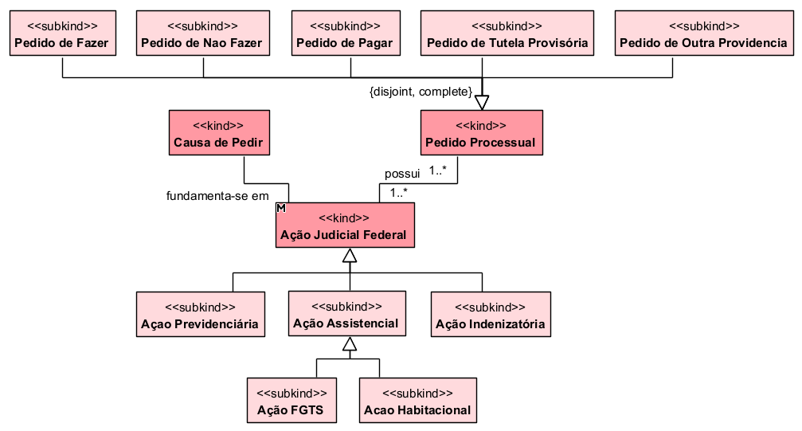

## Diagrama de demanda, causa e pedido

  
### Dicionario de termos
| Conceito | Definição |
|---|---|
| **Ação Judicial Federal** | Demanda apresentada à Justiça Federal para solução de uma pretensão. |
| **Ação Previdenciária** | Ação relacionada à concessão, revisão ou manutenção de benefício previdenciário. |
| **Ação Assistencial** | Ação relacionada à concessão ou proteção de benefício assistencial. |
| **Ação Indenizatória** | Ação que busca reparação por dano ou prejuízo sofrido. |
| **Ação FGTS** | Ação relacionada a direitos ou valores vinculados ao FGTS. |
| **Ação Habitacional** | Ação relacionada a questões de programas ou contratos habitacionais federais. |
| **Causa de Pedir** | Fatos e fundamentos que justificam a ação e os pedidos formulados. |
| **Pedido Processual** | Providência que o autor solicita ao Poder Judiciário. |
| **Pedido de Fazer** | Pedido para que o réu realize determinada obrigação ou conduta. |
| **Pedido de Não Fazer** | Pedido para que o réu deixe de praticar determinada conduta. |
| **Pedido de Pagar** | Pedido para que o réu realize o pagamento de determinado valor. |
| **Pedido de Outra Providência** | Pedido que busca providência diferente de fazer, não fazer ou pagar. |
| **Pedido de Tutela Provisória** | Pedido de proteção judicial antes da decisão definitiva do processo. |
| **Pedido Principal** | Pedido que representa a principal pretensão do autor na ação. |
| **Fundamenta-se em** | Relação entre a ação e os fatos e fundamentos que a justificam. |
| **Possui** | Relação que indica os pedidos existentes em uma ação judicial. |