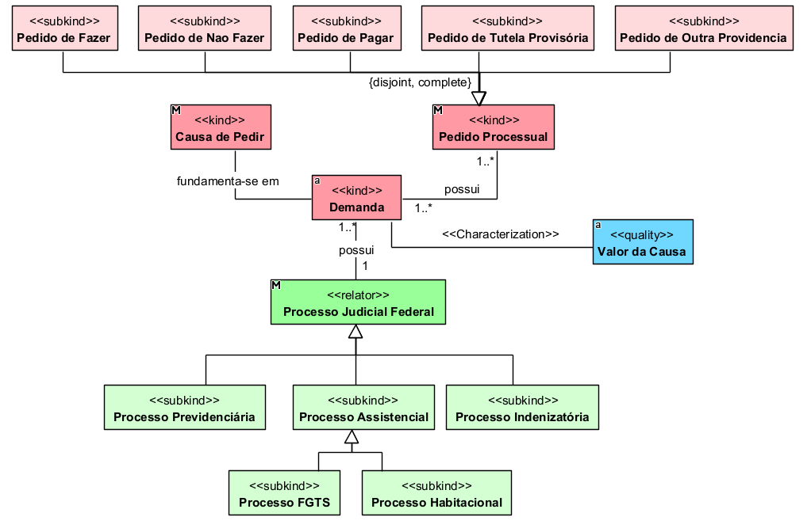

## Diagrama de demanda, causa e pedido

  
### Dicionário de termos

| Conceito | Definição |
|---|---|
| **Causa de Pedir** | Conjunto de fatos e fundamentos que sustentam a pretensão apresentada na demanda. |
| **Pedido Processual** | Providência jurisdicional requerida ao Poder Judiciário no âmbito da demanda. |
| **Pedido de Fazer** | Pedido que busca impor ao demandado a realização de determinada conduta. |
| **Pedido de Não Fazer** | Pedido que busca impor ao demandado a obrigação de se abster de determinada conduta. |
| **Pedido de Pagar** | Pedido que busca impor ao demandado o pagamento de determinada quantia. |
| **Pedido de Tutela Provisória** | Pedido de medida jurisdicional provisória destinada a antecipar ou assegurar os efeitos da tutela pretendida. |
| **Pedido de Outra Providência** | Pedido que busca providência jurisdicional distinta das categorias de fazer, não fazer, pagar ou tutela provisória. |
| **Demanda** | Pretensão submetida ao Poder Judiciário, fundamentada em uma causa de pedir e composta por um ou mais pedidos processuais. |
| **Valor da Causa** | Valor econômico atribuído à demanda para fins processuais. |
| **Processo Judicial Federal** | Relação processual instaurada perante a Justiça Federal para apreciação e solução de uma demanda. |
| **Processo Previdenciário** | Processo judicial federal relacionado à concessão, revisão, manutenção ou proteção de direito previdenciário. |
| **Processo Assistencial** | Processo judicial federal relacionado à concessão, manutenção ou proteção de benefício assistencial. |
| **Processo Indenizatório** | Processo judicial federal destinado à apreciação de pretensão de reparação por dano ou prejuízo. |
| **Processo FGTS** | Processo judicial federal relacionado a direitos, depósitos ou valores vinculados ao Fundo de Garantia do Tempo de Serviço. |
| **Processo Habitacional** | Processo judicial federal relacionado a contratos, financiamentos ou programas habitacionais submetidos à competência da Justiça Federal. |