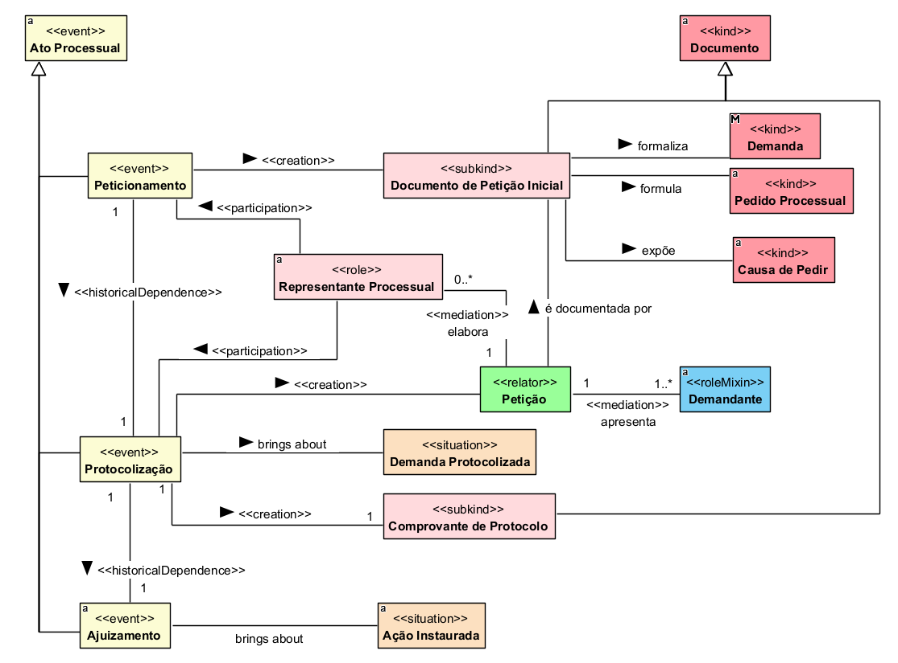

## Diagrama de Instauração

### Dicionário de termos

| Conceito | Definição |
|---|---|
| **Ato Processual** | Evento praticado no âmbito do processo ou de sua formação que produz efeitos juridicamente relevantes. |
| **Peticionamento** | Ato processual de elaboração e apresentação da petição inicial que formaliza a demanda, expõe a causa de pedir e formula os pedidos processuais. |
| **Protocolização** | Ato processual pelo qual a petição inicial é formalmente registrada perante o órgão judicial. |
| **Ajuizamento** | Ato processual que sucede a protocolização e dá início à tramitação judicial da demanda. |
| **Documento** | Registro que contém informações, manifestações ou comprovações juridicamente relevantes. |
| **Documento de Petição Inicial** | Documento produzido no peticionamento que formaliza a demanda, expõe a causa de pedir e apresenta os pedidos processuais. |
| **Demanda** | Pretensão submetida ao Poder Judiciário, fundamentada em uma causa de pedir e composta por um ou mais pedidos processuais. |
| **Pedido Processual** | Providência jurisdicional requerida ao Poder Judiciário no âmbito da demanda. |
| **Causa de Pedir** | Conjunto de fatos e fundamentos que sustentam a pretensão apresentada na demanda. |
| **Representante Processual** | Pessoa que atua juridicamente em nome ou na defesa dos interesses do demandante na prática dos atos processuais. |
| **Petição** | Relação estabelecida no peticionamento que vincula o demandante, seu representante processual e o documento de petição inicial elaborado. |
| **Demandante** | Participante que apresenta a demanda ao Poder Judiciário e em cujo interesse a petição é formulada. |
| **Demanda Protocolizada** | Situação resultante da protocolização, na qual a demanda encontra-se formalmente registrada perante o órgão judicial. |
| **Comprovante de Protocolo** | Documento produzido na protocolização que comprova o registro da demanda, identificando seu número de protocolo e a data e hora do ato. |
| **Ação Instaurada** | Situação resultante do ajuizamento, na qual a demanda passa a integrar uma ação judicial instaurada perante o Poder Judiciário. |