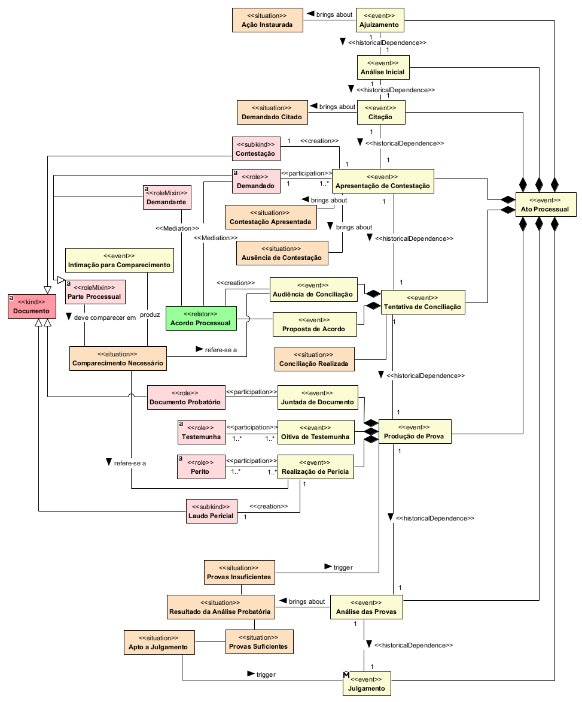

## Diagrama de procedimentos

  
### Dicionario de termos
| Conceito | Definição |
|---|---|
| **Ato Processual** | Ato realizado durante o andamento do processo judicial. |
| **Ajuizamento** | Ato de apresentar a ação ao Poder Judiciário. |
| **Ação Instaurada** | Situação em que a ação já foi apresentada e iniciada judicialmente. |
| **Análise Inicial** | Análise realizada no início do processo para verificar seu prosseguimento. |
| **Citação** | Ato de comunicar formalmente o réu sobre a existência da ação. |
| **Réu Citado** | Situação em que o réu já foi formalmente comunicado da ação. |
| **Apresentação de Contestação** | Ato pelo qual o réu apresenta sua defesa no processo. |
| **Contestação** | Documento que contém a defesa apresentada pelo réu. |
| **Contestação Apresentada** | Situação em que o réu apresentou sua contestação. |
| **Ausência de Contestação** | Situação em que não foi apresentada contestação pelo réu. |
| **Réu Federal** | Parte federal contra a qual a ação é proposta. |
| **Tentativa de Conciliação** | Ato destinado a buscar uma solução consensual entre as partes. |
| **Audiência de Conciliação** | Audiência realizada para tentar promover acordo entre as partes. |
| **Proposta de Acordo** | Proposta apresentada para solucionar consensualmente o conflito. |
| **Conciliação Realizada** | Situação em que foi realizada tentativa de conciliação entre as partes. |
| **Acordo Processual** | Relação estabelecida quando as partes chegam a uma solução consensual. |
| **Autor** | Parte que apresenta a demanda ao Poder Judiciário. |
| **Produção de Prova** | Atividade destinada à obtenção de elementos para demonstrar os fatos do processo. |
| **Juntada de Documento** | Ato de inserir documento no processo como elemento de prova. |
| **Documento** | Registro que contém ou comprova informações relevantes. |
| **Documento Probatório** | Documento utilizado como prova no processo. |
| **Oitiva de Testemunha** | Ato de colher o depoimento de uma testemunha. |
| **Testemunha** | Pessoa que presta depoimento sobre fatos relevantes para o processo. |
| **Realização de Perícia** | Atividade técnica realizada para esclarecer questão relevante ao processo. |
| **Perito** | Profissional que fornece conhecimento técnico ou científico ao processo. |
| **Laudo Pericial** | Documento que apresenta o resultado da perícia realizada. |
| **Análise das Provas** | Avaliação das provas disponíveis no processo. |
| **Resultado da Análise Probatória** | Situação resultante da avaliação das provas existentes. |
| **Provas Suficientes** | Situação em que as provas disponíveis permitem o julgamento da causa. |
| **Provas Insuficientes** | Situação em que as provas disponíveis não são suficientes para o julgamento. |
| **Instrução Necessária** | Situação em que é necessária a produção de novas provas. |
| **Apto a Julgamento** | Situação em que o processo possui elementos suficientes para ser julgado. |
| **Julgamento** | Ato em que o órgão julgador decide a controvérsia apresentada. |
| **Produz** | Relação que indica que um ato gera determinado documento. |
| **Participa de** | Relação que indica a participação de um sujeito em determinado ato processual. |
| **Apresenta** | Relação que indica a utilização de documento como elemento de prova. |
| **Aciona** | Relação que indica que determinada situação exige a realização de outro ato. |